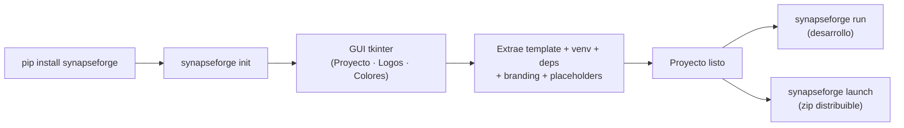

<p align="center">
  
</p>

---

<h1 align="center">
  
</h1>

---

<p align="center">
  <a href="./LICENSE">
    
  </a>
  &nbsp;
  <a href="https://link.mercadopago.com.ar/synapseforge">
    
  </a>
</p>

---

<h3 align="center">Framework open source para construir, orquestar y desplegar agentes de IA: multi-provider, tool calling, memoria RAG y distribución desktop</h3>

---

## Descripción

**synapseForge** es un paquete PyPI que provee un CLI para scaffoldear y distribuir proyectos de agentes IA desde cero. Incluye:

1. **CLI** (`synapseforge init`, `launch`, `colors`, `run`) — scaffolding con GUI tkinter + build de distribución + editor de colores en vivo + servidor de desarrollo.
2. **Framework de agentes** (`backend/agent/`) — AgentLoop, Tools Registry (nativas + externas + MCP), Sessions (SQLite WAL), Permissions, Skills, RAG, MCP.
3. **Template de proyecto** embebido (`pipeline/template.zip`) — backend FastAPI + frontend React/Vite/TypeScript.
4. **Docker** — `Dockerfile` multi-stage + `docker-compose.yml`.

### ✨ Características Principales

- **Scaffolding completo**: `synapseforge init` crea el proyecto desde un template embebido con GUI interactiva — estructura, venv, logos, `.ico`, colores y reemplazo de placeholders.
- **Distribución autocontenida**: `synapseforge launch` genera un zip listo para entregar (PyInstaller + Python embebido + frontend compilado).
- **Multi-provider LLM**: LOCAL (Ollama, opcional), Groq, Google Gemini y OpenRouter. API keys cloud gestionadas desde el panel de configuración, validadas contra la API de cada proveedor y guardadas cifradas en SQLite. Pantalla inicial de configuración saltable: sin ningún provider configurado la app queda bloqueada hasta cargar una key. Parámetros avanzados (temperature, top_p, reasoning) configurables por modelo desde el panel de configuración, con opción "Default" que usa los valores de cada agente.
- **Framework de agentes completo**: AgentLoop con tool calling nativo, tools registry (nativas + externas + MCP), permisos por agente (allow/deny/ask + wildcards) aplicados tanto al exponer las tools al modelo como en cada intento de ejecución, skills y sub-agentes con delegación por `task`.
- **RAG**: colecciones vectoriales en ChromaDB con embeddings en OpenRouter (`liquid/lfm-2.5-embedding-350m:free`). Subida de archivos y páginas web, chunking con overlap y búsqueda por similitud coseno. Requiere API key de OpenRouter (capa gratis). Memoria de largo plazo: cada turno se indexa automáticamente y todos los agentes pueden buscar en conversaciones pasadas con la tool `search_memory`. Las colecciones creadas con un modelo de embeddings anterior se detectan por la API y pueden reindexarse in situ.
- **Creación asistida por LLM**: interfaces standalone para crear skills, tools y agentes mediante entrevista iterativa + agente creador, con selección efímera de modelo cloud por tarea.
- **Telegram como control remoto**: el bot emite eventos al event bus y el frontend ejecuta el mismo flujo de chat. Comandos de sesión, modelo/proveedor, creación de skills/tools/RAG y gestión de la agenda.
- **Tareas programadas**: el usuario define tareas (descripción + hora + días) desde la Agenda del header o por Telegram; el backend las ejecuta con el modelo seleccionado y notifica el resultado en la campanita de la UI y por Telegram (siempre, aunque el bot esté deshabilitado).
- **Archivos de contexto**: subida de documentos (PDF, Word, TXT, MD, CSV, JSON, YAML, XML, PY) → extracción de texto → inyección en el system prompt del agente.
- **Métricas de uso**: sesiones, tools, modelos, errores y overview, con dashboard en el frontend.
- **Modo desktop app**: heartbeat watchdog + endpoint de shutdown para distribuir la app como producto.

---

## ¿Qué resuelve?

- **Scaffolding repetitivo**: Un solo comando crea el proyecto completo con la estructura estándar de todos los proyectos SYNAPSE.
- **Configuración centralizada**: GUI interactiva que reemplaza todos los placeholders XML del proyecto (empresa, cliente, colores, logo, etc.).
- **Branding automatizado**: Copia de logos + generación de `.ico` + extracción de paleta de colores desde la imagen.
- **Distribución sin dependencias**: Build autocontenido listo para entregar al cliente — incluye Python embebido, frontend estático, launcher nativo.

---

## Inicio rápido

```bash
pip install synapseforge

# Crear un proyecto (GUI interactiva)
synapseforge init mi-proyecto
cd mi-proyecto

# Levantar en desarrollo (requiere venv activado)
synapseforge run .
```

Al primer arranque aparece la pantalla de configuración: cargá una API key de algún proveedor cloud ([OpenRouter](https://openrouter.ai/settings/keys), [Google Gemini](https://aistudio.google.com/apikey) o [Groq](https://console.groq.com/keys) — todos con capa gratis) y aprieta **Aplicar**. Ollama es opcional (solo si querés modelos locales). La **fuente de conocimiento** necesita específicamente una key de OpenRouter.

---

## CLI — Comandos

| Comando | Descripción |
|---------|-------------|
| `synapseforge init [dir]` | Crea proyecto desde template con GUI interactiva |
| `synapseforge launch -p <path> -n <exe> [--skip-frontend] [--no-embed] [-c]` | Build de distribución autocontenida (zip). Con `-c` compila el backend a `.pyc`; por defecto empaqueta los `.py` |
| `synapseforge colors [dir]` | Editor GUI para `frontend/public/colors.json` (cambios en vivo sin rebuild) |
| `synapseforge run [dir]` | Levanta uvicorn --reload + npm run dev + abre browser |
| `synapseforge --help` | Ayuda global |

- **`init`**: pipeline de 10 pasos (input GUI → template → venv → deps → logos → `.ico` → colores → config → placeholders).
- **`launch`**: compila backend (PyInstaller), build del frontend, descarga Python embebido, genera launcher nativo y empaqueta todo en un zip.
- **`run`**: requiere el venv activado (`VIRTUAL_ENV`). Ctrl+C mata ambos servidores.



---

## Estructura del proyecto

```plaintext
synapseForge/
│
├─ synapseforge/                 # Paquete Python — CLI instalable via pip
│  ├─ cli/main.py                #   Parser CLI: init | launch | colors | run
│  └─ tk/                        #   GUIs tkinter (init, colors)
│
├─ pipeline/                     # Código fuente de init y launch
│  ├─ template.zip               #   Template del proyecto (embebido)
│  ├─ init/                      #   Init: input, template, venv, config, logo, placeholders
│  └─ launch/                    #   Launch: PyInstaller, npm build, zip
│
├─ backend/                      # Fuente del template — backend FastAPI
│  ├─ main.py                    #   App FastAPI: CORS, lifespan, routers, health, SPA static
│  ├─ instances.py               #   Singletons: agent, session_manager
│  ├─ event_bus.py               #   Event bus (SSE) para Telegram ↔ Frontend
│  ├─ routes/                    #   Endpoints API (chat SSE, create, config, sessions, rag, metrics…)
│  └─ agent/                     #   Framework de agentes
│     ├─ agent.py                #   Agent class (multi-provider, streaming SSE, tool calling)
│     ├─ loop.py                 #   AgentLoop: LLM → tool_calls → execute → continue
│     ├─ tools.py                #   Registry: nativas + externas (~/.config/synapseForge/tools/) + MCP
│     ├─ session.py              #   SessionManager (SQLite WAL, historial, config_kv)
│     ├─ permissions.py          #   Permisos por agente (tool/skill/task/rag + wildcards)
│     ├─ ddl_setup.py            #   Inicialización tablas SQLite
│     ├─ prompts/                #   System prompt, mandatory, help, creación de skills
│     └─ utils/                  #   Helpers: MCP, RAG/vector_db, skill_loader, model_resolver…
│
├─ frontend/                     # Fuente del template — frontend React/Vite/TS
│  ├─ public/docs.html           #   Documentación del producto (usuario final)
│  └─ src/
│     ├─ components/             #   Chat, Sidebar, configTab, RagInterface, SkillInterface…
│     └─ services/               #   Clientes API (chatService SSE, configService, …)
│
├─ store/                        # Store de tools y skills instalables
├─ on_boarding/                  # Onboarding para desarrolladores
├─ cicd/                         # CI/CD
├─ tests/                        # Tests (frontend + suite E2E declarativa en tests/e2e)
├─ .commands/                    # Comandos locales PowerShell
├─ .github/                      # Workflows y PR template
│
├─ Dockerfile                    # Multi-stage: Node 20 build → Python 3.12 slim runtime
├─ docker-compose.yml            # Servicio app: puerto 8000, VITE_MODE=prod
├─ pyproject.toml                # Build config, entry point synapseforge
└─ requirements.txt              # Dependencias de desarrollo del repo
```

---

## Backend — Framework de Agentes

El template incluye un framework completo de agentes en `backend/agent/`: AgentLoop con streaming SSE y tool calling nativo, registro de tools (nativas, externas desde `~/.config/synapseForge/tools/` y servidores MCP vía SDK oficial), gestión de sesiones en SQLite (WAL), sistema de permisos por agente y skills cargadas como contexto.

**Tools nativas**: `read`, `write`, `edit`, `glob`, `grep`, `webfetch`, `websearch`, `shell`, `list_dir`, `task` (delegación a sub-agentes), `skill`, `reference`, `rag`, `check_email`, `send_email`, `help`.

### Configuración de usuario (`~/.config/synapseForge/`)

```
~/.config/synapseForge/
├── skills/                 # Skills instaladas (SKILL.md + references/)
├── tools/                  # Tools personalizadas (.py con TOOL_NAME, execute())
├── agents/                 # Agentes (.md con frontmatter YAML + permisos) + AGENT.md
├── knowledge/              # Colecciones RAG (ChromaDB)
├── mcp.json                # Servidores MCP
└── config.yaml             # Permisos del router (opcional)
```

**Formato agente (`.md` en `agents/`):**
```markdown
---
name: "Mi Agente"
description: "Qué hace y cuándo usarlo"
permission:
  read: allow
  task:
    explorador: allow
  skill:
    mi_skill: allow
  rag:
    mi_coleccion: allow
parameters:
  temperature: 0.0
  top_p: 0.5
  model: null
---
# System prompt del agente (cuerpo del markdown)
```

- **AGENT.md**: comportamiento general inyectado como sección `## Behavior` en el system prompt de todos los agentes (compatibilidad con opencode/claude code).
- **`## MANDATORY:`**: reglas de fidelidad inyectadas al final del system prompt de todos los agentes.
- **Permisos del router**: el router siempre conserva un piso base de tools de lectura y delegación — `task`, `help`, `search_memory`, `read`, `websearch`, `webfetch` — independientemente de `config.yaml`. Si existe, sus permisos se **agregan** encima de ese piso (tools extra como `write`); solo `task` es restrictible por el yaml (limitar a qué sub-agentes puede delegar).

### Providers y modelos

Los proveedores soportados son **LOCAL** (Ollama, opcional), **GROQ**, **GOOGLE** (Gemini) y **OPENROUTER**. Las API keys cloud se gestionan desde el panel de Configuración (**Providers**): se validan contra la API de cada proveedor al guardarlas y se almacenan cifradas en la SQLite interna. Al guardar una key válida, el provider queda disponible de inmediato en los selectores; un provider solo aparece si tiene key guardada — para LOCAL basta con que Ollama responda.

El modelo se elige explícitamente: al primer arranque (o si no hay ningún provider disponible) aparece la pantalla inicial de configuración, saltable. Sin ningún provider configurado el chat y los creadores quedan bloqueados hasta cargar una key válida.

La ventana de contexto en tokens del modelo seleccionado se detecta y persiste automáticamente, y el frontend muestra un gauge con el porcentaje usado.

En las pantallas de creación (skill, tool y agente) se puede elegir con qué modelo cloud se genera el elemento (proveedor + modelo + Aplicar). La selección es efímera: vale solo para esa tarea mientras la pestaña está abierta.

### Fuente de conocimiento (RAG)

Las colecciones RAG usan embeddings en la nube vía OpenRouter (`liquid/lfm-2.5-embedding-350m:free`, capa gratis). Para usar esta sección hace falta una API key de OpenRouter cargada en **Providers**: sin ella, la fuente de conocimiento queda deshabilitada (el resto de la app funciona normalmente).

---

## Frontend

SPA React/Vite/TypeScript con Tailwind v4 y shadcn/ui, **multi-page**: chat principal, creación de skills, gestión de RAG y documentación de usuario (`docs.html`). Incluye chat con streaming SSE y visualización de tool calls, sidebar con conversaciones/configuración/panel de agentes, gauge de ventana de contexto, Agenda de tareas programadas con campanita de notificaciones, dashboard de métricas y toggle de Telegram.

El sistema de colores es dual: build-time (placeholders XML reemplazados por el pipeline) + runtime (`frontend/public/colors.json` cargado antes de renderizar). `synapseforge colors` edita los colores en vivo sin rebuild.

---

## Telegram

Bot de Telegram como control remoto del agente: hace long-polling contra la Telegram Bot API y actúa como puente — publica los mensajes en el event bus, el frontend corre el flujo normal de chat y el backend devuelve la respuesta final a Telegram. Soporta comandos de sesión (`/sesiones`, `/usar`, `/nueva`, `/borrar`), modelo/proveedor (`/modelo`, `/proveedor`), control (`/detener`, `/contexto`, `/actual`), creación de skills/tools/RAG (`/crear`), envío de archivos (`/archivo`) y gestión de la agenda (`/agenda`, `/agendar`, `/horario`, `/eliminar_tarea`), además de notas de voz (transcripción local con faster-whisper) y adjuntos. Las ejecuciones de tareas programadas se notifican por Telegram siempre, independientemente de si el bot está habilitado para trabajar.

| Variable | Descripción |
|----------|-------------|
| `TELEGRAM_BOT_TOKEN` | Token del bot (de BotFather). Si no está seteado, el bot queda deshabilitado. |
| `TELEGRAM_ALLOWED_CHAT_IDS` | Lista de `chat_id` autorizados (separados por coma). |

---

## Docker

`Dockerfile` multi-stage (Node 20 build del frontend → runtime Python 3.12 slim) + `docker-compose.yml`. El backend sirve el frontend estático automáticamente y expone healthcheck en `/health`.

```bash
docker compose up --build -d
# App disponible en http://localhost:8000
```

---

## Integración futura — Skills Vercel

Está planificada la integración con el ecosistema de [Vercel Skills](https://github.com/vercel-labs/skills) (`npx skills`), que permite buscar, instalar y gestionar skills desde repositorios públicos. El flujo planeado funciona en dos etapas:

1. **Búsqueda**: ejecutar `npx skills find <query>` para descubrir skills disponibles en el ecosistema.
2. **Evaluación/Instalación**: un LLM evalúa los resultados contra la necesidad del usuario, y si corresponde, instala la skill desde el source.

Esto permitiría ampliar el repositorio de skills sin tener que crearlas manualmente, aprovechando el ecosistema abierto de agent skills.

---

## Testing

Los tests end-to-end viven en `tests/e2e/`: una suite declarativa en YAML que maneja la aplicación real — un bot escribe mensajes por el mismo endpoint SSE que usa el frontend, más llamadas directas a la API — y aserta sobre estructura y contratos (nunca sobre texto exacto del modelo).

**Requisitos:**

- El backend corriendo (`uvicorn backend.main:app` o la app empaquetada).
- Dependencias del proyecto instaladas (`requests` y `pyyaml` ya son dependencias).
- Los escenarios de chat necesitan un provider configurado (Ollama corriendo o una API key cloud); los escenarios de API pura (scheduler, validaciones) funcionan sin nada.

**Ejecución:**

```bash
python -m tests.e2e.runner                # todos los escenarios
python -m tests.e2e.runner --only rag     # un escenario por nombre
python -m tests.e2e.runner --base-url http://127.0.0.1:8000
```

Cada escenario imprime pass/fail con el detalle de cada aserción; se genera un reporte JSON en `tests/e2e/reports/`. El exit code es `0` si todo pasó.

**Archivos de escenarios** (`tests/e2e/scenarios/*.yaml`): `main_flow` (chat, contexto de adjuntos, cancelación de stream), `creators` (listados + validaciones de error), `scheduler` (alta/toggle/borrado con propagación de ID), `rag` (colecciones, compatibilidad de embeddings, memoria de largo plazo). Las sesiones que crean los tests usan el prefijo `e2e-` y se borran en el cleanup, así tu historial queda intacto.

---

## Documentación

| Documento | Contenido |
|---|---|
| `frontend/public/docs.html` | Documentación del producto para el usuario final (servida por la app) |
| `on_boarding/` | Guía de onboarding, contribución y flujo Git |
| `docs/` | Documentación técnica del proyecto (no trackeada) |

---

## Stack Tecnológico

[](https://www.python.org/)
[](https://fastapi.tiangolo.com/)
[](https://www.sqlite.org/)
[](https://www.trychroma.com/)
[](https://react.dev/)
[](https://www.typescriptlang.org/)
[](https://vite.dev/)
[](https://tailwindcss.com/)
[](https://ui.shadcn.com/)
[](https://nodejs.org/)
[](https://pyinstaller.org/)
[](https://www.docker.com/)
[](https://telegram.org/)
[](https://pypi.org/)
[](https://groq.com/)
[](https://ai.google.dev/)
[](https://openrouter.ai/)
[](https://ollama.com/)

---


## Apoyar este proyecto

synapseForge va a ser siempre gratis y open source. Si te resulta útil, considerá apoyar su desarrollo con una [donación vía Mercado Pago](https://link.mercadopago.com.ar/synapseforge): tu donación se transforma en nuevas features, fixes y mejoras para todos.

---

## Licencia

Este proyecto está licenciado bajo los términos especificados en el archivo [LICENSE](./LICENSE) ubicado en la raíz del repositorio.

---

Copyright (c) 2026 SYNASPE AI SAS

---
