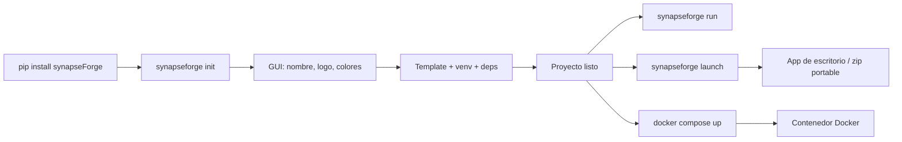

<p align="center">
  
</p>

---

<h1 align="center">
  
</h1>

---

<p align="center">
  <a href="./LICENSE">
    
  </a>
  &nbsp;
  <a href="https://link.mercadopago.com.ar/synapseforge">
    
  </a>
</p>

---

<h3 align="center">Forjá agentes. Distribuí inteligencia.</h3>

---

<p align="center">
  Una fábrica open-source para crear, equipar, ejecutar y distribuir agentes de IA autónomos.

---

<p align="center">
  <sub>CLI · Fábrica de Agentes · Distribución</sub>
</p>
</p>

---

```
    FORJAR             EQUIPAR           EJECUTAR         DISTRIBUIR
    ───────          ───────           ─────────        ──────────
    Agentes          Permisos          AgentLoop        Docker
    Skills           Proveedores       Tool calling     App de escritorio
    Tools            Modelos           RAG search       Zip portable
    Conocimiento                     Memoria           Listo para usar
                                     Streaming SSE
```

---

## ¿Qué es synapseForge?

La mayoría de las herramientas de agentes de IA te dan piezas y reglas. synapseForge te da la forja.

No armás un agente. Forjás un sistema.

synapseForge parte de una idea simple: los agentes deben construirse como sistemas, no armarse desde prompts.

Definí tus agentes, equipalos con skills y tools, conectalos a tus fuentes de datos, y distribuí una aplicación autónoma — desde `pip install` hasta un build distribuible (Docker, app de escritorio o zip portable).

### Una fábrica que se extiende a sí misma

Creá agentes, skills y tools a través de un flujo asistido por LLM. synapseForge no solo ejecuta agentes — puede crear las capacidades que necesitan.

---

## Cómo funciona

### Vos construís

- **Agentes** — definí roles, permisos y comportamiento en archivos `.md`
- **Skills** — paquetes de conocimiento estructurado con referencias y frontmatter
- **Tools** — nativos (filesystem, web, shell, email) o archivos `.py` externos
- **Colecciones RAG** — subí archivos y páginas web, indexados con embeddings vectoriales

### La fábrica

La fábrica transforma esas definiciones en sistemas autónomos.

- **Motor de permisos** — deny-by-default, por agente, con wildcards y grupos
- **Agent loop** — razonamiento iterativo → tool calling → ejecución → continuación, con streaming SSE
- **Memoria** — indexación persistente de conversaciones y recuperación cross-sesión
- **LLM multi-proveedor** — Ollama (local), Groq, Google Gemini, OpenRouter
- **Integración MCP** — conectá servidores de herramientas externos vía Model Context Protocol
- **Scheduler** — ejecutá prompts en un schedule, notificá vía UI y Telegram

### Vos distribuís

```bash
synapseforge init my-project      # scaffolding con GUI
synapseforge run .                # desarrollo local
synapseforge launch -n my-app     # app de escritorio / zip portable
docker compose up --build -d      # o desplegá con Docker
```

El resultado es una distribución de aplicación autónoma. Elegí la modalidad que te convenga: un contenedor **Docker** (autocontenido o solo backend), una **app de escritorio** (Python embebido + launcher nativo) o un **zip portable** listo para entregar a quien quieras.

---

## Inicio rápido

> Actualmente disponible en [TestPyPI](https://test.pypi.org/project/synapseforge/).

```bash
pip install synapseForge

# Crear un proyecto (GUI interactiva)
synapseforge init my-project
cd my-project

# Iniciar en modo desarrollo
synapseforge run .
```

En el primer inicio, configurá una API key de cualquier proveedor cloud soportado ([OpenRouter](https://openrouter.ai/settings/keys), [Google Gemini](https://aistudio.google.com/apikey) o [Groq](https://console.groq.com/keys) — todos con free tier) y presioná **Apply**. Ollama es opcional. La base de conocimiento requiere una key de OpenRouter.

---

## CLI

| Comando | Qué hace |
|---------|----------|
| `synapseforge init [dir]` | Crear un proyecto con GUI interactiva |
| `synapseforge launch -p <path> -n <name>` | Construir una app de escritorio / zip de distribución portable |
| `synapseforge colors [dir]` | Editar colores del proyecto en vivo |
| `synapseforge run [dir]` | Iniciar servidores de desarrollo |



---

## Arquitectura

### Backend

Aplicación FastAPI con routers REST/SSE. El framework de agentes vive en `backend/agent/`: AgentLoop con tool calling nativo, registro de tools (nativos + externos + MCP), sesiones SQLite, permisos por agente, skills, RAG (ChromaDB) y memoria de largo plazo.

**Tools nativos**: `read`, `write`, `edit`, `glob`, `grep`, `list_dir`, `webfetch`, `websearch`, `shell`, `task` (delegación a sub-agentes), `skill`, `reference`, `rag`, `search_memory`, `check_email`, `send_email`, `help`.

### Frontend

SPA React/Vite/TypeScript con Tailwind v4 y shadcn/ui. Multi-página: chat, creación de skills, gestión de RAG, documentación. Streaming SSE, visualización de tool calls, indicador de contexto, tareas programadas, dashboard de métricas, toggle de Telegram.

### Proveedores

| Proveedor | Tipo | Notas |
|-----------|------|-------|
| Ollama | Local | Opcional, requiere instalación local |
| Groq | Cloud | Free tier |
| Google Gemini | Cloud | Free tier |
| Gemini Embedding 2 | Cloud | Free tier, requerido para embeddings de RAG |

Las API keys se validan al guardar y se almacenan encriptadas (Fernet) en SQLite. No se necesitan variables de entorno.

### Base de conocimiento (RAG)

ChromaDB con embeddings de Gemini Embedding 2 (`gemini-embedding-exp-02-05`). Subí archivos y páginas web — el contenido se extrae, chunking y se indexa para recuperación semántica. Memoria de largo plazo: cada turno de conversación se indexa automáticamente y se puede buscar cross-sesión vía `search_memory`.

### Telegram

Control remoto del agente. Mandá mensajes, cambiá modelos, creá skills/tools, administrá tareas programadas — todo vía Telegram. El bot conecta al mismo flujo de chat que usa el frontend.

### Tareas programadas

Definí tareas (prompt + hora + días) desde la UI o Telegram. El backend las ejecuta con el modelo seleccionado y notifica vía la UI y Telegram.

---

## Estructura del proyecto

```plaintext
synapseForge/
├─ synapseforge/              # CLI + GUIs tkinter
├─ pipeline/                  # Init (template) + Launch (forja)
├─ backend/                   # FastAPI + Framework de Agentes
│  ├─ agent/                  #   AgentLoop, Tools, Sesiones, Permisos
│  ├─ routes/                 #   Endpoints API
│  └─ telegram/               #   Bot de Telegram
├─ frontend/                  # SPA React/Vite/TypeScript
├─ template/                  # Template de proyecto (usado por init)
├─ tests/                     # Suite E2E declarativa (YAML)
└─ pyproject.toml             # Config del paquete
```

---

## Configuración del usuario

```plaintext
~/.config/synapseForge/
├─ skills/            # Skills instalados
├─ tools/             # Tools custom (.py)
├─ agents/            # Definiciones de agentes (.md)
├─ knowledge/         # Colecciones RAG (ChromaDB)
├─ mcp.json           # Servidores MCP
└─ config.yaml        # Permisos del router (opcional)
```

---

## Testing

Suite E2E declarativa en `tests/e2e/`. Escenarios YAML que manejan el backend real — chat vía SSE, llamadas API directas — validando contratos y estructura.

```bash
python -m tests.e2e.runner                # todos los escenarios
python -m tests.e2e.runner --only rag     # filtrar por nombre
```

---

## Docker

Desplegá la app como contenedor. Hay dos targets disponibles en `docker-compose.yml`:

- **`app`** — autocontenido: compila el frontend y lo sirve desde el backend en un solo contenedor.
- **`backend`** — solo backend, para despliegues separados (ej. ACI).

```bash
docker compose up --build -d
# App en http://localhost:8000
```

---

## Tech Stack

[](https://www.python.org/)
[](https://fastapi.tiangolo.com/)
[](https://www.sqlite.org/)
[](https://www.trychroma.com/)
[](https://react.dev/)
[](https://www.typescriptlang.org/)
[](https://vite.dev/)
[](https://tailwindcss.com/)
[](https://ui.shadcn.com/)
[](https://nodejs.org/)
[](https://pyinstaller.org/)
[](https://www.docker.com/)
[](https://telegram.org/)
[](https://pypi.org/)
[](https://groq.com/)
[](https://ai.google.dev/)
[](https://openrouter.ai/)
[](https://ollama.com/)

---

## Apoyá este proyecto

synapseForge es free y open source. Si te resulta útil, considerá apoyar su desarrollo con una [donación vía Mercado Pago](https://link.mercadopago.com.ar/synapseforge).

---

## Licencia

Este proyecto está licenciado bajo los términos especificados en el archivo [LICENSE](./LICENSE).

---

Copyright (c) 2026 SYNAPSE AI SAS

---

*The forge is heating up...*
