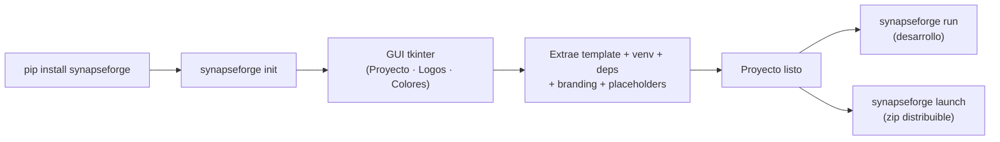

<p align="center">
  
</p>

---

<h1 align="center">synapseForge</h1>

---

<p align="center">
  <a href="./LICENSE">
    
  </a>
</p>

---

<h3 align="center">CLI + Framework + Template para crear y distribuir proyectos de agentes IA full-stack</h3>

---

## Descripción

**synapseForge** es un paquete PyPI que provee un CLI para scaffoldear y distribuir proyectos de agentes IA desde cero. Incluye:

1. **CLI** (`synapseforge init`, `launch`, `colors`, `run`) — scaffolding con GUI tkinter + build de distribución + editor de colores en vivo + servidor de desarrollo.
2. **Framework de agentes** (`backend/agent/`) — AgentLoop, Tools Registry (nativas + externas + MCP), Sessions (SQLite WAL), Permissions, Skills, RAG, MCP.
3. **Template de proyecto** embebido (`pipeline/template.zip`) — backend FastAPI + frontend React/Vite/TypeScript.
4. **Docker** — `Dockerfile` multi-stage + `docker-compose.yml`.

### ✨ Características Principales

- **Scaffolding completo**: `synapseforge init` crea el proyecto desde un template embebido con GUI interactiva — estructura, venv, logos, `.ico`, colores y reemplazo de placeholders.
- **Distribución autocontenida**: `synapseforge launch` genera un zip listo para entregar (PyInstaller + Python embebido + frontend compilado).
- **Multi-provider LLM**: LOCAL (Ollama, opcional), Groq, Google Gemini y OpenRouter. API keys cloud gestionadas desde el panel de configuración, validadas contra la API de cada proveedor y guardadas cifradas en SQLite. Pantalla inicial de configuración saltable: sin ningún provider configurado la app queda bloqueada hasta cargar una key. Parámetros avanzados (temperature, top_p, reasoning) configurables por modelo desde el panel de configuración, con opción "Default" que usa los valores de cada agente.
- **Framework de agentes completo**: AgentLoop con tool calling nativo, tools registry (nativas + externas + MCP), permisos por agente (allow/deny/ask + wildcards), skills y sub-agentes con delegación por `task`.
- **RAG**: colecciones vectoriales en ChromaDB con embeddings en OpenRouter (`liquid/lfm-2.5-embedding-350m:free`). Subida de archivos y páginas web, chunking con overlap y búsqueda por similitud coseno. Requiere API key de OpenRouter (capa gratis). Memoria de largo plazo: cada turno se indexa automáticamente y todos los agentes pueden buscar en conversaciones pasadas con la tool `search_memory`.
- **Creación asistida por LLM**: interfaces standalone para crear skills, tools y agentes mediante entrevista iterativa + agente creador, con selección efímera de modelo cloud por tarea.
- **Telegram como control remoto**: el bot emite eventos al event bus y el frontend ejecuta el mismo flujo de chat. Comandos de sesión, modelo/proveedor, creación de skills/tools/RAG y gestión de la agenda.
- **Tareas programadas**: el usuario define tareas (descripción + hora + días) desde la Agenda del header o por Telegram; el backend las ejecuta con el modelo seleccionado y notifica el resultado en la campanita de la UI y por Telegram (siempre, aunque el bot esté deshabilitado).
- **Archivos de contexto**: subida de documentos (PDF, Word, TXT, MD, CSV, JSON, YAML, XML, PY) → extracción de texto → inyección en el system prompt del agente.
- **Métricas de uso**: sesiones, tools, modelos, errores y overview, con dashboard en el frontend.
- **Modo desktop app**: heartbeat watchdog + endpoint de shutdown para distribuir la app como producto.

---

## ¿Qué resuelve?

- **Scaffolding repetitivo**: Un solo comando crea el proyecto completo con la estructura estándar de todos los proyectos SYNAPSE.
- **Configuración centralizada**: GUI interactiva que reemplaza todos los placeholders XML del proyecto (empresa, cliente, colores, logo, etc.).
- **Branding automatizado**: Copia de logos + generación de `.ico` + extracción de paleta de colores desde la imagen.
- **Distribución sin dependencias**: Build autocontenido listo para entregar al cliente — incluye Python embebido, frontend estático, launcher nativo.

---

## Inicio rápido

```bash
pip install synapseforge

# Crear un proyecto (GUI interactiva)
synapseforge init mi-proyecto
cd mi-proyecto

# Levantar en desarrollo (requiere venv activado)
synapseforge run .
```

Al primer arranque aparece la pantalla de configuración: cargá una API key de algún proveedor cloud ([OpenRouter](https://openrouter.ai/settings/keys), [Google Gemini](https://aistudio.google.com/apikey) o [Groq](https://console.groq.com/keys) — todos con capa gratis) y aprieta **Aplicar**. Ollama es opcional (solo si querés modelos locales). La **fuente de conocimiento** necesita específicamente una key de OpenRouter.

---

## CLI — Comandos

| Comando | Descripción |
|---------|-------------|
| `synapseforge init [dir]` | Crea proyecto desde template con GUI interactiva |
| `synapseforge launch -p <path> -n <exe> [--skip-frontend] [--no-embed] [-c]` | Build de distribución autocontenida (zip). Con `-c` compila el backend a `.pyc`; por defecto empaqueta los `.py` |
| `synapseforge colors [dir]` | Editor GUI para `frontend/public/colors.json` (cambios en vivo sin rebuild) |
| `synapseforge run [dir]` | Levanta uvicorn --reload + npm run dev + abre browser |
| `synapseforge --help` | Ayuda global |

- **`init`**: pipeline de 10 pasos (input GUI → template → venv → deps → logos → `.ico` → colores → config → placeholders).
- **`launch`**: compila backend (PyInstaller), build del frontend, descarga Python embebido, genera launcher nativo y empaqueta todo en un zip.
- **`run`**: requiere el venv activado (`VIRTUAL_ENV`). Ctrl+C mata ambos servidores.



---

## Estructura del proyecto

```plaintext
synapseForge/
│
├─ synapseforge/                 # Paquete Python — CLI instalable via pip
│  ├─ cli/main.py                #   Parser CLI: init | launch | colors | run
│  └─ tk/                        #   GUIs tkinter (init, colors)
│
├─ pipeline/                     # Código fuente de init y launch
│  ├─ template.zip               #   Template del proyecto (embebido)
│  ├─ init/                      #   Init: input, template, venv, config, logo, placeholders
│  └─ launch/                    #   Launch: PyInstaller, npm build, zip
│
├─ backend/                      # Fuente del template — backend FastAPI
│  ├─ main.py                    #   App FastAPI: CORS, lifespan, routers, health, SPA static
│  ├─ instances.py               #   Singletons: agent, session_manager
│  ├─ event_bus.py               #   Event bus (SSE) para Telegram ↔ Frontend
│  ├─ routes/                    #   Endpoints API (chat SSE, create, config, sessions, rag, metrics…)
│  └─ agent/                     #   Framework de agentes
│     ├─ agent.py                #   Agent class (multi-provider, streaming SSE, tool calling)
│     ├─ loop.py                 #   AgentLoop: LLM → tool_calls → execute → continue
│     ├─ tools.py                #   Registry: nativas + externas (~/.config/synapseForge/tools/) + MCP
│     ├─ session.py              #   SessionManager (SQLite WAL, historial, config_kv)
│     ├─ permissions.py          #   Permisos por agente (tool/skill/task/rag + wildcards)
│     ├─ ddl_setup.py            #   Inicialización tablas SQLite
│     ├─ prompts/                #   System prompt, mandatory, help, creación de skills
│     └─ utils/                  #   Helpers: MCP, RAG/vector_db, skill_loader, model_resolver…
│
├─ frontend/                     # Fuente del template — frontend React/Vite/TS
│  ├─ public/docs.html           #   Documentación del producto (usuario final)
│  └─ src/
│     ├─ components/             #   Chat, Sidebar, configTab, RagInterface, SkillInterface…
│     └─ services/               #   Clientes API (chatService SSE, configService, …)
│
├─ store/                        # Store de tools y skills instalables
├─ on_boarding/                  # Onboarding para desarrolladores
├─ cicd/                         # CI/CD
├─ tests/                        # Tests
├─ .commands/                    # Comandos locales PowerShell
├─ .github/                      # Workflows y PR template
│
├─ Dockerfile                    # Multi-stage: Node 20 build → Python 3.12 slim runtime
├─ docker-compose.yml            # Servicio app: puerto 8000, VITE_MODE=prod
├─ pyproject.toml                # Build config, entry point synapseforge
└─ requirements.txt              # Dependencias de desarrollo del repo
```

---

## Backend — Framework de Agentes

El template incluye un framework completo de agentes en `backend/agent/`: AgentLoop con streaming SSE y tool calling nativo, registro de tools (nativas, externas desde `~/.config/synapseForge/tools/` y servidores MCP vía SDK oficial), gestión de sesiones en SQLite (WAL), sistema de permisos por agente y skills cargadas como contexto.

**Tools nativas**: `read`, `write`, `edit`, `glob`, `grep`, `webfetch`, `websearch`, `shell`, `list_dir`, `task` (delegación a sub-agentes), `skill`, `reference`, `rag`, `check_email`, `send_email`, `help`.

### Configuración de usuario (`~/.config/synapseForge/`)

```
~/.config/synapseForge/
├── skills/                 # Skills instaladas (SKILL.md + references/)
├── tools/                  # Tools personalizadas (.py con TOOL_NAME, execute())
├── agents/                 # Agentes (.md con frontmatter YAML + permisos) + AGENT.md
├── knowledge/              # Colecciones RAG (ChromaDB)
├── mcp.json                # Servidores MCP
└── config.yaml             # Permisos del router (opcional)
```

**Formato agente (`.md` en `agents/`):**
```markdown
---
name: "Mi Agente"
description: "Qué hace y cuándo usarlo"
permission:
  read: allow
  task:
    explorador: allow
  skill:
    mi_skill: allow
  rag:
    mi_coleccion: allow
parameters:
  temperature: 0.0
  top_p: 0.5
  model: null
---
# System prompt del agente (cuerpo del markdown)
```

- **AGENT.md**: comportamiento general inyectado como sección `## Behavior` en el system prompt de todos los agentes (compatibilidad con opencode/claude code).
- **`## MANDATORY:`**: reglas de fidelidad inyectadas al final del system prompt de todos los agentes.
- **Permisos del router**: si existe `config.yaml` se usan solo sus permisos explícitos; si no, el router queda solo con `task` (delegación siempre disponible).

### Providers y modelos

Los proveedores soportados son **LOCAL** (Ollama, opcional), **GROQ**, **GOOGLE** (Gemini) y **OPENROUTER**. Las API keys cloud se gestionan desde el panel de Configuración (**Providers**): se validan contra la API de cada proveedor al guardarlas y se almacenan cifradas en la SQLite interna. Al guardar una key válida, el provider queda disponible de inmediato en los selectores; un provider solo aparece si tiene key guardada — para LOCAL basta con que Ollama responda.

El modelo se elige explícitamente: al primer arranque (o si no hay ningún provider disponible) aparece la pantalla inicial de configuración, saltable. Sin ningún provider configurado el chat y los creadores quedan bloqueados hasta cargar una key válida.

La ventana de contexto en tokens del modelo seleccionado se detecta y persiste automáticamente, y el frontend muestra un gauge con el porcentaje usado.

En las pantallas de creación (skill, tool y agente) se puede elegir con qué modelo cloud se genera el elemento (proveedor + modelo + Aplicar). La selección es efímera: vale solo para esa tarea mientras la pestaña está abierta.

### Fuente de conocimiento (RAG)

Las colecciones RAG usan embeddings en la nube vía OpenRouter (`liquid/lfm-2.5-embedding-350m:free`, capa gratis). Para usar esta sección hace falta una API key de OpenRouter cargada en **Providers**: sin ella, la fuente de conocimiento queda deshabilitada (el resto de la app funciona normalmente).

---

## Frontend

SPA React/Vite/TypeScript con Tailwind v4 y shadcn/ui, **multi-page**: chat principal, creación de skills, gestión de RAG y documentación de usuario (`docs.html`). Incluye chat con streaming SSE y visualización de tool calls, sidebar con conversaciones/configuración/panel de agentes, gauge de ventana de contexto, Agenda de tareas programadas con campanita de notificaciones, dashboard de métricas y toggle de Telegram.

El sistema de colores es dual: build-time (placeholders XML reemplazados por el pipeline) + runtime (`frontend/public/colors.json` cargado antes de renderizar). `synapseforge colors` edita los colores en vivo sin rebuild.

---

## Telegram

Bot de Telegram como control remoto del agente: hace long-polling contra la Telegram Bot API y actúa como puente — publica los mensajes en el event bus, el frontend corre el flujo normal de chat y el backend devuelve la respuesta final a Telegram. Soporta comandos de sesión (`/sesiones`, `/usar`, `/nueva`, `/borrar`), modelo/proveedor (`/modelo`, `/proveedor`), control (`/detener`, `/contexto`, `/actual`), creación de skills/tools/RAG (`/crear`), envío de archivos (`/archivo`) y gestión de la agenda (`/agenda`, `/agendar`, `/horario`, `/eliminar_tarea`), además de notas de voz (transcripción local con faster-whisper) y adjuntos. Las ejecuciones de tareas programadas se notifican por Telegram siempre, independientemente de si el bot está habilitado para trabajar.

| Variable | Descripción |
|----------|-------------|
| `TELEGRAM_BOT_TOKEN` | Token del bot (de BotFather). Si no está seteado, el bot queda deshabilitado. |
| `TELEGRAM_ALLOWED_CHAT_IDS` | Lista de `chat_id` autorizados (separados por coma). |

---

## Docker

`Dockerfile` multi-stage (Node 20 build del frontend → runtime Python 3.12 slim) + `docker-compose.yml`. El backend sirve el frontend estático automáticamente y expone healthcheck en `/health`.

```bash
docker compose up --build -d
# App disponible en http://localhost:8000
```

---

## Integración futura — Skills Vercel

Está planificada la integración con el ecosistema de [Vercel Skills](https://github.com/vercel-labs/skills) (`npx skills`), que permite buscar, instalar y gestionar skills desde repositorios públicos. El flujo planeado funciona en dos etapas:

1. **Búsqueda**: ejecutar `npx skills find <query>` para descubrir skills disponibles en el ecosistema.
2. **Evaluación/Instalación**: un LLM evalúa los resultados contra la necesidad del usuario, y si corresponde, instala la skill desde el source.

Esto permitiría ampliar el repositorio de skills sin tener que crearlas manualmente, aprovechando el ecosistema abierto de agent skills.

---

## Documentación

| Documento | Contenido |
|---|---|
| `frontend/public/docs.html` | Documentación del producto para el usuario final (servida por la app) |
| `on_boarding/` | Guía de onboarding, contribución y flujo Git |
| `docs/` | Documentación técnica del proyecto (no trackeada) |

---

## Stack Tecnológico

[![Python](https://img.shields.io/badge/Python-3.12%2B-3776ab?labelColor=555&logo=data:image/svg%2bxml;base64,PHN2ZyB4bWxucz0iaHR0cDovL3d3dy53My5vcmcvMjAwMC9zdmciIHZpZXdCb3g9IjAgMCAxMjggMTI4Ij48bGluZWFyR3JhZGllbnQgaWQ9InB5dGhvbi1vcmlnaW5hbC1hIiBncmFkaWVudFVuaXRzPSJ1c2VyU3BhY2VPblVzZSIgeDE9IjcwLjI1MiIgeTE9IjEyMzcuNDc2IiB4Mj0iMTcwLjY1OSIgeTI9IjExNTEuMDg5IiBncmFkaWVudFRyYW5zZm9ybT0ibWF0cml4KC41NjMgMCAwIC0uNTY4IC0yOS4yMTUgNzA3LjgxNykiPjxzdG9wIG9mZnNldD0iMCIgc3RvcC1jb2xvcj0iIzVBOUZENCIvPjxzdG9wIG9mZnNldD0iMSIgc3RvcC1jb2xvcj0iIzMwNjk5OCIvPjwvbGluZWFyR3JhZGllbnQ+PGxpbmVhckdyYWRpZW50IGlkPSJweXRob24tb3JpZ2luYWwtYiIgZ3JhZGllbnRVbml0cz0idXNlclNwYWNlT25Vc2UiIHgxPSIyMDkuNDc0IiB5MT0iMTA5OC44MTEiIHgyPSIxNzMuNjIiIHkyPSIxMTQ5LjUzNyIgZ3JhZGllbnRUcmFuc2Zvcm09Im1hdHJpeCguNTYzIDAgMCAtLjU2OCAtMjkuMjE1IDcwNy44MTcpIj48c3RvcCBvZmZzZXQ9IjAiIHN0b3AtY29sb3I9IiNGRkQ0M0IiLz48c3RvcCBvZmZzZXQ9IjEiIHN0b3AtY29sb3I9IiNGRkU4NzMiLz48L2xpbmVhckdyYWRpZW50PjxwYXRoIGZpbGw9InVybCgjcHl0aG9uLW9yaWdpbmFsLWEpIiBkPSJNNjMuMzkxIDEuOTg4Yy00LjIyMi4wMi04LjI1Mi4zNzktMTEuOCAxLjAwNy0xMC40NSAxLjg0Ni0xMi4zNDYgNS43MS0xMi4zNDYgMTIuODM3djkuNDExaDI0LjY5M3YzLjEzN0gyOS45NzdjLTcuMTc2IDAtMTMuNDYgNC4zMTMtMTUuNDI2IDEyLjUyMS0yLjI2OCA5LjQwNS0yLjM2OCAxNS4yNzUgMCAyNS4wOTYgMS43NTUgNy4zMTEgNS45NDcgMTIuNTE5IDEzLjEyNCAxMi41MTloOC40OTFWNjcuMjM0YzAtOC4xNTEgNy4wNTEtMTUuMzQgMTUuNDI2LTE1LjM0aDI0LjY2NWM2Ljg2NiAwIDEyLjM0Ni01LjY1NCAxMi4zNDYtMTIuNTQ4VjE1LjgzM2MwLTYuNjkzLTUuNjQ2LTExLjcyLTEyLjM0Ni0xMi44MzctNC4yNDQtLjcwNi04LjY0NS0xLjAyNy0xMi44NjYtMS4wMDh6TTUwLjAzNyA5LjU1N2MyLjU1IDAgNC42MzQgMi4xMTcgNC42MzQgNC43MjEgMCAyLjU5My0yLjA4MyA0LjY5LTQuNjM0IDQuNjktMi41NiAwLTQuNjMzLTIuMDk3LTQuNjMzLTQuNjktLjAwMS0yLjYwNCAyLjA3My00LjcyMSA0LjYzMy00LjcyMXoiIHRyYW5zZm9ybT0idHJhbnNsYXRlKDAgMTAuMjYpIi8+PHBhdGggZmlsbD0idXJsKCNweXRob24tb3JpZ2luYWwtYikiIGQ9Ik05MS42ODIgMjguMzh2MTAuOTY2YzAgOC41LTcuMjA4IDE1LjY1NS0xNS40MjYgMTUuNjU1SDUxLjU5MWMtNi43NTYgMC0xMi4zNDYgNS43ODMtMTIuMzQ2IDEyLjU0OXYyMy41MTVjMCA2LjY5MSA1LjgxOCAxMC42MjggMTIuMzQ2IDEyLjU0NyA3LjgxNiAyLjI5NyAxNS4zMTIgMi43MTMgMjQuNjY1IDAgNi4yMTYtMS44MDEgMTIuMzQ2LTUuNDIzIDEyLjM0Ni0xMi41NDd2LTkuNDEySDYzLjkzOHYtMy4xMzhoMzcuMDEyYzcuMTc2IDAgOS44NTItNS4wMDUgMTIuMzQ4LTEyLjUxOSAyLjU3OC03LjczNSAyLjQ2Ny0xNS4xNzQgMC0yNS4wOTYtMS43NzQtNy4xNDUtNS4xNjEtMTIuNTIxLTEyLjM0OC0xMi41MjFoLTkuMjY4ek03Ny44MDkgODcuOTI3YzIuNTYxIDAgNC42MzQgMi4wOTcgNC42MzQgNC42OTIgMCAyLjYwMi0yLjA3NCA0LjcxOS00LjYzNCA0LjcxOS0yLjU1IDAtNC42MzMtMi4xMTctNC42MzMtNC43MTkgMC0yLjU5NSAyLjA4My00LjY5MiA0LjYzMy00LjY5MnoiIHRyYW5zZm9ybT0idHJhbnNsYXRlKDAgMTAuMjYpIi8+PHJhZGlhbEdyYWRpZW50IGlkPSJweXRob24tb3JpZ2luYWwtYyIgY3g9IjE4MjUuNjc4IiBjeT0iNDQ0LjQ1IiByPSIyNi43NDMiIGdyYWRpZW50VHJhbnNmb3JtPSJtYXRyaXgoMCAtLjI0IC0xLjA1NSAwIDUzMi45NzkgNTU3LjU3NikiIGdyYWRpZW50VW5pdHM9InVzZXJTcGFjZU9uVXNlIj48c3RvcCBvZmZzZXQ9IjAiIHN0b3AtY29sb3I9IiNCOEI4QjgiIHN0b3Atb3BhY2l0eT0iLjQ5OCIvPjxzdG9wIG9mZnNldD0iMSIgc3RvcC1jb2xvcj0iIzdGN0Y3RiIgc3RvcC1vcGFjaXR5PSIwIi8+PC9yYWRpYWxHcmFkaWVudD48cGF0aCBvcGFjaXR5PSIuNDQ0IiBmaWxsPSJ1cmwoI3B5dGhvbi1vcmlnaW5hbC1jKSIgZD0iTTk3LjMwOSAxMTkuNTk3YzAgMy41NDMtMTQuODE2IDYuNDE2LTMzLjA5MSA2LjQxNi0xOC4yNzYgMC0zMy4wOTItMi44NzMtMzMuMDkyLTYuNDE2IDAtMy41NDQgMTQuODE1LTYuNDE3IDMzLjA5Mi02LjQxNyAxOC4yNzUgMCAzMy4wOTEgMi44NzIgMzMuMDkxIDYuNDE3eiIvPjwvc3ZnPgo=)](https://www.python.org/)
[](https://fastapi.tiangolo.com/)
[![SQLite](https://img.shields.io/badge/SQLite-3-003b57?labelColor=555&logo=data:image/svg%2bxml;base64,PHN2ZyB2aWV3Qm94PSIwIDAgMTI4IDEyOCIgeG1sbnM9Imh0dHA6Ly93d3cudzMub3JnLzIwMDAvc3ZnIj48ZGVmcz48bGluZWFyR3JhZGllbnQgaWQ9InNxbGl0ZS1vcmlnaW5hbC1hIiB4MT0iLTE1LjYxNSIgeDI9Ii02Ljc0MSIgeTE9Ii05LjEwOCIgeTI9Ii05LjEwOCIgZ3JhZGllbnRUcmFuc2Zvcm09InJvdGF0ZSg5MCAtOTAuNDg2IDY0LjYzNCkgc2NhbGUoOS4yNzEyKSIgZ3JhZGllbnRVbml0cz0idXNlclNwYWNlT25Vc2UiPjxzdG9wIHN0b3AtY29sb3I9IiM5NWQ3ZjQiIG9mZnNldD0iMCIvPjxzdG9wIHN0b3AtY29sb3I9IiMwZjdmY2MiIG9mZnNldD0iLjkyIi8+PHN0b3Agc3RvcC1jb2xvcj0iIzBmN2ZjYyIgb2Zmc2V0PSIxIi8+PC9saW5lYXJHcmFkaWVudD48L2RlZnM+PHBhdGggZD0iTTY5LjUgOTkuMTc2Yy0uMDU5LS43My0uMDk0LTEuMi0uMDk0LTEuMlM2Ny4yIDgzLjA4NyA2NC41NyA3OC42NDJjLS40MTQtLjcwNy4wNDMtMy41OTQgMS4yMDctNy44OC42OCAxLjE2OSAzLjU0IDYuMTkyIDQuMTE4IDcuODEuNjQ4IDEuODI0Ljc4IDIuMzQ3Ljc4IDIuMzQ3cy0xLjU3LTguMDgyLTQuMTQ0LTEyLjc5N2ExNjIuMjg2IDE2Mi4yODYgMCAwMTIuMDA0LTYuMjY1Yy45NzMgMS43MSAzLjMxMyA1Ljg1OSAzLjgyOCA3LjMuMTAyLjI5My4xOTIuNTQzLjI3Ljc3NC4wMjMtLjEzNy4wNS0uMjc0LjA3NC0uNDE0LS41OS0yLjUwNC0xLjc1LTYuODYtMy4zMzYtMTAuMDgyIDMuNTItMTguMzI4IDE1LjUzMS00Mi44MjQgMjcuODQtNTMuNzU0SDE2LjljLTUuMzg3IDAtOS43ODkgNC40MDYtOS43ODkgOS43ODl2ODguNTdjMCA1LjM4MyA0LjQwNiA5Ljc4OSA5Ljc5IDkuNzg5aDUyLjg5N2ExMTguNjU3IDExOC42NTcgMCAwMS0uMjk3LTE0LjY1MiIgZmlsbD0iIzBiN2ZjYyIvPjxwYXRoIGQ9Ik02NS43NzcgNzAuNzYyYy42OCAxLjE2OCAzLjU0IDYuMTg4IDQuMTE3IDcuODA5LjY0OSAxLjgyNC43ODEgMi4zNDcuNzgxIDIuMzQ3cy0xLjU3LTguMDgyLTQuMTQ0LTEyLjc5N2ExNjQuNTM1IDE2NC41MzUgMCAwMTIuMDA0LTYuMjdjLjg4NyAxLjU2NyAyLjkyMiA1LjE2OSAzLjY1MiA2Ljg3MmwuMDgyLS45NjFjLS42NDgtMi40OTYtMS42MzMtNS43NjYtMi44OTgtOC4zMjggMy4yNDItMTYuODcxIDEzLjY4LTM4Ljk3IDI0LjkyNi01MC44OThIMTYuODk5YTYuOTQgNi45NCAwIDAwLTYuOTM0IDYuOTMzdjgyLjExYzE3LjUyNy02LjczMSAzOC42NjQtMTIuODggNTYuODU1LTEyLjYxNC0uNjcyLTIuNjA1LTEuNDQxLTQuOTYtMi4yNS02LjMyNC0uNDE0LS43MDcuMDQzLTMuNTk3IDEuMjA3LTcuODc5IiBmaWxsPSJ1cmwoI3NxbGl0ZS1vcmlnaW5hbC1hKSIvPjxwYXRoIGQ9Ik0xMTUuOTUgMi43ODFjLTUuNS00LjkwNi0xMi4xNjQtMi45MzMtMTguNzM0IDIuODk5YTQ0LjM0NyA0NC4zNDcgMCAwMC0yLjkxNCAyLjg1OWMtMTEuMjUgMTEuOTI2LTIxLjY4NCAzNC4wMjMtMjQuOTI2IDUwLjg5NSAxLjI2MiAyLjU2MyAyLjI1IDUuODMyIDIuODk0IDguMzI4LjE2OC42NC4zMiAxLjI0Mi40NDIgMS43NTQuMjg1IDEuMjA3LjQzNyAxLjk5Ni40MzcgMS45OTZzLS4xMDEtLjM4My0uNTE1LTEuNTgyYy0uMDc4LS4yMy0uMTY4LS40ODQtLjI3LS43NzMtLjA0My0uMTI1LS4xMDUtLjI3NC0uMTcyLS40MzQtLjczNC0xLjcwMy0yLjc2NS01LjMwNS0zLjY1Ni02Ljg2Ny0uNzYyIDIuMjUtMS40MzcgNC4zNi0yLjAwNCA2LjI2NSAyLjU3OCA0LjcxNSA0LjE0OSAxMi43OTcgNC4xNDkgMTIuNzk3cy0uMTM3LS41MjMtLjc4Mi0yLjM0N2MtLjU3OC0xLjYyMS0zLjQ0MS02LjY0LTQuMTE3LTcuODA5LTEuMTY0IDQuMjgxLTEuNjI1IDcuMTcyLTEuMjA3IDcuODguODA5IDEuMzYyIDEuNTc0IDMuNzIyIDIuMjUgNi4zMjMgMS41MjQgNS44NjcgMi41ODYgMTMuMDEyIDIuNTg2IDEzLjAxMnMuMDMxLjQ2OS4wOTQgMS4yYTExOC42NTMgMTE4LjY1MyAwIDAwLjI5NyAxNC42NTFjLjUwNCA2LjExIDEuNDUzIDExLjM2MyAyLjY2NCAxNC4xNzJsLjgyOC0uNDQ5Yy0xLjc4MS01LjUzNS0yLjUwNC0xMi43OTMtMi4xODgtMjEuMTU2LjQ4LTEyLjc5MyAzLjQyMi0yOC4yMTUgOC44NTYtNDQuMjg5IDkuMTkxLTI0LjI3IDIxLjkzOC00My43MzggMzMuNjAyLTUzLjAzNS0xMC42MzMgOS42MDItMjUuMDIzIDQwLjY4NC0yOS4zMzIgNTIuMTk1LTQuODIgMTIuODkxLTguMjM4IDI0Ljk4NC0xMC4zMDEgMzYuNTc0IDMuNTUtMTAuODYzIDE1LjA0Ny0xNS41MyAxNS4wNDctMTUuNTNzNS42MzctNi45NTggMTIuMjI3LTE2Ljg4OGMtMy45NS45MDMtMTAuNDMgMi40NDItMTIuNTk4IDMuMzUyLTMuMiAxLjM0NC00LjA2NyAxLjgtNC4wNjcgMS44czEwLjM3MS02LjMxMiAxOS4yNy05LjE3MWMxMi4yMzQtMTkuMjcgMjUuNTYyLTQ2LjY0OCAxMi4xNDEtNTguNjIxIiBmaWxsPSIjMDAzOTU2Ii8+PC9zdmc+Cg==)](https://www.sqlite.org/)
[](https://www.trychroma.com/)
[![React](https://img.shields.io/badge/React-18-61dafb?labelColor=555&logo=data:image/svg%2bxml;base64,PHN2ZyB4bWxucz0iaHR0cDovL3d3dy53My5vcmcvMjAwMC9zdmciIHZpZXdCb3g9IjAgMCAxMjggMTI4Ij48ZyBmaWxsPSIjNjFEQUZCIj48Y2lyY2xlIGN4PSI2NCIgY3k9IjY0IiByPSIxMS40Ii8+PHBhdGggZD0iTTEwNy4zIDQ1LjJjLTIuMi0uOC00LjUtMS42LTYuOS0yLjMuNi0yLjQgMS4xLTQuOCAxLjUtNy4xIDIuMS0xMy4yLS4yLTIyLjUtNi42LTI2LjEtMS45LTEuMS00LTEuNi02LjQtMS42LTcgMC0xNS45IDUuMi0yNC45IDEzLjktOS04LjctMTcuOS0xMy45LTI0LjktMTMuOS0yLjQgMC00LjUuNS02LjQgMS42LTYuNCAzLjctOC43IDEzLTYuNiAyNi4xLjQgMi4zLjkgNC43IDEuNSA3LjEtMi40LjctNC43IDEuNC02LjkgMi4zQzguMiA1MCAxLjQgNTYuNiAxLjQgNjRzNi45IDE0IDE5LjMgMTguOGMyLjIuOCA0LjUgMS42IDYuOSAyLjMtLjYgMi40LTEuMSA0LjgtMS41IDcuMS0yLjEgMTMuMi4yIDIyLjUgNi42IDI2LjEgMS45IDEuMSA0IDEuNiA2LjQgMS42IDcuMSAwIDE2LTUuMiAyNC45LTEzLjkgOSA4LjcgMTcuOSAxMy45IDI0LjkgMTMuOSAyLjQgMCA0LjUtLjUgNi40LTEuNiA2LjQtMy43IDguNy0xMyA2LjYtMjYuMS0uNC0yLjMtLjktNC43LTEuNS03LjEgMi40LS43IDQuNy0xLjQgNi45LTIuMyAxMi41LTQuOCAxOS4zLTExLjQgMTkuMy0xOC44cy02LjgtMTQtMTkuMy0xOC44ek05Mi41IDE0LjdjNC4xIDIuNCA1LjUgOS44IDMuOCAyMC4zLS4zIDIuMS0uOCA0LjMtMS40IDYuNi01LjItMS4yLTEwLjctMi0xNi41LTIuNS0zLjQtNC44LTYuOS05LjEtMTAuNC0xMyA3LjQtNy4zIDE0LjktMTIuMyAyMS0xMi4zIDEuMyAwIDIuNS4zIDMuNS45ek04MS4zIDc0Yy0xLjggMy4yLTMuOSA2LjQtNi4xIDkuNi0zLjcuMy03LjQuNC0xMS4yLjQtMy45IDAtNy42LS4xLTExLjItLjQtMi4yLTMuMi00LjItNi40LTYtOS42LTEuOS0zLjMtMy43LTYuNy01LjMtMTAgMS42LTMuMyAzLjQtNi43IDUuMy0xMCAxLjgtMy4yIDMuOS02LjQgNi4xLTkuNiAzLjctLjMgNy40LS40IDExLjItLjQgMy45IDAgNy42LjEgMTEuMi40IDIuMiAzLjIgNC4yIDYuNCA2IDkuNiAxLjkgMy4zIDMuNyA2LjcgNS4zIDEwLTEuNyAzLjMtMy40IDYuNi01LjMgMTB6bTguMy0zLjNjMS41IDMuNSAyLjcgNi45IDMuOCAxMC4zLTMuNC44LTcgMS40LTEwLjggMS45IDEuMi0xLjkgMi41LTMuOSAzLjYtNiAxLjItMi4xIDIuMy00LjIgMy40LTYuMnpNNjQgOTcuOGMtMi40LTIuNi00LjctNS40LTYuOS04LjMgMi4zLjEgNC42LjIgNi45LjIgMi4zIDAgNC42LS4xIDYuOS0uMi0yLjIgMi45LTQuNSA1LjctNi45IDguM3ptLTE4LjYtMTVjLTMuOC0uNS03LjQtMS4xLTEwLjgtMS45IDEuMS0zLjMgMi4zLTYuOCAzLjgtMTAuMyAxLjEgMiAyLjIgNC4xIDMuNCA2LjEgMS4yIDIuMiAyLjQgNC4xIDMuNiA2LjF6bS03LTI1LjVjLTEuNS0zLjUtMi43LTYuOS0zLjgtMTAuMyAzLjQtLjggNy0xLjQgMTAuOC0xLjktMS4yIDEuOS0yLjUgMy45LTMuNiA2LTEuMiAyLjEtMi4zIDQuMi0zLjQgNi4yek02NCAzMC4yYzIuNCAyLjYgNC43IDUuNCA2LjkgOC4zLTIuMy0uMS00LjYtLjItNi45LS4yLTIuMyAwLTQuNi4xLTYuOS4yIDIuMi0yLjkgNC41LTUuNyA2LjktOC4zem0yMi4yIDIxbC0zLjYtNmMzLjguNSA3LjQgMS4xIDEwLjggMS45LTEuMSAzLjMtMi4zIDYuOC0zLjggMTAuMy0xLjEtMi4xLTIuMi00LjItMy40LTYuMnpNMzEuNyAzNWMtMS43LTEwLjUtLjMtMTcuOSAzLjgtMjAuMyAxLS42IDIuMi0uOSAzLjUtLjkgNiAwIDEzLjUgNC45IDIxIDEyLjMtMy41IDMuOC03IDguMi0xMC40IDEzLTUuOC41LTExLjMgMS40LTE2LjUgMi41LS42LTIuMy0xLTQuNS0xLjQtNi42ek03IDY0YzAtNC43IDUuNy05LjcgMTUuNy0xMy40IDItLjggNC4yLTEuNSA2LjQtMi4xIDEuNiA1IDMuNiAxMC4zIDYgMTUuNi0yLjQgNS4zLTQuNSAxMC41LTYgMTUuNUMxNS4zIDc1LjYgNyA2OS42IDcgNjR6bTI4LjUgNDkuM2MtNC4xLTIuNC01LjUtOS44LTMuOC0yMC4zLjMtMi4xLjgtNC4zIDEuNC02LjYgNS4yIDEuMiAxMC43IDIgMTYuNSAyLjUgMy40IDQuOCA2LjkgOS4xIDEwLjQgMTMtNy40IDcuMy0xNC45IDEyLjMtMjEgMTIuMy0xLjMgMC0yLjUtLjMtMy41LS45ek05Ni4zIDkzYzEuNyAxMC41LjMgMTcuOS0zLjggMjAuMy0xIC42LTIuMi45LTMuNS45LTYgMC0xMy41LTQuOS0yMS0xMi4zIDMuNS0zLjggNy04LjIgMTAuNC0xMyA1LjgtLjUgMTEuMy0xLjQgMTYuNS0yLjUuNiAyLjMgMSA0LjUgMS40IDYuNnptOS0xNS42Yy0yIC44LTQuMiAxLjUtNi40IDIuMS0xLjYtNS0zLjYtMTAuMy02LTE1LjYgMi40LTUuMyA0LjUtMTAuNSA2LTE1LjUgMTMuOCA0IDIyLjEgMTAgMjIuMSAxNS42IDAgNC43LTUuOCA5LjctMTUuNyAxMy40eiIvPjwvZz48L3N2Zz4=)](https://react.dev/)
[![TypeScript](https://img.shields.io/badge/TypeScript-5-3178c6?labelColor=555&logo=data:image/svg%2bxml;base64,PHN2ZyB4bWxucz0iaHR0cDovL3d3dy53My5vcmcvMjAwMC9zdmciIHZpZXdCb3g9IjAgMCAxMjggMTI4Ij48cGF0aCBmaWxsPSIjZmZmIiBkPSJNMjIuNjcgNDdoOTkuNjd2NzMuNjdIMjIuNjd6Ii8+PHBhdGggZGF0YS1uYW1lPSJvcmlnaW5hbCIgZmlsbD0iIzAwN2FjYyIgZD0iTTEuNSA2My45MXY2Mi41aDEyNXYtMTI1SDEuNXptMTAwLjczLTVhMTUuNTYgMTUuNTYgMCAwMTcuODIgNC41IDIwLjU4IDIwLjU4IDAgMDEzIDRjMCAuMTYtNS40IDMuODEtOC42OSA1Ljg1LS4xMi4wOC0uNi0uNDQtMS4xMy0xLjIzYTcuMDkgNy4wOSAwIDAwLTUuODctMy41M2MtMy43OS0uMjYtNi4yMyAxLjczLTYuMjEgNWE0LjU4IDQuNTggMCAwMC41NCAyLjM0Yy44MyAxLjczIDIuMzggMi43NiA3LjI0IDQuODYgOC45NSAzLjg1IDEyLjc4IDYuMzkgMTUuMTYgMTAgMi42NiA0IDMuMjUgMTAuNDYgMS40NSAxNS4yNC0yIDUuMi02LjkgOC43My0xMy44MyA5LjlhMzguMzIgMzguMzIgMCAwMS05LjUyLS4xIDIzIDIzIDAgMDEtMTIuNzItNi42M2MtMS4xNS0xLjI3LTMuMzktNC41OC0zLjI1LTQuODJhOS4zNCA5LjM0IDAgMDExLjE1LS43M0w4MiAxMDFsMy41OS0yLjA4Ljc1IDEuMTFhMTYuNzggMTYuNzggMCAwMDQuNzQgNC41NGM0IDIuMSA5LjQ2IDEuODEgMTIuMTYtLjYyYTUuNDMgNS40MyAwIDAwLjY5LTYuOTJjLTEtMS4zOS0zLTIuNTYtOC41OS01LTYuNDUtMi43OC05LjIzLTQuNS0xMS43Ny03LjI0YTE2LjQ4IDE2LjQ4IDAgMDEtMy40My02LjI1IDI1IDI1IDAgMDEtLjIyLThjMS4zMy02LjIzIDYtMTAuNTggMTIuODItMTEuODdhMzEuNjYgMzEuNjYgMCAwMTkuNDkuMjZ6bS0yOS4zNCA1LjI0djUuMTJINTYuNjZ2NDYuMjNINDUuMTVWNjkuMjZIMjguODh2LTVhNDkuMTkgNDkuMTkgMCAwMS4xMi01LjE3QzI5LjA4IDU5IDM5IDU5IDUxIDU5aDIxLjgzeiIvPjwvc3ZnPg==)](https://www.typescriptlang.org/)
[](https://vite.dev/)
[](https://tailwindcss.com/)
[](https://ui.shadcn.com/)
[![Node.js](https://img.shields.io/badge/Node.js-20%2B-339933?labelColor=555&logo=data:image/svg%2bxml;base64,PHN2ZyB4bWxucz0iaHR0cDovL3d3dy53My5vcmcvMjAwMC9zdmciIHZpZXdCb3g9IjAgMCAxMjggMTI4Ij48cGF0aCBmaWxsPSJ1cmwoI2EpIiBkPSJNNjYuOTU4LjgyNWE2LjA3IDYuMDcgMCAwIDAtNi4wMzUgMEwxMS4xMDMgMjkuNzZjLTEuODk1IDEuMDcyLTIuOTYgMy4wOTUtMi45NiA1LjI0djU3Ljk4OGMwIDIuMTQzIDEuMTgzIDQuMTY3IDIuOTU4IDUuMjRsNDkuODIgMjguOTM0YTYuMDcgNi4wNyAwIDAgMCA2LjAzNiAwbDQ5LjgyLTI4LjkzNWMxLjg5NC0xLjA3MiAyLjk1OC0zLjA5NiAyLjk1OC01LjI0VjM1YzAtMi4xNDQtMS4xODMtNC4xNjctMi45NTgtNS4yNHoiLz48cGF0aCBmaWxsPSJ1cmwoI2IpIiBkPSJNMTE2Ljg5NyAyOS43NiA2Ni44NDEuODI1QTguMTYxIDguMTYxIDAgMCAwIDY1LjMwMi4yM0w5LjIxIDk2Ljc5OGE2LjI1MSA2LjI1MSAwIDAgMCAxLjY1NyAxLjQzbDUwLjA1NyAyOC45MzRjMS40Mi44MzMgMy4wNzYgMS4wNzIgNC42MTUuNTk1bDUyLjY2LTk2LjkyNWEzLjcwMiAzLjcwMiAwIDAgMC0xLjMwMi0xLjA3MnoiLz48cGF0aCBmaWxsPSJ1cmwoI2MpIiBkPSJNMTE2Ljg5OCA5OC4yMjVjMS40Mi0uODMzIDIuNDg1LTIuMjYyIDIuOTU4LTMuODFMNjUuMDY2LjEwOGMtMS40Mi0uMjM4LTIuOTU5LS4xMTktNC4yNi43MTVMMTEuMTA0IDI5LjYzOWw1My42MDYgOTguMzU1Yy43MS0uMTIgMS41NC0uMzU4IDIuMjUtLjcxNXoiLz48ZGVmcz48bGluZWFyR3JhZGllbnQgaWQ9ImEiIHgxPSIzNC41MTMiIHgyPSIyNy4xNTciIHkxPSIxNS41MzUiIHkyPSIzMC40NDgiIGdyYWRpZW50VHJhbnNmb3JtPSJ0cmFuc2xhdGUoLTEyOS4yNDIgLTczLjcxNSkgc2NhbGUoNi4xODUyMykiIGdyYWRpZW50VW5pdHM9InVzZXJTcGFjZU9uVXNlIj48c3RvcCBzdG9wLWNvbG9yPSIjM0Y4NzNGIi8+PHN0b3Agb2Zmc2V0PSIuMzMiIHN0b3AtY29sb3I9IiMzRjhCM0QiLz48c3RvcCBvZmZzZXQ9Ii42MzciIHN0b3AtY29sb3I9IiMzRTk2MzgiLz48c3RvcCBvZmZzZXQ9Ii45MzQiIHN0b3AtY29sb3I9IiMzREE5MkUiLz48c3RvcCBvZmZzZXQ9IjEiIHN0b3AtY29sb3I9IiMzREFFMkIiLz48L2xpbmVhckdyYWRpZW50PjxsaW5lYXJHcmFkaWVudCBpZD0iYiIgeDE9IjMwLjAwOSIgeDI9IjUwLjUzMyIgeTE9IjIzLjM1OSIgeTI9IjguMjg4IiBncmFkaWVudFRyYW5zZm9ybT0idHJhbnNsYXRlKC0xMjkuMjQyIC03My43MTUpIHNjYWxlKDYuMTg1MjMpIiBncmFkaWVudFVuaXRzPSJ1c2VyU3BhY2VPblVzZSI+PHN0b3Agb2Zmc2V0PSIuMTM4IiBzdG9wLWNvbG9yPSIjM0Y4NzNGIi8+PHN0b3Agb2Zmc2V0PSIuNDAyIiBzdG9wLWNvbG9yPSIjNTJBMDQ0Ii8+PHN0b3Agb2Zmc2V0PSIuNzEzIiBzdG9wLWNvbG9yPSIjNjRCNzQ5Ii8+PHN0b3Agb2Zmc2V0PSIuOTA4IiBzdG9wLWNvbG9yPSIjNkFCRjRCIi8+PC9saW5lYXJHcmFkaWVudD48bGluZWFyR3JhZGllbnQgaWQ9ImMiIHgxPSIyMS45MTciIHgyPSI0MC41NTUiIHkxPSIyMi4yNjEiIHkyPSIyMi4yNjEiIGdyYWRpZW50VHJhbnNmb3JtPSJ0cmFuc2xhdGUoLTEyOS4yNDIgLTczLjcxNSkgc2NhbGUoNi4xODUyMykiIGdyYWRpZW50VW5pdHM9InVzZXJTcGFjZU9uVXNlIj48c3RvcCBvZmZzZXQ9Ii4wOTIiIHN0b3AtY29sb3I9IiM2QUJGNEIiLz48c3RvcCBvZmZzZXQ9Ii4yODciIHN0b3AtY29sb3I9IiM2NEI3NDkiLz48c3RvcCBvZmZzZXQ9Ii41OTgiIHN0b3AtY29sb3I9IiM1MkEwNDQiLz48c3RvcCBvZmZzZXQ9Ii44NjIiIHN0b3AtY29sb3I9IiMzRjg3M0YiLz48L2xpbmVhckdyYWRpZW50PjwvZGVmcz48L3N2Zz4K)](https://nodejs.org/)
[![PyInstaller](https://img.shields.io/badge/PyInstaller-3.12%2B-3776ab?labelColor=555&logo=data:image/svg%2bxml;base64,PHN2ZyB4bWxucz0iaHR0cDovL3d3dy53My5vcmcvMjAwMC9zdmciIHZpZXdCb3g9IjAgMCAxMjggMTI4Ij48bGluZWFyR3JhZGllbnQgaWQ9InB5dGhvbi1vcmlnaW5hbC1hIiBncmFkaWVudFVuaXRzPSJ1c2VyU3BhY2VPblVzZSIgeDE9IjcwLjI1MiIgeTE9IjEyMzcuNDc2IiB4Mj0iMTcwLjY1OSIgeTI9IjExNTEuMDg5IiBncmFkaWVudFRyYW5zZm9ybT0ibWF0cml4KC41NjMgMCAwIC0uNTY4IC0yOS4yMTUgNzA3LjgxNykiPjxzdG9wIG9mZnNldD0iMCIgc3RvcC1jb2xvcj0iIzVBOUZENCIvPjxzdG9wIG9mZnNldD0iMSIgc3RvcC1jb2xvcj0iIzMwNjk5OCIvPjwvbGluZWFyR3JhZGllbnQ+PGxpbmVhckdyYWRpZW50IGlkPSJweXRob24tb3JpZ2luYWwtYiIgZ3JhZGllbnRVbml0cz0idXNlclNwYWNlT25Vc2UiIHgxPSIyMDkuNDc0IiB5MT0iMTA5OC44MTEiIHgyPSIxNzMuNjIiIHkyPSIxMTQ5LjUzNyIgZ3JhZGllbnRUcmFuc2Zvcm09Im1hdHJpeCguNTYzIDAgMCAtLjU2OCAtMjkuMjE1IDcwNy44MTcpIj48c3RvcCBvZmZzZXQ9IjAiIHN0b3AtY29sb3I9IiNGRkQ0M0IiLz48c3RvcCBvZmZzZXQ9IjEiIHN0b3AtY29sb3I9IiNGRkU4NzMiLz48L2xpbmVhckdyYWRpZW50PjxwYXRoIGZpbGw9InVybCgjcHl0aG9uLW9yaWdpbmFsLWEpIiBkPSJNNjMuMzkxIDEuOTg4Yy00LjIyMi4wMi04LjI1Mi4zNzktMTEuOCAxLjAwNy0xMC40NSAxLjg0Ni0xMi4zNDYgNS43MS0xMi4zNDYgMTIuODM3djkuNDExaDI0LjY5M3YzLjEzN0gyOS45NzdjLTcuMTc2IDAtMTMuNDYgNC4zMTMtMTUuNDI2IDEyLjUyMS0yLjI2OCA5LjQwNS0yLjM2OCAxNS4yNzUgMCAyNS4wOTYgMS43NTUgNy4zMTEgNS45NDcgMTIuNTE5IDEzLjEyNCAxMi41MTloOC40OTFWNjcuMjM0YzAtOC4xNTEgNy4wNTEtMTUuMzQgMTUuNDI2LTE1LjM0aDI0LjY2NWM2Ljg2NiAwIDEyLjM0Ni01LjY1NCAxMi4zNDYtMTIuNTQ4VjE1LjgzM2MwLTYuNjkzLTUuNjQ2LTExLjcyLTEyLjM0Ni0xMi44MzctNC4yNDQtLjcwNi04LjY0NS0xLjAyNy0xMi44NjYtMS4wMDh6TTUwLjAzNyA5LjU1N2MyLjU1IDAgNC42MzQgMi4xMTcgNC42MzQgNC43MjEgMCAyLjU5My0yLjA4MyA0LjY5LTQuNjM0IDQuNjktMi41NiAwLTQuNjMzLTIuMDk3LTQuNjMzLTQuNjktLjAwMS0yLjYwNCAyLjA3My00LjcyMSA0LjYzMy00LjcyMXoiIHRyYW5zZm9ybT0idHJhbnNsYXRlKDAgMTAuMjYpIi8+PHBhdGggZmlsbD0idXJsKCNweXRob24tb3JpZ2luYWwtYikiIGQ9Ik05MS42ODIgMjguMzh2MTAuOTY2YzAgOC41LTcuMjA4IDE1LjY1NS0xNS40MjYgMTUuNjU1SDUxLjU5MWMtNi43NTYgMC0xMi4zNDYgNS43ODMtMTIuMzQ2IDEyLjU0OXYyMy41MTVjMCA2LjY5MSA1LjgxOCAxMC42MjggMTIuMzQ2IDEyLjU0NyA3LjgxNiAyLjI5NyAxNS4zMTIgMi43MTMgMjQuNjY1IDAgNi4yMTYtMS44MDEgMTIuMzQ2LTUuNDIzIDEyLjM0Ni0xMi41NDd2LTkuNDEySDYzLjkzOHYtMy4xMzhoMzcuMDEyYzcuMTc2IDAgOS44NTItNS4wMDUgMTIuMzQ4LTEyLjUxOSAyLjU3OC03LjczNSAyLjQ2Ny0xNS4xNzQgMC0yNS4wOTYtMS43NzQtNy4xNDUtNS4xNjEtMTIuNTIxLTEyLjM0OC0xMi41MjFoLTkuMjY4ek03Ny44MDkgODcuOTI3YzIuNTYxIDAgNC42MzQgMi4wOTcgNC42MzQgNC42OTIgMCAyLjYwMi0yLjA3NCA0LjcxOS00LjYzNCA0LjcxOS0yLjU1IDAtNC42MzMtMi4xMTctNC42MzMtNC43MTkgMC0yLjU5NSAyLjA4My00LjY5MiA0LjYzMy00LjY5MnoiIHRyYW5zZm9ybT0idHJhbnNsYXRlKDAgMTAuMjYpIi8+PHJhZGlhbEdyYWRpZW50IGlkPSJweXRob24tb3JpZ2luYWwtYyIgY3g9IjE4MjUuNjc4IiBjeT0iNDQ0LjQ1IiByPSIyNi43NDMiIGdyYWRpZW50VHJhbnNmb3JtPSJtYXRyaXgoMCAtLjI0IC0xLjA1NSAwIDUzMi45NzkgNTU3LjU3NikiIGdyYWRpZW50VW5pdHM9InVzZXJTcGFjZU9uVXNlIj48c3RvcCBvZmZzZXQ9IjAiIHN0b3AtY29sb3I9IiNCOEI4QjgiIHN0b3Atb3BhY2l0eT0iLjQ5OCIvPjxzdG9wIG9mZnNldD0iMSIgc3RvcC1jb2xvcj0iIzdGN0Y3RiIgc3RvcC1vcGFjaXR5PSIwIi8+PC9yYWRpYWxHcmFkaWVudD48cGF0aCBvcGFjaXR5PSIuNDQ0IiBmaWxsPSJ1cmwoI3B5dGhvbi1vcmlnaW5hbC1jKSIgZD0iTTk3LjMwOSAxMTkuNTk3YzAgMy41NDMtMTQuODE2IDYuNDE2LTMzLjA5MSA2LjQxNi0xOC4yNzYgMC0zMy4wOTItMi44NzMtMzMuMDkyLTYuNDE2IDAtMy41NDQgMTQuODE1LTYuNDE3IDMzLjA5Mi02LjQxNyAxOC4yNzUgMCAzMy4wOTEgMi44NzIgMzMuMDkxIDYuNDE3eiIvPjwvc3ZnPgo=)](https://pyinstaller.org/)
[![Docker](https://img.shields.io/badge/Docker--2496ED?labelColor=555&logo=data:image/svg%2bxml;base64,PHN2ZyByb2xlPSJpbWciIHZpZXdCb3g9IjAgMCAyNCAyNCIgeG1sbnM9Imh0dHA6Ly93d3cudzMub3JnLzIwMDAvc3ZnIj48cGF0aCBmaWxsPSIjMjQ5NkVEIiBkPSJNMTMuOTgzIDExLjA3OGgyLjExOWEuMTg2LjE4NiAwIDAwLjE4Ni0uMTg1VjkuMDA2YS4xODYuMTg2IDAgMDAtLjE4Ni0uMTg2aC0yLjExOWEuMTg1LjE4NSAwIDAwLS4xODUuMTg1djEuODg4YzAgLjEwMi4wODMuMTg1LjE4NS4xODVtLTIuOTU0LTUuNDNoMi4xMThhLjE4Ni4xODYgMCAwMC4xODYtLjE4NlYzLjU3NGEuMTg2LjE4NiAwIDAwLS4xODYtLjE4NWgtMi4xMThhLjE4NS4xODUgMCAwMC0uMTg1LjE4NXYxLjg4OGMwIC4xMDIuMDgyLjE4NS4xODUuMTg1bTAgMi43MTZoMi4xMThhLjE4Ny4xODcgMCAwMC4xODYtLjE4NlY2LjI5YS4xODYuMTg2IDAgMDAtLjE4Ni0uMTg1aC0yLjExOGEuMTg1LjE4NSAwIDAwLS4xODUuMTg1djEuODg3YzAgLjEwMi4wODIuMTg1LjE4NS4xODZtLTIuOTMgMGgyLjEyYS4xODYuMTg2IDAgMDAuMTg0LS4xODZWNi4yOWEuMTg1LjE4NSAwIDAwLS4xODUtLjE4NUg4LjFhLjE4NS4xODUgMCAwMC0uMTg1LjE4NXYxLjg4N2MwIC4xMDIuMDgzLjE4NS4xODUuMTg2bS0yLjk2NCAwaDIuMTE5YS4xODYuMTg2IDAgMDAuMTg1LS4xODZWNi4yOWEuMTg1LjE4NSAwIDAwLS4xODUtLjE4NUg1LjEzNmEuMTg2LjE4NiAwIDAwLS4xODYuMTg1djEuODg3YzAgLjEwMi4wODQuMTg1LjE4Ni4xODZtNS44OTMgMi43MTVoMi4xMThhLjE4Ni4xODYgMCAwMC4xODYtLjE4NVY5LjAwNmEuMTg2LjE4NiAwIDAwLS4xODYtLjE4NmgtMi4xMThhLjE4NS4xODUgMCAwMC0uMTg1LjE4NXYxLjg4OGMwIC4xMDIuMDgyLjE4NS4xODUuMTg1bS0yLjkzIDBoMi4xMmEuMTg1LjE4NSAwIDAwLjE4NC0uMTg1VjkuMDA2YS4xODUuMTg1IDAgMDAtLjE4NC0uMTg2aC0yLjEyYS4xODUuMTg1IDAgMDAtLjE4NC4xODV2MS44ODhjMCAuMTAyLjA4My4xODUuMTg1LjE4NW0tMi45NjQgMGgyLjExOWEuMTg1LjE4NSAwIDAwLjE4NS0uMTg1VjkuMDA2YS4xODUuMTg1IDAgMDAtLjE4NC0uMTg2aC0yLjEyYS4xODYuMTg2IDAgMDAtLjE4Ni4xODZ2MS44ODdjMCAuMTAyLjA4NC4xODUuMTg2LjE4NW0tMi45MiAwaDIuMTJhLjE4NS4xODUgMCAwMC4xODQtLjE4NVY5LjAwNmEuMTg1LjE4NSAwIDAwLS4xODQtLjE4NmgtMi4xMmEuMTg1LjE4NSAwIDAwLS4xODQuMTg1djEuODg4YzAgLjEwMi4wODIuMTg1LjE4NS4xODVNMjMuNzYzIDkuODljLS4wNjUtLjA1MS0uNjcyLS41MS0xLjk1NC0uNTEtLjMzOC4wMDEtLjY3Ni4wMy0xLjAxLjA4Ny0uMjQ4LTEuNy0xLjY1My0yLjUzLTEuNzE2LTIuNTY2bC0uMzQ0LS4xOTktLjIyNi4zMjdjLS4yODQuNDM4LS40OS45MjItLjYxMiAxLjQzLS4yMy45Ny0uMDkgMS44ODIuNDAzIDIuNjYxLS41OTUuMzMyLTEuNTUuNDEzLTEuNzQ0LjQySC43NTFhLjc1MS43NTEgMCAwMC0uNzUuNzQ4IDExLjM3NiAxMS4zNzYgMCAwMC42OTIgNC4wNjJjLjU0NSAxLjQyOCAxLjM1NSAyLjQ4IDIuNDEgMy4xMjQgMS4xOC43MjMgMy4xIDEuMTM3IDUuMjc1IDEuMTM3Ljk4My4wMDMgMS45NjMtLjA4NiAyLjkzLS4yNjZhMTIuMjQ4IDEyLjI0OCAwIDAwMy44MjMtMS4zODljLjk4LS41NjcgMS44Ni0xLjI4OCAyLjYxLTIuMTM2IDEuMjUyLTEuNDE4IDEuOTk4LTIuOTk3IDIuNTUzLTQuNGguMjIxYzEuMzcyIDAgMi4yMTUtLjU0OSAyLjY4LTEuMDA5LjMwOS0uMjkzLjU1LS42NS43MDctMS4wNDZsLjA5OC0uMjg4WiIvPjwvc3ZnPg==)](https://www.docker.com/)
[![Telegram](https://img.shields.io/badge/Telegram-Bot-26A5E4?labelColor=555&logo=data:image/svg%2bxml;base64,PHN2ZyBpZD0iTGl2ZWxsb18xIiBkYXRhLW5hbWU9IkxpdmVsbG8gMSIgeG1sbnM9Imh0dHA6Ly93d3cudzMub3JnLzIwMDAvc3ZnIiB4bWxuczp4bGluaz0iaHR0cDovL3d3dy53My5vcmcvMTk5OS94bGluayIgdmlld0JveD0iMCAwIDI0MCAyNDAiPjxkZWZzPjxsaW5lYXJHcmFkaWVudCBpZD0ibGluZWFyLWdyYWRpZW50IiB4MT0iMTIwIiB5MT0iMjQwIiB4Mj0iMTIwIiBncmFkaWVudFVuaXRzPSJ1c2VyU3BhY2VPblVzZSI+PHN0b3Agb2Zmc2V0PSIwIiBzdG9wLWNvbG9yPSIjMWQ5M2QyIi8+PHN0b3Agb2Zmc2V0PSIxIiBzdG9wLWNvbG9yPSIjMzhiMGUzIi8+PC9saW5lYXJHcmFkaWVudD48L2RlZnM+PHRpdGxlPlRlbGVncmFtX2xvZ288L3RpdGxlPjxjaXJjbGUgY3g9IjEyMCIgY3k9IjEyMCIgcj0iMTIwIiBmaWxsPSJ1cmwoI2xpbmVhci1ncmFkaWVudCkiLz48cGF0aCBkPSJNODEuMjI5LDEyOC43NzJsMTQuMjM3LDM5LjQwNnMxLjc4LDMuNjg3LDMuNjg2LDMuNjg3LDMwLjI1NS0yOS40OTIsMzAuMjU1LTI5LjQ5MmwzMS41MjUtNjAuODlMODEuNzM3LDExOC42WiIgZmlsbD0iI2M4ZGFlYSIvPjxwYXRoIGQ9Ik0xMDAuMTA2LDEzOC44NzhsLTIuNzMzLDI5LjA0NnMtMS4xNDQsOC45LDcuNzU0LDAsMTcuNDE1LTE1Ljc2MywxNy40MTUtMTUuNzYzIiBmaWxsPSIjYTljNmQ4Ii8+PHBhdGggZD0iTTgxLjQ4NiwxMzAuMTc4LDUyLjIsMTIwLjYzNnMtMy41LTEuNDItMi4zNzMtNC42NGMuMjMyLS42NjQuNy0xLjIyOSwyLjEtMi4yLDYuNDg5LTQuNTIzLDEyMC4xMDYtNDUuMzYsMTIwLjEwNi00NS4zNnMzLjIwOC0xLjA4MSw1LjEtLjM2MmEyLjc2NiwyLjc2NiwwLDAsMSwxLjg4NSwyLjA1NSw5LjM1Nyw5LjM1NywwLDAsMSwuMjU0LDIuNTg1Yy0uMDA5Ljc1Mi0uMSwxLjQ0OS0uMTY5LDIuNTQyLS42OTIsMTEuMTY1LTIxLjQsOTQuNDkzLTIxLjQsOTQuNDkzcy0xLjIzOSw0Ljg3Ni01LjY3OCw1LjA0M0E4LjEzLDguMTMsMCwwLDEsMTQ2LjEsMTcyLjVjLTguNzExLTcuNDkzLTM4LjgxOS0yNy43MjctNDUuNDcyLTMyLjE3N2ExLjI3LDEuMjcsMCwwLDEtLjU0Ni0uOWMtLjA5My0uNDY5LjQxNy0xLjA1LjQxNy0xLjA1czUyLjQyNi00Ni42LDUzLjgyMS01MS40OTJjLjEwOC0uMzc5LS4zLS41NjYtLjg0OC0uNC0zLjQ4MiwxLjI4MS02My44NDQsMzkuNC03MC41MDYsNDMuNjA3QTMuMjEsMy4yMSwwLDAsMSw4MS40ODYsMTMwLjE3OFoiIGZpbGw9IiNmZmYiLz48L3N2Zz4=)](https://telegram.org/)
[![PyPI](https://img.shields.io/badge/PyPI-synapseForge-555?labelColor=555&logo=data:image/svg%2bxml;base64,PHN2ZyB4bWxucz0iaHR0cDovL3d3dy53My5vcmcvMjAwMC9zdmciIHZpZXdCb3g9IjAgMCAyMzIgMTc0Ij48cGF0aCBkPSJNMTYgMTE1bDE2IDYgMTYtNi0xNi02em0xNi0xM2wxNiA2IDE2LTYtMTYtNnoiIGZpbGw9IiNmN2Y3ZjQiLz48cGF0aCBkPSJNMzEgMTAybDE2IDZ2MThsLTE2LTZ6IiBmaWxsPSIjZWZlZWVhIi8+PHBhdGggZD0iTS4xNzggMTM5bDE2IDYgMTYtNi0xNi02eiIgZmlsbD0iI2Y3ZjdmNCIvPjxwYXRoIGQ9Ik0uMTc4IDEzOWwxNiA2djE4TC4xNzggMTU3eiIgZmlsbD0iI2VmZWVlYSIvPjxwYXRoIGQ9Ik0uMTc4IDExM2wxNiA2IDE2LTYtMTYtNnoiIGZpbGw9IiNmN2Y3ZjQiLz48cGF0aCBkPSJNMTYgMTE4djE4bDE2LTZ2LTE4eiIgZmlsbD0iI2ZmZiIvPjxwYXRoIGQ9Ik0uMTc4IDExM2wxNiA2djE4TC4xNzggMTMxeiIgZmlsbD0iI2VmZWVlYSIvPjxwYXRoIGQ9Ik0xNiAxNDRsMTYgNnYxOGwtMTYtNnoiIGZpbGw9IiNlZmVlZWEiLz48cGF0aCBkPSJNMTYgMTI2bDE2IDYgMTYtNi0xNi02eiIgZmlsbD0iI2Y3ZjdmNCIvPjxwYXRoIGQ9Ik0xNiAxMjZsMTYgNnYxOGwtMTYtNnoiIGZpbGw9IiNlZmVlZWEiLz48cGF0aCBkPSJNOTQgMTM5djE4bDE2LTZ2LTE4eiIgZmlsbD0iI2ZmZiIvPjxwYXRoIGQ9Ik03OCAxNDR2MThsMTYtNnYtMTh6IiBmaWxsPSIjZmZkMjQyIi8+PHBhdGggZD0iTTkxIDE0OWEzIDQgMzUgMCAxLTMgNCAzIDQgMzUgMCAxLTMtMiAzIDQgMzUgMCAxIDMtNCAzIDQgMzUgMCAxIDMgMnoiIGZpbGw9IiNmZmYiLz48cGF0aCBkPSJNNjMgMTUwdjE4bDE2LTZ2LTE4eiIgZmlsbD0iI2ZmZDI0MiIvPjxwYXRoIGQ9Ik00NyAxNTZ2MThsMTYtNlYxNTB6IiBmaWxsPSIjZmZmIi8+PHBhdGggZD0iTTMxIDE1MGwxNiA2djE4bC0xNi02eiIgZmlsbD0iI2VmZWVlYSIvPjxwYXRoIGQ9Ik05NCAxMjB2MThsMTYtNnYtMTh6IiBmaWxsPSIjZmZkMjQyIi8+PHBhdGggZD0iTTc4IDk2bDE2IDYgMTYtNi0xNi02eiIgZmlsbD0iI2ZmYzkxZCIvPjxwYXRoIGQ9Ik05NCAxMDJ2MThsMTYtNlY5NnptLTE2IDI0djE4bDE2LTZ2LTE4eiIgZmlsbD0iI2ZmZDI0MiIvPjxwYXRoIGQ9Ik03OCAxMDh2MThsMTYtNnYtMTh6IiBmaWxsPSIjMzc3NWE5Ii8+PHBhdGggZD0iTTYzIDgzbDE2IDYgMTYtNi0xNi02eiIgZmlsbD0iIzJmNjQ5MSIvPjxwYXRoIGQ9Ik03OCA4OXYxOGwxNi02VjgzeiIgZmlsbD0iIzM3NzVhOSIvPjxwYXRoIGQ9Ik02MyAxMzJ2MThsMTYtNnYtMTh6IiBmaWxsPSIjZmZkMjQyIi8+PHBhdGggZD0iTTYzIDExM3YxOGwxNi02VjEwN3pNNDcgMTM3djE4bDE2LTZ2LTE4eiIgZmlsbD0iIzM3NzVhOSIvPjxwYXRoIGQ9Ik0zMSAxMzJsMTYgNnYxOGwtMTYtNnptMC0xOGwxNiA2IDE2LTYtMTYtNnoiIGZpbGw9IiMyZjY0OTEiLz48cGF0aCBkPSJNNDcgMTE5djE4bDE2LTZ2LTE4eiIgZmlsbD0iIzM3NzVhOSIvPjxwYXRoIGQ9Ik0zMSAxMTNsMTYgNnYxOGwtMTYtNnpNNDcgODlsMTYgNiAxNi02LTE2LTZ6IiBmaWxsPSIjMmY2NDkxIi8+PHBhdGggZD0iTTYzIDk1djE4bDE2LTZWODl6IiBmaWxsPSIjMzc3NWE5Ii8+PHBhdGggZD0iTTQ3IDg5bDE2IDZ2MThsLTE2LTZ6IiBmaWxsPSIjMmY2NDkxIi8+PHBhdGggZD0iTTcyIDEwMWEzIDQgMzUgMCAxLTMgNCAzIDQgMzUgMCAxLTMtMiAzIDQgMzUgMCAxIDMtNCAzIDQgMzUgMCAxIDMgMnoiIGZpbGw9IiNmZmYiLz48L3N2Zz4=)](https://pypi.org/)
[](https://groq.com/)
[![Google Gemini](https://img.shields.io/badge/Google_Gemini-API-4285F4?labelColor=555&logo=data:image/svg%2bxml;base64,PHN2ZyBoZWlnaHQ9IjFlbSIgc3R5bGU9ImZsZXg6bm9uZTtsaW5lLWhlaWdodDoxIiB2aWV3Qm94PSIwIDAgMjQgMjQiIHdpZHRoPSIxZW0iIHhtbG5zPSJodHRwOi8vd3d3LnczLm9yZy8yMDAwL3N2ZyI+PHBhdGggZD0iTTIwLjYxNiAxMC44MzVhMTQuMTQ3IDE0LjE0NyAwIDAxLTQuNDUtMy4wMDEgMTQuMTExIDE0LjExMSAwIDAxLTMuNjc4LTYuNDUyLjUwMy41MDMgMCAwMC0uOTc1IDAgMTQuMTM0IDE0LjEzNCAwIDAxLTMuNjc5IDYuNDUyIDE0LjE1NSAxNC4xNTUgMCAwMS00LjQ1IDMuMDAxYy0uNjUuMjgtMS4zMTguNTA1LTIuMDAyLjY3OGEuNTAyLjUwMiAwIDAwMCAuOTc1Yy42ODQuMTcyIDEuMzUuMzk3IDIuMDAyLjY3N2ExNC4xNDcgMTQuMTQ3IDAgMDE0LjQ1IDMuMDAxIDE0LjExMiAxNC4xMTIgMCAwMTMuNjc5IDYuNDUzLjUwMi41MDIgMCAwMC45NzUgMGMuMTcyLS42ODUuMzk3LTEuMzUxLjY3Ny0yLjAwM2ExNC4xNDUgMTQuMTQ1IDAgMDEzLjAwMS00LjQ1IDE0LjExMyAxNC4xMTMgMCAwMTYuNDUzLTMuNjc4LjUwMy41MDMgMCAwMDAtLjk3NSAxMy4yNDUgMTMuMjQ1IDAgMDEtMi4wMDMtLjY3OHoiIGZpbGw9IiMzMTg2RkYiPjwvcGF0aD48cGF0aCBkPSJNMjAuNjE2IDEwLjgzNWExNC4xNDcgMTQuMTQ3IDAgMDEtNC40NS0zLjAwMSAxNC4xMTEgMTQuMTExIDAgMDEtMy42NzgtNi40NTIuNTAzLjUwMyAwIDAwLS45NzUgMCAxNC4xMzQgMTQuMTM0IDAgMDEtMy42NzkgNi40NTIgMTQuMTU1IDE0LjE1NSAwIDAxLTQuNDUgMy4wMDFjLS42NS4yOC0xLjMxOC41MDUtMi4wMDIuNjc4YS41MDIuNTAyIDAgMDAwIC45NzVjLjY4NC4xNzIgMS4zNS4zOTcgMi4wMDIuNjc3YTE0LjE0NyAxNC4xNDcgMCAwMTQuNDUgMy4wMDEgMTQuMTEyIDE0LjExMiAwIDAxMy42NzkgNi40NTMuNTAyLjUwMiAwIDAwLjk3NSAwYy4xNzItLjY4NS4zOTctMS4zNTEuNjc3LTIuMDAzYTE0LjE0NSAxNC4xNDUgMCAwMTMuMDAxLTQuNDUgMTQuMTEzIDE0LjExMyAwIDAxNi40NTMtMy42NzguNTAzLjUwMyAwIDAwMC0uOTc1IDEzLjI0NSAxMy4yNDUgMCAwMS0yLjAwMy0uNjc4eiIgZmlsbD0idXJsKCNsb2JlLWljb25zLWdlbWluaS0wLV9SXzBfKSI+PC9wYXRoPjxwYXRoIGQ9Ik0yMC42MTYgMTAuODM1YTE0LjE0NyAxNC4xNDcgMCAwMS00LjQ1LTMuMDAxIDE0LjExMSAxNC4xMTEgMCAwMS0zLjY3OC02LjQ1Mi41MDMuNTAzIDAgMDAtLjk3NSAwIDE0LjEzNCAxNC4xMzQgMCAwMS0zLjY3OSA2LjQ1MiAxNC4xNTUgMTQuMTU1IDAgMDEtNC40NSAzLjAwMWMtLjY1LjI4LTEuMzE4LjUwNS0yLjAwMi42NzhhLjUwMi41MDIgMCAwMDAgLjk3NWMuNjg0LjE3MiAxLjM1LjM5NyAyLjAwMi42NzdhMTQuMTQ3IDE0LjE0NyAwIDAxNC40NSAzLjAwMSAxNC4xMTIgMTQuMTEyIDAgMDEzLjY3OSA2LjQ1My41MDIuNTAyIDAgMDAuOTc1IDBjLjE3Mi0uNjg1LjM5Ny0xLjM1MS42NzctMi4wMDNhMTQuMTQ1IDE0LjE0NSAwIDAxMy4wMDEtNC40NSAxNC4xMTMgMTQuMTEzIDAgMDE2LjQ1My0zLjY3OC41MDMuNTAzIDAgMDAwLS45NzUgMTMuMjQ1IDEzLjI0NSAwIDAxLTIuMDAzLS42Nzh6IiBmaWxsPSJ1cmwoI2xvYmUtaWNvbnMtZ2VtaW5pLTEtX1JfMF8pIj48L3BhdGg+PHBhdGggZD0iTTIwLjYxNiAxMC44MzVhMTQuMTQ3IDE0LjE0NyAwIDAxLTQuNDUtMy4wMDEgMTQuMTExIDE0LjExMSAwIDAxLTMuNjc4LTYuNDUyLjUwMy41MDMgMCAwMC0uOTc1IDAgMTQuMTM0IDE0LjEzNCAwIDAxLTMuNjc5IDYuNDUyIDE0LjE1NSAxNC4xNTUgMCAwMS00LjQ1IDMuMDAxYy0uNjUuMjgtMS4zMTguNTA1LTIuMDAyLjY3OGEuNTAyLjUwMiAwIDAwMCAuOTc1Yy42ODQuMTcyIDEuMzUuMzk3IDIuMDAyLjY3N2ExNC4xNDcgMTQuMTQ3IDAgMDE0LjQ1IDMuMDAxIDE0LjExMiAxNC4xMTIgMCAwMTMuNjc5IDYuNDUzLjUwMi41MDIgMCAwMC45NzUgMGMuMTcyLS42ODUuMzk3LTEuMzUxLjY3Ny0yLjAwM2ExNC4xNDUgMTQuMTQ1IDAgMDEzLjAwMS00LjQ1IDE0LjExMyAxNC4xMTMgMCAwMTYuNDUzLTMuNjc4LjUwMy41MDMgMCAwMDAtLjk3NSAxMy4yNDUgMTMuMjQ1IDAgMDEtMi4wMDMtLjY3OHoiIGZpbGw9InVybCgjbG9iZS1pY29ucy1nZW1pbmktMi1fUl8wXykiPjwvcGF0aD48ZGVmcz48bGluZWFyR3JhZGllbnQgZ3JhZGllbnRVbml0cz0idXNlclNwYWNlT25Vc2UiIGlkPSJsb2JlLWljb25zLWdlbWluaS0wLV9SXzBfIiB4MT0iNyIgeDI9IjExIiB5MT0iMTUuNSIgeTI9IjEyIj48c3RvcCBzdG9wLWNvbG9yPSIjMDhCOTYyIj48L3N0b3A+PHN0b3Agb2Zmc2V0PSIxIiBzdG9wLWNvbG9yPSIjMDhCOTYyIiBzdG9wLW9wYWNpdHk9IjAiPjwvc3RvcD48L2xpbmVhckdyYWRpZW50PjxsaW5lYXJHcmFkaWVudCBncmFkaWVudFVuaXRzPSJ1c2VyU3BhY2VPblVzZSIgaWQ9ImxvYmUtaWNvbnMtZ2VtaW5pLTEtX1JfMF8iIHgxPSI4IiB4Mj0iMTEuNSIgeTE9IjUuNSIgeTI9IjExIj48c3RvcCBzdG9wLWNvbG9yPSIjRjk0NTQzIj48L3N0b3A+PHN0b3Agb2Zmc2V0PSIxIiBzdG9wLWNvbG9yPSIjRjk0NTQzIiBzdG9wLW9wYWNpdHk9IjAiPjwvc3RvcD48L2xpbmVhckdyYWRpZW50PjxsaW5lYXJHcmFkaWVudCBncmFkaWVudFVuaXRzPSJ1c2VyU3BhY2VPblVzZSIgaWQ9ImxvYmUtaWNvbnMtZ2VtaW5pLTItX1JfMF8iIHgxPSIzLjUiIHgyPSIxNy41IiB5MT0iMTMuNSIgeTI9IjEyIj48c3RvcCBzdG9wLWNvbG9yPSIjRkFCQzEyIj48L3N0b3A+PHN0b3Agb2Zmc2V0PSIuNDYiIHN0b3AtY29sb3I9IiNGQUJDMTIiIHN0b3Atb3BhY2l0eT0iMCI+PC9zdG9wPjwvbGluZWFyR3JhZGllbnQ+PC9kZWZzPjwvc3ZnPg==)](https://ai.google.dev/)
[](https://openrouter.ai/)
[](https://ollama.com/)

---

## Licencia

Este proyecto está licenciado bajo los términos especificados en el archivo [LICENSE](./LICENSE) ubicado en la raíz del repositorio.

---

Copyright (c) 2026 SYNASPE AI SAS

---
