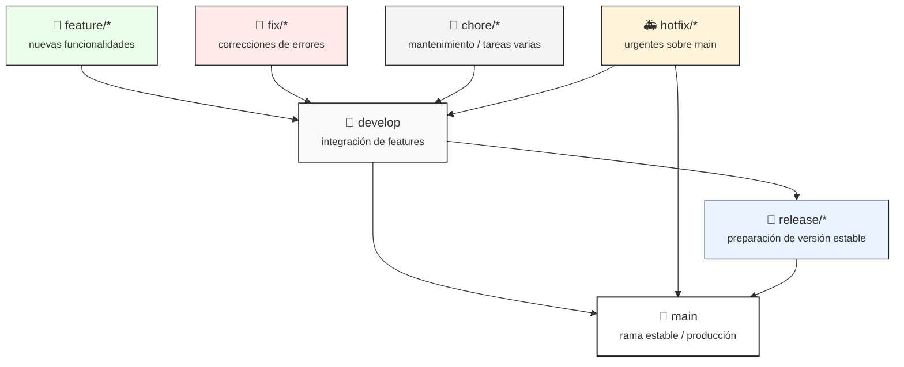
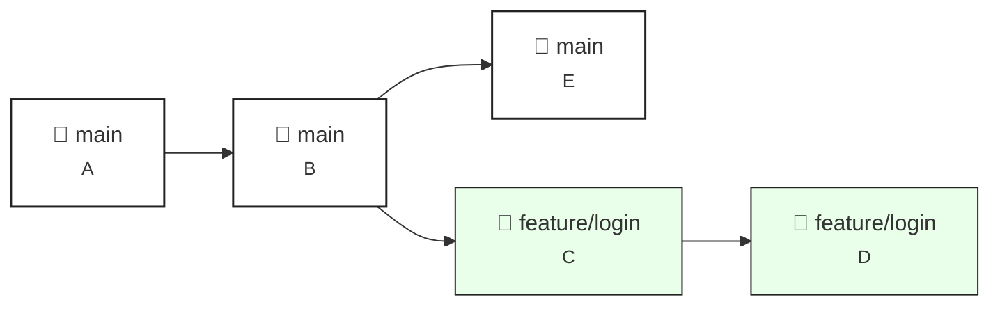
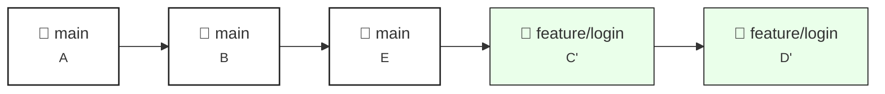
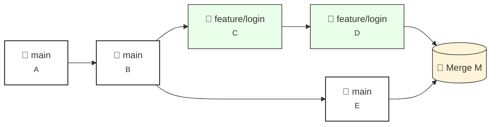

<p align="center">
  
</p>

---

## Flujo de trabajo Git recomendado para `synapseForge`

Este documento explica cómo debemos trabajar con Git en este proyecto para mantener un historial limpio, permitir que varias personas colaboren sin conflictos y que cualquiera pueda realizar un merge (habrá una persona designada, pero queremos que el proceso sea accesible).

Se asume que todos tienen configurado Git y acceso al repositorio remoto. Si no, pedir al responsable de infra que les agregue acceso.

> Nota: Este flujo está preparado para integrar pipelines de CI/CD en el futuro, manteniendo compatibilidad con despliegues automatizados.

---

### 1. Reglas generales

- Trabajar siempre desde ramas feature/bugfix/refactor o release, nunca directamente en `main`.
- `main` debe reflejar siempre una versión estable que puede desplegarse.
- Usar commits pequeños y atómicos con mensajes claros (imperativos): "Agregar validación X", "Corregir bug en Y".
- Antes de push, actualizar la rama local con la rama remota base (ver más abajo) y correr tests/linter si aplica.
- Los merges a `main` se hacen mediante Pull Requests (PR) revisados por al menos una persona. Si hay una persona designada para merge, seguirá el mismo procedimiento pero cualquiera puede hacerlo si está autorizado.

---

### 2. Nombres de ramas (convención)

- `main` — rama estable / producción.
- `develop` — (opcional) rama de integración para características en desarrollo (varias features para integrar).
- `release/<versión>` — preparación de lanzamientos estables.
- `feature/<descripción-corta>` — nuevas funcionalidades.
- `fix/<descripción-corta>` — correcciones de bugs.
- `chore/<descripción-corta>` — tareas de mantenimiento.
- `hotfix/<descripción-corta>` — correcciones urgentes directamente sobre `main`.

Ejemplos:

```
feature/login-oauth
fix/fetch-timeout
chore/update-deps
```



---

### 3. Flujo típico para desarrollar una feature (local)

1. Sincronizar `main` y crear la rama desde `main`:

```bash
>>> git checkout main
>>> git pull origin main
>>> git checkout -b feature/nombre-descriptivo
```

2. Trabajar en la rama, hacer commits atómicos:

```bash
>>> git add <archivos>
>>> git commit -m "Agregar: descripción breve en imperativo"
```

> Los commits deben estar siempre en español, escritos en modo imperativo (como si dieras una orden) y deben ser atómicos, es decir, representar un cambio pequeño, claro y coherente.
El título debe indicar qué hace el cambio, no por qué ni cómo.

```bash
Ejemplos:

>>> git commit -m "Agregar: endpoint para obtener estadísticas de usuarios"
>>> git commit -m "Corregir: error en la carga de datos desde CSV"
>>> git commit -m "Refactorizar: función de limpieza de texto"
>>> git commit -m "Actualizar: documentación del README"
>>> git commit -m "Optimizar: consultas a la base de datos"
```

3. Primer push y set-upstream (se configura la rama remota)

```bash
>>> git push -u origin feature/nombre-descriptivo
```

4. Mantener la rama actualizada con `main` mientras desarrollás (rebase o merge):

Opción A — rebase (historial más limpio):

```bash
>>> git fetch origin
>>> git checkout feature/nombre-descriptivo
>>> git rebase origin/main
>>> # resolver conflictos si aparecen, luego:
>>> git rebase --continue
>>> # y finalmente push forzado porque reescribiste el historial local
>>> git push --force-with-lease origin feature/nombre-descriptivo
```

#### Antes de rebase



#### Después de rebase



Opción B — merge (más simple):

```bash
>>> git fetch origin
>>> git checkout feature/nombre-descriptivo
>>> git merge origin/main
>>> # resolver conflictos, commit de merge
>>> git push origin feature/nombre-descriptivo
```

#### Antes de merge


#### Después de merge



Recomendación: usar rebase para mantener un historial lineal y limpio. Usar `--force-with-lease` en lugar de `--force` para evitar sobrescribir trabajo remoto inesperadamente.

---

### 4. Abrir Pull Request (PR)

1. Push de la rama al remoto:

```bash
>>> git push origin feature/nombre-descriptivo
```

2. En GitHub, usar el template correspondiente según el tipo de cambio agregando el query parameter:
   - General: `?template=general.md`
   - Feature: `?template=feature.md`
   - Fix: `?template=fix.md`

```bash
# Ejemplo: abrir PR con template de feature
https://github.com/synapse-ai-hub/synapseForge/compare/main...feature/mi-feature?template=feature.md
```

3. Incluir descripción clara: qué hace, por qué, cómo probarlo, snapshot/artefactos si aplica.
4. Añadir reviewers y etiquetas (bug, enhancement, etc.).
5. Esperar aprobaciones y resolver comentarios.

---

### 5. Merge final (pasos detallados para quien haga el merge)

Este procedimiento está pensado para que cualquiera pueda hacerlo de forma segura.

1. Antes de mergear, desde la rama remota base (`main`) tráela y actualízala localmente:

```bash
>>> git checkout main
>>> # Recomendado: mantener historial lineal localmente
>>> git pull --rebase origin main
```

2. Traer la rama feature localmente si no existe:

```bash
>>> git fetch origin
>>> git checkout -b feature/nombre-descriptivo origin/feature/nombre-descriptivo
```

3. Actualizar la rama feature con `main` (rebase recomendado):

```bash
>>> git checkout feature/nombre-descriptivo
>>> git rebase origin/main
>>> # resolver conflictos si los hay, y finalizar el rebase
>>> git rebase --continue
```

4. Ejecutar tests/linter localmente y verificar que todo está ok.

5. Push de la rama actualizada (puede requerir forzado seguro):

```bash
>>> git push --force-with-lease origin feature/nombre-descriptivo
```

6. En la plataforma de hosting, terminar el PR con la opción "Merge" preferida por el equipo. Recomendamos "Squash and merge" o "Merge commit" según política del equipo:

- Squash and merge: mantiene `main` con commits ordenados y un único commit por PR.
- Merge commit: preserva commits individuales.

7. Tras mergear, actualizar `main` local y borrar la rama remota y local:

```bash
>>> git checkout main
>>> git pull origin main
>>> git push origin --delete feature/nombre-descriptivo
>>> git branch -d feature/nombre-descriptivo
```

Si la rama local no puede borrarse por no estar fully merged, usar `git branch -D feature/nombre-descriptivo` con cuidado.

---

### 6. Qué hacer si hay conflictos complejos o histórico sucio

- Si aparece un conflicto durante rebase, Git marcará archivos en conflicto. Editar los archivos, probar localmente y luego:

```bash
>>> git add <archivos-resueltos>
>>> git rebase --continue
```

- Si el rebase falla y querés volver al estado previo:

```bash
>>> git rebase --abort
```

- Nunca uses `reset --hard` para sincronizar ramas compartidas en el remoto. Si necesitás forzar algo en el remoto, coordinar con el equipo y preferir `--force-with-lease`.

---

### 7. Recuperar trabajo perdido o limpiar historial en nuevo repo (caso de migración)

Si van a crear un repositorio nuevo para "limpiar" el historial, seguir estos pasos mínimos:

1. Crear repo nuevo en la plataforma (por ejemplo GitHub) y clonar vacío o agregar remoto.
2. En el repo actual, crear una rama que contenga el estado que quieran preservar (por ejemplo `clean-start`):

```bash
>>> git checkout --orphan clean-start
>>> git add -A
>>> git commit -m "Initial clean commit: estado actual del proyecto"
>>> git push origin clean-start
```

3. En el repo nuevo, hacer pull o push de `clean-start` como `main` y forzar si es necesario (coordinar con el equipo):

```bash
>>> # en repo nuevo clonado
>>> git checkout -b main
>>> git pull <old-repo-url> clean-start
>>> git push origin main
```

O alternativamente, en el repo antiguo empujar `clean-start` al remoto nuevo directamente:

```bash
>>> git remote add new-origin <new-repo-url>
>>> git push new-origin clean-start:main
```

Nota: estos pasos crean un historial limpio y comienzan de cero con un commit único que representa el estado actual del código.

> ⚠️ Atención: esto crea un nuevo historial. No debe hacerse sin coordinación, ya que destruye trazabilidad de commits anteriores.

---

### 8. Checklist rápido antes de mergear (para quien lo haga)

- [ ] PR aprobado por al menos 1 reviewer.
- [ ] Pipeline/CI pasa (tests, linter, build) o verificación manual si no hay CI.
- [ ] Rebase/merge con `main` y resolución de conflictos local.
- [ ] Pruebas locales realizadas (unitarias, integración mínimas).
- [ ] Mensaje del merge/PR claro y link a issue (si aplica).

---

### Plantilla sugerida para Pull Request

Usar una plantilla facilita revisiones consistentes. Crear un archivo `.github/PULL_REQUEST_TEMPLATE.md` con el siguiente contenido sugerido:

```
## Descripción
- ¿Qué cambios incluye este PR?
- ¿Por qué son necesarios?

## Cómo probar
- Pasos para reproducir / comprobar los cambios

## Checklist
- [ ] Tests pasan
- [ ] Linter pasa
- [ ] Documentación actualizada si aplica

## Issues relacionados
- Closes #<número-de-issue>
```

Esto ayuda a la persona que mergea a tener toda la información necesaria.

---

### 9. Pautas para cuando se suma personal

- Documentar convenciones (nombres de branches, commits) en este archivo.
- Hacer un pequeño onboarding: mostrar ejemplos de PR, merges y resolución de conflictos.
- Asignar roles: reviewer, release manager (opcional).
- Mantener comunicación: Discord/Slack/Teams para coordinar merges que puedan afectar a otras ramas.

---

### 10. Preguntas frecuentes (FAQ)

Q: ¿Puedo usar `git pull` sin argumentos?
A: Preferible usar `git pull --rebase` o `git fetch && git rebase origin/<branch>` para evitar merges automáticos indeseados.

Q: ¿Por qué `--force-with-lease` y no `--force`?
A: `--force-with-lease` comprueba que el remoto no cambió desde tu último fetch; evita sobreescribir accidentalmente el trabajo de otro.

Q: ¿Qué hago si rompí algo en `main`?
A: Revertir el commit problemático con `git revert <sha>` y desplegar un hotfix si hace falta. Evitar reescribir historial público.

---

### 11. Recursos útiles

- [Git book](https://git-scm.com/book/es/v2)
- [GitHub](https://docs.github.com)
- [Conventional Commits](https://www.conventionalcommits.org/en/v1.0.0/)

---

Autor: synapse.ai  
