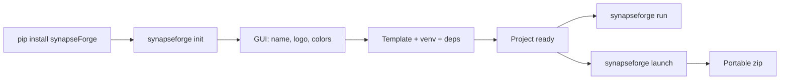

<p align="center">
  
</p>

---

<h1 align="center">
  
</h1>

---

<p align="center">
  <a href="./LICENSE">
    
  </a>
  &nbsp;
  <a href="https://link.mercadopago.com.ar/synapseforge">
    
  </a>
</p>

---

<h3 align="center">Forge agents. Ship intelligence.</h3>

---

<p align="center">
  An open-source forge for creating, equipping, running and shipping autonomous AI agents.

---

<p align="center">
  <sub>CLI · Agent Factory · Distribution</sub>
</p>
</p>

---

```
    FORGE             EQUIP             RUN              SHIP
    ─────             ─────             ───              ────
    Agents            Permissions       AgentLoop        Portable zip
    Skills            Providers         Tool calling     Embedded Python
    Tools             Models            RAG search       Native launcher
    Knowledge                           Memory           Ready to ship
                                        Streaming SSE
```

---

## What is synapseForge?

Most AI agent tools give you pieces and rules. synapseForge gives you the forge.

You don't assemble an agent. You forge a system.

synapseForge is designed around a simple idea: agents should be built as systems, not assembled from prompts.

Define your agents, equip them with skills and tools, connect them to your data sources, and ship a self-contained application — from `pip install` to a distributable zip.

### A forge that can extend itself

Create agents, skills and tools through an LLM-assisted workflow. synapseForge doesn't just run agents — it can create the capabilities they need.

---

## How it works

### You build

- **Agents** — define roles, permissions and behavior in `.md` files
- **Skills** — structured knowledge packages with references and frontmatter
- **Tools** — native (filesystem, web, shell, email) or external `.py` files
- **RAG collections** — upload files and web pages, indexed with vector embeddings

### The Forge

The Forge turns those definitions into autonomous systems.

- **Permission engine** — deny-by-default, per-agent, with wildcards and groups
- **Agent loop** — iterative reasoning → tool calling → execution → continuation, with streaming SSE
- **Memory** — persistent conversation indexing and cross-session retrieval
- **Multi-provider LLM** — Ollama (local), Groq, Google Gemini, OpenRouter
- **MCP integration** — connect external tool servers via the Model Context Protocol
- **Scheduler** — run prompts on a schedule, notify via UI and Telegram

### You ship

```bash
synapseforge init my-project      # scaffold with GUI
synapseforge run .                # develop locally
synapseforge launch -n my-app     # build portable zip
```

The result is a self-contained application distribution: embedded Python, compiled backend, built frontend, native launcher. Hand it to anyone.

---

## Quick start

> Currently available on [TestPyPI](https://test.pypi.org/project/synapseforge/).

```bash
pip install synapseForge

# Create a project (interactive GUI)
synapseforge init my-project
cd my-project

# Start in development mode
synapseforge run .
```

On first launch, configure an API key from any supported cloud provider ([OpenRouter](https://openrouter.ai/settings/keys), [Google Gemini](https://aistudio.google.com/apikey) or [Groq](https://console.groq.com/keys) — all with free tiers) and press **Apply**. Ollama is optional. The knowledge base requires an OpenRouter key.

---

## CLI

| Command | What it does |
|---------|-------------|
| `synapseforge init [dir]` | Create a project with interactive GUI |
| `synapseforge launch -p <path> -n <name>` | Build a portable distribution zip |
| `synapseforge colors [dir]` | Edit project colors live |
| `synapseforge run [dir]` | Start development servers |



---

## Architecture

### Backend

FastAPI application with REST/SSE routers. The agent framework lives in `backend/agent/`: AgentLoop with native tool calling, tools registry (native + external + MCP), SQLite sessions, per-agent permissions, skills, RAG (ChromaDB) and long-term memory.

**Native tools**: `read`, `write`, `edit`, `glob`, `grep`, `webfetch`, `websearch`, `shell`, `task` (sub-agent delegation), `skill`, `reference`, `rag`, `search_memory`, `check_email`, `send_email`, `help`.

### Frontend

React/Vite/TypeScript SPA with Tailwind v4 and shadcn/ui. Multi-page: chat, skill creation, RAG management, docs. SSE streaming, tool call visualization, context window gauge, scheduled tasks, metrics dashboard, Telegram toggle.

### Providers

| Provider | Type | Notes |
|----------|------|-------|
| Ollama | Local | Optional, requires local install |
| Groq | Cloud | Free tier |
| Google Gemini | Cloud | Free tier |
| OpenRouter | Cloud | Free tier, required for RAG embeddings |

API keys are validated on save and stored encrypted (Fernet) in SQLite. No environment variables needed.

### Knowledge base (RAG)

ChromaDB with OpenRouter-hosted embeddings (`liquid/lfm-2.5-embedding-350m:free`). Upload files and web pages — content is extracted, chunked and indexed for semantic retrieval. Long-term memory: every conversation turn is automatically indexed and searchable across sessions via `search_memory`.

### Telegram

Remote control for the agent. Send messages, switch models, create skills/tools, manage scheduled tasks — all through Telegram. The bot bridges to the same chat flow the frontend uses.

### Scheduled tasks

Define tasks (prompt + time + days) from the UI or Telegram. The backend executes them with the selected model and notifies via the UI and Telegram.

---

## Project structure

```plaintext
synapseForge/
├─ synapseforge/              # CLI + tkinter GUIs
├─ pipeline/                  # Init (template) + Launch (forge)
├─ backend/                   # FastAPI + Agent Framework
│  ├─ agent/                  #   AgentLoop, Tools, Sessions, Permissions
│  ├─ routes/                 #   API endpoints
│  └─ telegram/               #   Telegram bot
├─ frontend/                  # React/Vite/TypeScript SPA
├─ template/                  # Project template (used by init)
├─ tests/                     # E2E declarative suite (YAML)
└─ pyproject.toml             # Package config
```

---

## User configuration

```plaintext
~/.config/synapseForge/
├─ skills/            # Installed skills
├─ tools/             # Custom tools (.py)
├─ agents/            # Agent definitions (.md)
├─ knowledge/         # RAG collections (ChromaDB)
├─ mcp.json           # MCP servers
└─ config.yaml        # Router permissions (optional)
```

---

## Testing

Declarative E2E suite in `tests/e2e/`. YAML scenarios drive the real backend — chat via SSE, direct API calls — asserting on contracts and structure.

```bash
python -m tests.e2e.runner                # all scenarios
python -m tests.e2e.runner --only rag     # filter by name
```

---

## Docker

```bash
docker compose up --build -d
# App at http://localhost:8000
```

---

## Tech Stack

[](https://www.python.org/)
[](https://fastapi.tiangolo.com/)
[](https://www.sqlite.org/)
[](https://www.trychroma.com/)
[](https://react.dev/)
[](https://www.typescriptlang.org/)
[](https://vite.dev/)
[](https://tailwindcss.com/)
[](https://ui.shadcn.com/)
[](https://nodejs.org/)
[](https://pyinstaller.org/)
[](https://www.docker.com/)
[](https://telegram.org/)
[](https://pypi.org/)
[](https://groq.com/)
[](https://ai.google.dev/)
[](https://openrouter.ai/)
[](https://ollama.com/)

---

## Support this project

synapseForge is free and open source. If you find it useful, consider supporting its development with a [donation via Mercado Pago](https://link.mercadopago.com.ar/synapseforge).

---

## License

This project is licensed under the terms specified in the [LICENSE](./LICENSE) file.

---

Copyright (c) 2026 SYNAPSE AI SAS

---

*The forge is heating up...*
