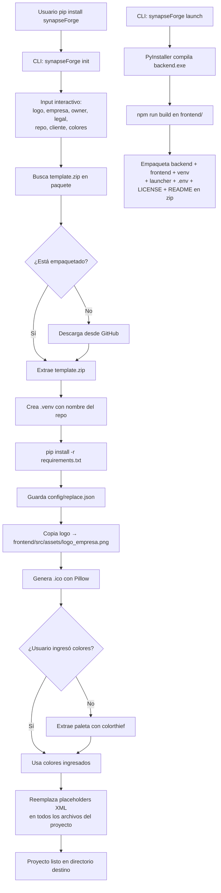

<p align="center">
  
</p>

---

<h1 align="center">synapseForge</h1>

---

<p align="center">
  <a href="./LICENSE">
    
  </a>
  <a href="https://pypi.org/project/synapseforge/">
    
  </a>
  <a href="https://www.python.org/downloads/">
    
  </a>
</p>

---

<h3 align="center">CLI + Framework + Template para crear y distribuir proyectos de agentes IA full-stack</h3>

---

## Descripción

**synapseForge** es un paquete PyPI que provee un CLI para scaffoldear y distribuir proyectos de agentes IA desde cero. Incluye:

1. **CLI** (`synapseForge init`, `synapseForge launch`) — scaffolding interactivo + build de distribución.
2. **Framework de agentes** (`backend/agent/`) — AgentLoop, Tools, Sessions, MCP, Skills, Permissions.
3. **Template de proyecto** embebido — backend FastAPI + frontend React/Vite/TypeScript + estructura completa.

El usuario instala el paquete, ejecuta `synapseForge init`, completa los datos interactivos, y obtiene un proyecto funcional con venv, dependencias, logo, .ico, colores, y placeholders reemplazados.

---

### ✨ Características Principales

- **`synapseForge init`**: Scaffolding completo desde template embebido — estructura de carpetas, venv, logo, .ico, placeholders, colores.
- **`synapseForge launch`**: Build de distribución autocontenido con PyInstaller + frontend compilado.
- **Pipeline de 9 pasos**: Input interactivo, template, venv, pip install, reemplazo de placeholders XML en todo el proyecto.
- **Extracción automática de colores**: Si no se ingresan colores, colorthief extrae la paleta desde el logo.
- **Branding automatizado**: Copia del logo + generación de `.ico` (16×16 a 256×256).
- **Framework de agentes completo**: AgentLoop, Tools Registry, MCP, Skills, Sessions, Permissions.
- **Configuración de usuario en `~/.config/synapseForge/`**: tools personalizadas, skills, agentes con permisos.

---

## ¿Qué resuelve?

- **Scaffolding repetitivo**: Un solo comando crea el proyecto completo con la estructura estándar de todos los proyectos SYNAPSE.
- **Configuración centralizada**: Input interactivo que reemplaza todos los placeholders XML del proyecto (empresa, cliente, colores, logo, etc.).
- **Branding automatizado**: Copia del logo + generación de .ico + extracción de paleta de colores desde la imagen.
- **Distribución**: Build de distribución autocontenido listo para entregar al cliente sin dependencias externas.

---

## Estructura del repositorio

```plaintext
synapseForge/
│
├─ synapseforge/                 # Paquete Python — CLI instalable via pip
│  ├─ __init__.py                #   __version__
│  ├─ __main__.py                #   python -m synapseforge
│  └─ cli/
│     └─ main.py                 #   Parser CLI: init | launch
│
├─ pipeline/                     # Pipeline — código fuente de init y launch
│  ├─ template.zip               #   Template del proyecto comprimido
│  ├─ init/                      #   Init: input, template, venv, config, logo, placeholders
│  │  ├─ main.py
│  │  ├─ input_handler.py
│  │  ├─ template_handler.py
│  │  ├─ venv_handler.py
│  │  ├─ config_handler.py
│  │  ├─ logo_handler.py
│  │  └─ placeholder_handler.py
│  └─ launch/                    #   Launch: PyInstaller, npm build, zip
│     ├─ forge.py
│     └─ templates/
│        └─ launcher.py
│
├─ backend/                      # Fuente del template — backend FastAPI
│  ├─ main.py                    #   FastAPI app, CORS, lifespan, routers
│  ├─ routes/
│  │  ├─ chat.py                 #   POST /api/chat → SSE stream (AgentLoop)
│  │  ├─ config.py               #   Providers, models, MCP health
│  │  └─ sessions.py             #   CRUD sesiones, mensajes, títulos
│  └─ agent/                     #   Framework de agentes
│     ├─ agent.py                #   Agent class (Groq/Ollama, streaming, tool calling)
│     ├─ tools.py                #   Registry: nativas + externas + MCP
│     ├─ loop.py                 #   AgentLoop: while True → LLM → tools → continue
│     ├─ session.py              #   SessionManager (SQLite WAL)
│     ├─ permissions.py          #   Permisos por agente (tool, skill, task)
│     ├─ config_dir.py           #   ~/.config/synapseForge/ discovery
│     ├─ contract.py             #   ContractResponse, StreamingResponse
│     └─ utils/
│        ├─ generate_ico.py      #   PNG → ICO
│        ├─ mcp_helper.py        #   MCP stdio/HTTP, tool discovery, health
│        ├─ skill_loader.py      #   SKILL.md parsing, triggers
│        └─ ...
│
├─ frontend/                     # Fuente del template — frontend React/Vite/TS
│  ├─ package.json               #   React 18, TS, Vite, Tailwind, shadcn/ui
│  ├─ vite.config.ts
│  └─ src/
│     ├─ services/
│     │  ├─ chatService.ts       #   SSE parsing: chunk, tool_call, done
│     │  ├─ configService.ts     #   Providers, models, MCP health
│     │  └─ sessionService.ts    #   Sesiones CRUD
│     └─ components/
│        ├─ Sidebar.tsx          #   Sessions + Config tabs
│        ├─ MessageBubble.tsx
│        └─ ...
│
├─ config/                       # Fuente del template — replace.json con placeholders XML
├─ store/                        # Store de tools y skills instalables
│  ├─ tools_store/               #   Tools disponibles (.py)
│  └─ skills_store/              #   Skills disponibles (carpeta con SKILL.md)
│
├─ docs/                         # Documentación del producto
│  ├─ tools/                     #   Guía de creación de tools
│  ├─ agents/                    #   Guía de creación de agentes
│  ├─ producto/                  #   Análisis, arquitectura, docs del producto
│  ├─ dev/                       #   Plan de desarrollo y roadmap
│  └─ ejemplos/                  #   Ejemplos de configuraciones
│
├─ src/                          # Recursos adicionales
│  └─ template_readme.md         #   README.md para el proyecto generado
│
├─ on_boarding/                  # Onboarding para desarrolladores
├─ cicd/                         # CI/CD
├─ client_db/                    # Base de datos cliente (template)
├─ tests/                        # Tests
├─ .commands/                    # Comandos locales PowerShell
├─ .github/                      # Workflows y PR template
│
├─ pyproject.toml                # Build config, entry point synapseForge, dependencias
├─ requirements.txt              # Dependencias de desarrollo
├─ .env.example
├─ .gitignore
├─ LICENSE
└─ README.md
```

---

## Pipeline / Flujo principal



---

## CLI — Comandos

```bash
pip install synapseForge
```

| Comando | Descripción |
|---------|-------------|
| `synapseForge init [dir]` | Crea proyecto desde template con input interactivo |
| `synapseForge launch <path> <exe>` | Build de distribución autocontenido |
| `synapseForge --help` | Ayuda global |

### synapseForge init — Pipeline de 9 pasos

1. **Input interactivo** — Pide logo (ruta absoluta), empresa, owner, legal, repo, cliente, colores (hex, opcionales).
2. **Template** — Extrae `template.zip` empaquetado (o descarga desde GitHub si no está).
3. **Venv** — Crea `./.{repo}/` con `python -m venv`.
4. **Deps** — `pip install -r requirements.txt` en el venv.
5. **Config** — Guarda input como `config/replace.json`.
6. **Logo** — Copia el logo a `frontend/src/assets/logo_empresa.png`.
7. **.ico** — Genera `logo_empresa.ico` con Pillow (16×16 a 256×256).
8. **Colores** — Si no se ingresaron, extrae paleta con colorthief (máx 3 colores: primary, secondary, background).
9. **Placeholders** — Reemplaza tags XML (`<empresa>`, `<cliente>`, `<color_primario>`, etc.) en todo el proyecto.

> **Comportamiento según el directorio destino:**
> - Si **no existe** → el comando falla con error y no hace nada.
> - Si **existe y está vacío** → extrae el template sin problemas.
> - Si **existe y tiene archivos** → extrae el template encima. Los archivos del zip sobrescriben los existentes. Los archivos previos que no están en el zip **se quedan** (quedan restos).

### synapseForge launch — Build de distribución

1. **PyInstaller** — Compila `backend/main.py` a `.exe` autocontenido.
2. **Frontend** — `npm run build` genera `frontend/dist/`.
3. **Empaquetado** — Crea zip con: backend.exe, frontend/dist/, venv, launcher, .env, LICENSE, README.md, docs/.

---

## Backend — Framework de Agentes

El template incluye un framework completo de agentes en `backend/agent/`:

| Módulo | Descripción |
|--------|-------------|
| `agent.py` | Agent class: conexión con Groq/Ollama, streaming SSE, tool calling |
| `loop.py` | AgentLoop: while True → LLM → tool_calls → execute → continue |
| `tools.py` | Tools Registry: nativas (read, write, websearch, etc.) + externas + MCP |
| `session.py` | SessionManager: SQLite WAL, historial, config_kv, error_log |
| `permissions.py` | Permisos por agente: tool/skill/task allow/deny/ask |
| `config_dir.py` | Descubrimiento de `~/.config/synapseForge/` |
| `contract.py` | ContractResponse y tipos para streaming |
| `utils/generate_ico.py` | Conversión PNG → ICO |
| `utils/mcp_helper.py` | MCP stdio/HTTP, tool discovery, health check |
| `utils/skill_loader.py` | SKILL.md parsing y triggers |

### Configuración de usuario (`~/.config/synapseForge/`)

```
~/.config/synapseForge/
├── skills/                 # Skills instaladas (carpeta por skill con SKILL.md)
├── tools/                  # Tools instaladas (.py con TOOL_NAME, execute())
├── agents/                 # Agentes (.md con frontmatter YAML + permisos)
└── config.json             # Config MCP: servers, timeout, transport
```

---

## Frontend — Chat SSE

El frontend es una SPA React/Vite/TypeScript con Tailwind y shadcn/ui:

| Componente | Descripción |
|------------|-------------|
| `chatService.ts` | Conexión SSE a `POST /api/chat`, parsea chunks, tool_calls, tool_results, subagent_*, done |
| `configService.ts` | Obtiene providers, modelos, contexto, health de servidores MCP |
| `sessionService.ts` | CRUD de sesiones y mensajes |
| `Sidebar.tsx` | Pestañas Sessions (historial) + Config (modelo, proveedor, MCP health) |
| `MessageBubble.tsx` | Renderiza mensajes con tool calls colapsables y resultados |

---

## Documentación

| Documento | Descripción |
|-----------|-------------|
| `docs/tools/guia-creacion-tools.md` | Cómo crear tools personalizadas para el agente |
| `docs/agents/guia-creacion-agentes.md` | Cómo crear y configurar agentes con permisos |
| `docs/producto/` | Análisis de producto, arquitectura técnica, documentación general |
| `docs/dev/` | Plan de desarrollo y roadmap |
| `docs/ejemplos/` | Ejemplos de configuraciones (agentes, tools, DB, etc.) |
| `on_boarding/` | Guía de onboarding, contribución y flujo Git |

---

## Stack Tecnológico


---

## Licencia

Apache 2.0 — Ver archivo [LICENSE](./LICENSE)

---

Copyright (c) 2026 SYNASPE AI SAS

---
