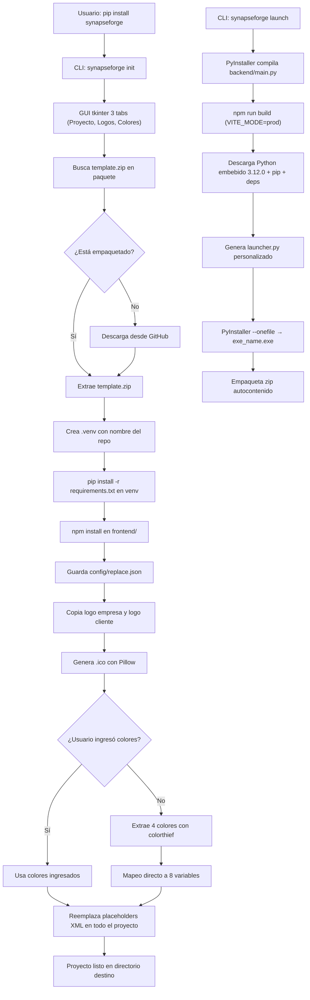

<p align="center">
  
</p>

---

<h1 align="center">synapseForge</h1>

---

<p align="center">
  <a href="./LICENSE">
    
  </a>
  <a href="https://pypi.org/project/synapseforge/">
    
  </a>
  <a href="https://www.python.org/downloads/">
    
  </a>
</p>

---

<h3 align="center">CLI + Framework + Template para crear y distribuir proyectos de agentes IA full-stack</h3>

---

## Descripción

**synapseForge** es un paquete PyPI que provee un CLI para scaffoldear y distribuir proyectos de agentes IA desde cero. Incluye:

1. **CLI** (`synapseforge init`, `synapseforge launch`, `synapseforge colors`, `synapseforge run`) — scaffolding con GUI tkinter + build de distribución + editor de colores en vivo + servidor de desarrollo.
2. **Framework de agentes** (`backend/agent/`) — AgentLoop, Tools Registry (nativas + externas + MCP), Sessions (SQLite WAL), Permissions, Skills, MCP integration.
3. **Template de proyecto** embebido (`pipeline/template.zip`) — backend FastAPI + frontend React/Vite/TypeScript + estructura completa.
4. **Docker** — `Dockerfile` multi-stage + `docker-compose.yml` para despliegue en contenedor.

El usuario instala el paquete, ejecuta `synapseforge init`, completa los datos en la GUI, y obtiene un proyecto funcional con venv, dependencias, logo, `.ico`, colores, y placeholders reemplazados.

---

### ✨ Características Principales

- **`synapseforge init`**: Scaffolding completo desde template embebido con **GUI tkinter** (3 tabs: Proyecto, Logos, Colores) — estructura, venv, logo, .ico, placeholders, colores.
- **`synapseforge launch`**: Build de distribución autocontenido con PyInstaller + frontend compilado + Python embebido + launcher nativo → `.zip` listo para entregar.
- **`synapseforge colors`**: Editor GUI para modificar `frontend/public/colors.json` en caliente — recarga el navegador y ves los cambios sin rebuild.
- **`synapseforge run`**: Levanta `uvicorn --reload` (backend) + `npm run dev` (frontend) + abre el navegador. Ctrl+C mata ambos.
- **Pipeline de 10 pasos**: Input GUI → template → venv → pip install → npm install → config → logos → `.ico` → colores (extracción automática con colorthief si no se ingresan) → placeholders XML en todo el proyecto.
- **Sistema de colores dual**: Build-time (placeholders XML en `config/replace.json`) + Runtime (`frontend/public/colors.json` cargado en `main.tsx`). 8 variables configurables, el resto fijas.
- **Framework de agentes completo**: AgentLoop (while True → LLM → tools → continue), Tools Registry (nativas + externas dinámicas + MCP), SessionManager (SQLite WAL), Permissions (allow/deny/ask + wildcards), Skills (SKILL.md + references), MCP (stdio/HTTP + health check).
- **Archivos de contexto**: Subida de PDF, Word, TXT, MD, CSV, JSON, YAML, XML, PY → extracción de texto (pdfminer + OCR fallback) → inyección en system prompt del agente.
- **Métricas de uso**: Endpoints para sesiones, tokens por modelo/proveedor, estadísticas agregadas. Dashboard en frontend (`MetricsModal` con tabs: Overview, Sessions, Tools, Errors).
- **Extracción de texto robusta**: Módulo compartido `file_text_extractor.py` soporta texto plano, Markdown, CSV, JSON, XML, YAML, Python, DOCX, DOC, XLSX, XLS, PDF. OCR **best-effort**: si falla por deps faltantes, devuelve lo que extrajo pdfminer.
- **Modo desktop app**: Heartbeat cada 10s desde frontend → watchdog en backend (3 min sin heartbeat = exit). Endpoint `/api/shutdown` para botón "Salir".
- **Configuración de usuario** (`~/.config/synapseForge/`): tools personalizadas, skills, agentes con permisos, config MCP.
- **Docker**: `Dockerfile` multi-stage (Node 20 build → Python 3.12 slim runtime) + `docker-compose.yml` con `VITE_MODE=prod`.

---

## ¿Qué resuelve?

- **Scaffolding repetitivo**: Un solo comando crea el proyecto completo con la estructura estándar de todos los proyectos SYNAPSE.
- **Configuración centralizada**: GUI interactiva que reemplaza todos los placeholders XML del proyecto (empresa, cliente, colores, logo, etc.).
- **Branding automatizado**: Copia de logos + generación de `.ico` (16×16 a 256×256) + extracción de paleta de colores desde la imagen (colorthief).
- **Distribución sin dependencias**: Build autocontenido listo para entregar al cliente — incluye Python embebido, frontend estático, launcher nativo.

---

## Estructura del repositorio

```plaintext
synapseForge/
│
├─ synapseforge/                 # Paquete Python — CLI instalable via pip
│  ├─ __init__.py                #   __version__
│  ├─ __main__.py                #   python -m synapseforge
│  ├─ cli/
│  │  ├─ __init__.py
│  │  └─ main.py                 #   Parser CLI: init | launch | colors | run
│  └─ tk/                        #   GUIs tkinter
│     ├─ __init__.py
│     ├─ init_app.py             #   GUI 3 tabs para synapseforge init
│     └─ colors_app.py           #   GUI editor colors.json para synapseforge colors
│
├─ pipeline/                     # Pipeline — código fuente de init y launch
│  ├─ __init__.py
│  ├─ template.zip               #   Template del proyecto comprimido (embebido)
│  ├─ init/                      #   Init: input, template, venv, config, logo, placeholders
│  │  ├─ __init__.py
│  │  ├─ __main__.py
│  │  ├─ main.py                 #   Orquestador (run(target_dir, config=None))
│  │  ├─ input_handler.py        #   GUI tkinter
│  │  ├─ template_handler.py     #   Descarga/extrae template.zip
│  │  ├─ venv_handler.py         #   Crea venv .{repo}/
│  │  ├─ config_handler.py       #   Guarda config/replace.json + frontend/public/colors.json
│  │  ├─ logo_handler.py         #   Copia logos + genera .ico con Pillow
│  │  ├─ placeholder_handler.py  #   Reemplaza tags XML en todo el proyecto
│  │  └─ color_utils.py          #   Extracción paleta (colorthief) + mapeo 8 vars
│  └─ launch/                    #   Launch: PyInstaller, npm build, zip
│     ├─ __init__.py
│     ├─ forge.py                #   Orquestador 7 pasos
│     ├─ requirements.txt
│     ├─ .cache/                 #   Caché: Python embed + get-pip.py (descargados)
│     ├─ templates/
│     │  └─ launcher.py          #   Template launcher (abre browser, usa python embebido)
│     └─ README.md
│
├─ backend/                      # Fuente del template — backend FastAPI
│  ├─ __init__.py
│  ├─ main.py                    #   FastAPI app, CORS, lifespan, routers, health, shutdown, heartbeat, SPA static
│  ├─ instances.py               #   Singletons: agent, session_manager
│  ├─ routes/
│  │  ├─ __init__.py
│  │  ├─ chat.py                 #   POST /api/chat → SSE stream (AgentLoop)
│  │  ├─ config.py               #   Providers, models, MCP health, context window
│  │  ├─ sessions.py             #   CRUD sesiones, mensajes, títulos
│  │  ├─ context_files.py        #   CRUD archivos de contexto (instrucciones/documentos)
│  │  ├─ metrics.py              #   Métricas: agregadas, por sesión, tokens por modelo/proveedor
│  │  ├─ file_text_extractor.py  #   Extracción texto: PDF, DOCX, XLSX, TXT + OCR fallback
│  │  └─ README.md
│  └─ agent/                     #   Framework de agentes
│     ├─ __init__.py
│     ├─ agent.py                #   Agent class (Groq/Ollama, streaming SSE, tool calling)
│     ├─ tools.py                #   Registry: nativas + externas (~/.config/synapseForge/tools/) + MCP
│     ├─ loop.py                 #   AgentLoop: while True → LLM → tool_calls → execute → continue
│     ├─ loop_helpers.py         #   build_system_prompt (inyecta context_files), fetch_context_window, execute_tool
│     ├─ session.py              #   SessionManager (SQLite WAL, historial, config_kv, error_log)
│     ├─ permissions.py          #   Permisos por agente (tool/skill/task allow/deny/ask + wildcards)
│     ├─ config_dir.py           #   Descubrimiento ~/.config/synapseForge/
│     ├─ contract.py             #   ContractResponse, UsageReport, StreamingResponse
│     ├─ ddl_setup.py            #   Inicialización tablas SQLite
│     ├─ agent_db/               #   SQLite runtime (se crea al iniciar)
│     ├─ prompts/
│     │  ├─ system_prompt.md     #   Prompt base del router (con checklist de fidelidad)
│     │  ├─ help.md              #   Documentación interna para tool `help`
│     │  └─ title.md             #   Prompt para generar títulos de sesión
│     ├─ utils/
│     │  ├─ __init__.py
│     │  ├─ clean_memory.py      #   Liberación modelos GPU/CPU
│     │  ├─ model_resolver.py    #   Resolución y validación modelo activo
│     │  ├─ skill_loader.py      #   Carga y formateo SKILL.md para system prompt
│     │  ├─ email_parser.py      #   Parseo emails (headers, body, adjuntos)
│     │  ├─ mcp_helper.py        #   MCP stdio/HTTP, tool discovery, health check
│     │  ├─ subagent_logger.py   #   Logger custom nivel SUBAGENT
│     │  └─ error_logger.py      #   Log de errores a SQLite (error_log table)
│     └─ README.md
│
├─ frontend/                     # Fuente del template — frontend React/Vite/TS
│  ├─ package.json
│  ├─ package-lock.json
│  ├─ tsconfig.json
│  ├─ tsconfig.app.json
│  ├─ tsconfig.node.json
│  ├─ tsconfig.app.tsbuildinfo
│  ├─ tsconfig.node.tsbuildinfo
│  ├─ vite.config.ts
│  ├─ index.html
│  ├─ public/
│  │  └─ docs.html
│  └─ src/
│     ├─ main.tsx                #   Entry: carga colors.json → setea CSS vars → render App
│     ├─ App.tsx                 #   Root + providers
│     ├─ index.css               #   @theme Tailwind v4: 8 vars configurables + fijas
│     ├─ vite-env.d.ts
│     ├─ assets/
│     │  └─ logo_cliente.png
│     ├─ services/
│     │  ├─ chatService.ts       #   SSE parsing: chunk, tool_call, done
│     │  ├─ configService.ts     #   Providers, models, MCP health
│     │  ├─ sessionService.ts    #   Sesiones CRUD
│     │  ├─ contextFilesService.ts  #   CRUD archivos de contexto
│     │  ├─ metricsService.ts    #   Métricas: overview, sessions, tokens
│     │  └─ quoteHistoryService.ts
│     ├─ components/
│     │  ├─ ChatInterface.tsx
│     │  ├─ Sidebar.tsx          #   Sessions + Config tabs
│     │  ├─ MessageBubble.tsx
│     │  ├─ MetricsModal.tsx     #   Dashboard métricas
│     │  ├─ HistoryModal.tsx
│     │  ├─ Logo.tsx
│     │  └─ ui/                  #   shadcn/ui: avatar, button, dialog, input, separator, textarea, utils
│     └─ README.md
│
├─ config/                       # Fuente del template — replace.json con placeholders XML
│  └─ replace.json
│
├─ store/                        # Store de tools y skills instalables
│  ├─ tools_store/
│  └─ skills_store/
│
├─ src/                          # Recursos adicionales
│  ├─ logo.ico                   #   Ícono de la app (generado por pipeline)
│  ├─ logo_empresa.png           #   Logo empresa para README (copiado por pipeline)
│  └─ template_readme.md         #   README.md para el proyecto generado
│
├─ on_boarding/                  # Onboarding para desarrolladores
│  ├─ ONBOARDING.md
│  ├─ CONTRIBUTING.md
│  └─ GIT_WORKFLOW.md
│
├─ cicd/                         # CI/CD
├─ client_db/                    # Base de datos cliente (template)
├─ tests/                        # Tests
│  └─ _test_gui.py
│
├─ .commands/                    # Comandos locales PowerShell
│  ├─ README.md
│  ├─ commands.json
│  ├─ init.ps1
│  └─ commands/
│     ├─ list_cmds.py
│     ├─ quick_push.py
│     └─ quick_sync.py
│
├─ .github/                      # Workflows y PR template
│
├─ Dockerfile                    # Multi-stage: Node 20 build → Python 3.12 slim runtime
├─ docker-compose.yml            # Servicio app: build ., puerto 8000, VITE_MODE=prod
├─ .dockerignore
├─ pyproject.toml                # Build config, entry point synapseforge, deps (colorthief, Pillow)
├─ requirements.txt              # Dependencias de desarrollo del repo synapseForge
├─ .env.example
├─ .gitignore
├─ LICENSE
├─ README.md                     # Este archivo (repo root)
├─ README_PYPI.md                # README para PyPI (package description)
└─ tareas-pendientes.md          # Tracking interno
```

---

## Pipeline / Flujo principal



---

## CLI — Comandos

```bash
pip install synapseforge
```

| Comando | Descripción |
|---------|-------------|
| `synapseforge init [dir]` | Crea proyecto desde template con GUI interactiva |
| `synapseforge launch <path> <exe>` | Build de distribución autocontenida (zip) |
| `synapseforge colors [dir]` | Editor GUI para `frontend/public/colors.json` (cambios en vivo) |
| `synapseforge run [dir]` | Levanta uvicorn --reload + npm run dev + abre browser |
| `synapseforge --help` | Ayuda global |

### `synapseforge init` — Pipeline (GUI)

1. **Proyecto** — Empresa, owner, legal, repo, cliente, descripción, tarea (todos obligatorios).
2. **Logos** — Logo empresa (obligatorio, para README), logo cliente (opcional, para app + .ico), ancho/alto opcionales.
3. **Colores** — 8 campos hex opcionales con color picker: Avatar asistente, Avatar usuario, Botón Nuevo Chat fondo/texto, Botón adjuntar, Botón enviar, Botón detener, Flecha autoscroll.
4. **Template** — Extrae `template.zip` empaquetado (o descarga desde GitHub).
5. **Venv** — Crea `./.{repo}/` con `python -m venv`.
6. **Deps Python** — `pip install -r requirements.txt` en el venv.
7. **npm install** — Instala dependencias del frontend.
8. **Config** — Guarda input como `config/replace.json` + genera `frontend/public/colors.json`.
9. **Logos** — Copia logos + genera `.ico`.
10. **Colores** — Si no se ingresaron, extrae paleta con colorthief y mapea directo a las 8 variables.
11. **Placeholders** — Reemplaza tags XML en todo el proyecto.

> **Comportamiento según directorio destino:**
> - Si **no existe** → lo crea y extrae el template.
> - Si **existe y está vacío** → extrae el template sin problemas.
> - Si **existe y tiene archivos** → extrae el template encima. Archivos del zip sobrescriben. Archivos previos no en el zip **se quedan** (restos).

### `synapseforge launch` — Build de distribución (7 pasos)

1. **Frontend** — `npm run build` con `VITE_MODE=prod` → `frontend/dist/`.
2. **Backend compile** — `python -m compileall -b backend/` → `.pyc` legacy.
3. **Backend limpio** — Copia compilado excluyendo: `.py` (solo `.pyc`), `__pycache__/`, `sessions.db`, `.md/.txt` fuera de `agent/prompts/`.
4. **Python embebido** — Descarga Python 3.12.0 embed amd64, configura `_pth`, instala pip, instala `requirements.txt` deps en `Lib/site-packages/`.
5. **Launcher** — Genera `launcher.py` personalizado → PyInstaller `--onefile --noconsole` → `exe_name.exe`.
6. **Zip** — Empaqueta: `exe_name.exe`, `backend/`, `frontend/dist/`, `python/`, `.env`, `LICENSE`, `README.md`.
7. **Cleanup** — Mueve zip a raíz del repo, borra `__forge_build__/`, limpia `.pyc` del backend original.

### `synapseforge colors` — Editor de colores en vivo

- Abre GUI tkinter con los 8 campos + preview cuadrado + color picker nativo.
- Lee/escribe `frontend/public/colors.json`.
- **Cambios instantáneos**: recargá el navegador (F5) y ves los colores nuevos **sin rebuild**.

### `synapseforge run` — Servidor de desarrollo

- Levanta `uvicorn backend.main:app --reload --port 8000` (backend).
- Levanta `npm run dev` en `frontend/` (frontend, puerto 5173 por defecto Vite).
- Espera 3s y abre `http://localhost:5173` en el browser.
- **Ctrl+C** mata ambos procesos.

---

## Backend — Framework de Agentes

El template incluye un framework completo de agentes en `backend/agent/`:

| Módulo | Descripción |
|--------|-------------|
| `agent.py` | Agent class: conexión Groq/Ollama, streaming SSE, tool calling nativo |
| `loop.py` | AgentLoop: while True → LLM → tool_calls → execute → continue (max 25 iteraciones, max 3 profundidad sub-agentes) |
| `loop_helpers.py` | `build_system_prompt` (inyecta context_files + fecha + agentes), `fetch_context_window_turns`, `execute_tool` |
| `tools.py` | Tools Registry: nativas (read, write, websearch, webfetch, parser, email, reference, task, help) + externas dinámicas (`~/.config/synapseForge/tools/`) + MCP (`execute_mcp_tool`) |
| `session.py` | SessionManager: SQLite WAL, historial, config_kv (modelo, proveedor, context_window), error_log |
| `permissions.py` | Permisos por agente (tool/skill/task allow/deny/ask + wildcards), filtrado en runtime |
| `config_dir.py` | Descubrimiento `~/.config/synapseForge/` (dev/prod) |
| `contract.py` | ContractResponse, UsageReport, StreamingResponse — tipado estricto |
| `instances.py` | Singletons: `agent`, `session_manager` |
| `ddl_setup.py` | Inicialización tablas SQLite (sessions, messages, config_kv, context_files, error_log) |
| `utils/clean_memory.py` | Liberación modelos GPU/CPU |
| `utils/model_resolver.py` | Resolución y validación modelo activo |
| `utils/skill_loader.py` | Carga y formateo SKILL.md para system prompt |
| `utils/email_parser.py` | Parseo emails (headers, body, adjuntos) |
| `utils/mcp_helper.py` | MCP stdio/HTTP, tool discovery, health check |
| `utils/subagent_logger.py` | Logger custom nivel SUBAGENT |
| `utils/error_logger.py` | Log de errores a SQLite (session_id, turn_number, exception, source) |

### Rutas API (`backend/routes/`)

| Archivo | Endpoints | Descripción |
|---------|-----------|-------------|
| `chat.py` | `POST /api/chat` | SSE stream: chunk, tool_call, tool_result, subagent_call, subagent_result, session_title, done, error |
| `config.py` | `GET /api/config/providers`, `GET /api/config/models?provider=`, `POST /api/config/models/select`, `GET /api/config/context-window`, `POST /api/config/context-window`, `GET /api/config/mcp/servers`, `GET /api/config/mcp/health` | Configuración proveedores, modelos, ventana de contexto, MCP |
| `sessions.py` | `GET /api/sessions`, `GET /api/sessions/{id}`, `DELETE /api/sessions/{id}`, `GET /api/sessions/{id}/messages`, `POST /api/sessions/{id}/title` | CRUD sesiones y mensajes |
| `context_files.py` | `GET /api/context-files`, `POST /api/context-files`, `DELETE /api/context-files/{id}` | CRUD archivos de contexto (PDF, Word, TXT, MD, CSV, JSON, YAML, XML, PY). Extracción texto → inyección en system prompt |
| `metrics.py` | `GET /api/metrics?days=7`, `GET /api/metrics/sessions?days=7&limit=50`, `GET /api/metrics/tokens?days=7` | Métricas agregadas, por sesión, tokens por modelo/proveedor |
| `file_text_extractor.py` | — | Módulo compartido extracción texto. Soporta: texto plano, Markdown, CSV, JSON, XML, YAML, Python, DOCX, DOC (LibreOffice), XLSX, XLS (LibreOffice), PDF (pdfminer + OCR opcional Tesseract). OCR **best-effort**: si falla por deps faltantes, devuelve lo que extrajo pdfminer. |

### Configuración de usuario (`~/.config/synapseForge/`)

```
~/.config/synapseForge/
├── skills/                 # Skills instaladas (carpeta por skill con SKILL.md + references/)
├── tools/                  # Tools instaladas (.py con TOOL_NAME, execute())
├── agents/                 # Agentes (.md con frontmatter YAML + permisos + prompt body)
└── config.json             # Config MCP: servers, timeout, transport
```

**Formato agente (`.md` en `agents/`):**
```markdown
---
name: "Mi Agente"
description: "Qué hace y cuándo usarlo"
permission:
  read: allow
  write: allow
  task:
    explorador: allow
  skill:
    mi_skill: allow
parameters:
  temperature: 0.0
  top_p: 0.5
  model: null
---
# System prompt del agente (cuerpo del markdown)
```

### Manejo de contexto

> **Estado actual**: El contexto se maneja únicamente mediante **ventana de contexto** (`context_window_turns`), que limita cuántos turnos del historial se pasan al LLM (`-1` = todo el historial). No hay compactación automática ni resumen de contexto implementado — es una feature futura planificada.

**Archivos de contexto (Instrucciones y documentos)**: Los archivos subidos vía `POST /api/context-files` se extraen y su contenido se concatena e inyecta en el system prompt del router y sub-agentes (ver `loop_helpers.py:load_context_text()` → `build_system_prompt()`). Sirven para proveer información de referencia permanente: manuales, reglas de negocio, documentación técnica.

---

## Frontend — Chat SSE

SPA React/Vite/TypeScript con Tailwind v4 y shadcn/ui:

| Componente / Servicio | Descripción |
|----------------------|-------------|
| `chatService.ts` | Conexión SSE a `POST /api/chat`, parsea eventos: chunk, tool_call, tool_result, subagent_call, subagent_result, session_title, done, error |
| `configService.ts` | Providers, modelos, selección modelo, ventana de contexto, MCP health |
| `sessionService.ts` | CRUD sesiones y mensajes |
| `contextFilesService.ts` | CRUD archivos de contexto (list, upload, delete) |
| `metricsService.ts` | Overview, sessions, tokens |
| `Sidebar.tsx` | Tabs: Conversaciones (historial + nueva) + Configuración |
| `ConfigPanel.tsx` | ProviderSelector, ModelSelector, ContextWindowInput, VerboseToggle, **Instrucciones y documentos** (drag-click upload, lista con delete) |
| `MetricsModal.tsx` | Dashboard 4 tabs: Overview, Sessions, Tools, Errors |
| `MessageBubble.tsx` | Renderiza mensajes con tool calls colapsables |
| `main.tsx` | **Carga `colors.json` ANTES de renderizar React** → setea CSS custom properties en `document.documentElement.style` |

### Sistema de colores (Tailwind v4 `@theme`)

**Variables configurables (8 — build-time placeholders + runtime `colors.json`):**
```css
--color-app-primary
--color-app-primary-light
--color-app-avatar-asistente
--color-app-avatar-usuario
--color-app-btn-nuevo-chat-bg
--color-app-btn-nuevo-chat-text
--color-app-btn-adjuntar
--color-app-btn-enviar
--color-app-btn-detener
--color-app-flecha-autoscroll
```

- **Build-time**: `pipeline/init/placeholder_handler.py` reemplaza tags XML en `index.css` y todo el proyecto usando `config/replace.json`.
- **Runtime**: `main.tsx` hace `fetch("/colors.json")` y setea `--color-app-*` en `document.documentElement.style`. **Prioridad: runtime > build-time**.
- **`synapseforge colors`** edita `colors.json` en vivo → F5 en browser = colores nuevos sin rebuild.

---

## Docker

### Dockerfile (multi-stage)

```dockerfile
# Stage 1: Build frontend (Node 20 Alpine)
FROM node:20-alpine AS frontend-build
WORKDIR /app/frontend
COPY frontend/package*.json ./
RUN npm ci
COPY frontend/ ./
ARG VITE_MODE=prod
ARG VITE_URL_BASE=
ARG VITE_URL_PROD=
ENV VITE_MODE=$VITE_MODE VITE_URL_BASE=$VITE_URL_BASE VITE_URL_PROD=$VITE_URL_PROD
RUN npm run build

# Stage 2: Python runtime (3.12 slim)
FROM python:3.12-slim
WORKDIR /app
ENV PYTHONDONTWRITEBYTECODE=1 PYTHONUNBUFFERED=1
RUN apt-get update && apt-get install -y --no-install-recommends curl && rm -rf /var/lib/apt/lists/*
COPY requirements.txt ./
RUN pip install --no-cache-dir -r requirements.txt
COPY backend/ ./backend/
COPY --from=frontend-build /app/frontend/dist/ ./frontend/dist/
EXPOSE 8000
HEALTHCHECK --interval=30s --timeout=5s --start-period=10s --retries=3 CMD curl -f http://localhost:8000/health || exit 1
CMD ["uvicorn", "backend.main:app", "--host", "0.0.0.0", "--port", "8000"]
```

### docker-compose.yml

```yaml
services:
  app:
    build:
      context: .
      args:
        VITE_MODE: prod
    ports:
      - "8000:8000"
    restart: unless-stopped
```

**Uso:**
```bash
docker compose up --build -d
# App disponible en http://localhost:8000
```

- El backend sirve el frontend estático (`frontend/dist/`) automáticamente si existe.
- `VITE_MODE=prod` hace que los servicios frontend usen `VITE_URL_PROD` para llamadas a la API.
- Healthcheck en `/health` para orquestadores.

---

## Documentación

| Documento | Descripción |
|-----------|-------------|
| `docs/tools/guia-creacion-tools.md` | Cómo crear tools personalizadas para el agente |
| `docs/agents/guia-creacion-agentes.md` | Cómo crear y configurar agentes con permisos |
| `docs/producto/` | Análisis de producto, arquitectura técnica, documentación general |
| `docs/dev/` | Plan de desarrollo y roadmap |
| `docs/ejemplos/` | Ejemplos de configuraciones (agentes, tools, DB, etc.) |
| `on_boarding/` | Guía de onboarding, contribución y flujo Git |

---

## Stack Tecnológico


---

## Licencia

Apache 2.0 — Ver archivo [LICENSE](./LICENSE)

---

Copyright (c) 2026 SYNASPE AI SAS

---