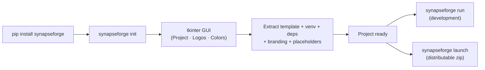

<p align="center">
  
</p>

---

<h1 align="center">
  
</h1>

---

<p align="center">
  <a href="./LICENSE">
    
  </a>
  &nbsp;
  <a href="https://link.mercadopago.com.ar/synapseforge">
    
  </a>
</p>

---

<h3 align="center">CLI + Framework + Template for building and distributing full-stack AI agent projects</h3>

---

## Description

**synapseForge** is a PyPI package that provides a CLI for scaffolding and distributing AI agent projects from scratch. It includes:

1. **CLI** (`synapseforge init`, `launch`, `colors`, `run`) — scaffolding with tkinter GUI + distribution build + live color editor + dev server.
2. **Agent framework** (`backend/agent/`) — AgentLoop, Tools Registry (native + external + MCP), Sessions (SQLite WAL), Permissions, Skills, RAG, MCP.
3. **Embedded project template** (`pipeline/template.zip`) — FastAPI backend + React/Vite/TypeScript frontend.
4. **Docker** — multi-stage `Dockerfile` + `docker-compose.yml`.

### ✨ Key Features

- **Full scaffolding**: `synapseforge init` creates the project from an embedded template with an interactive GUI — structure, venv, logos, `.ico`, colors and placeholder replacement.
- **Self-contained distribution**: `synapseforge launch` generates a ready-to-deliver zip (PyInstaller + embedded Python + compiled frontend).
- **Multi-provider LLM**: LOCAL (Ollama, optional), Groq, Google Gemini and OpenRouter. Cloud API keys are managed from the settings panel, validated against each provider's API and stored encrypted in SQLite. Skippable initial setup screen: with no provider configured the app stays locked until a key is loaded. Advanced parameters (temperature, top_p, reasoning) configurable per model from the settings panel, with "default" option that falls back to each agent's own values.
- **Complete agent framework**: AgentLoop with native tool calling, tools registry (native + external + MCP), per-agent permissions (allow/deny/ask + wildcards) enforced both when exposing tools to the model and at every execution attempt, skills and sub-agents with delegation via `task`.
- **RAG**: vector collections in ChromaDB with OpenRouter embeddings (`liquid/lfm-2.5-embedding-350m:free`). File and web page upload, chunking with overlap and cosine similarity search. Requires an OpenRouter API key (free tier). Long-term conversation memory: every turn is indexed automatically and all agents can search past conversations with the `search_memory` tool. Collections created with an older embedding model are detected via the API and can be reindexed in place.
- **LLM-assisted creation**: standalone interfaces to create skills, tools and agents through an iterative interview + creator agent, with ephemeral cloud model selection per task.
- **Telegram as remote control**: the bot publishes events to the event bus and the frontend runs the same chat flow. Session commands, model/provider switching, skill/tool/RAG creation and agenda management.
- **Scheduled tasks**: the user defines tasks (description + time + days) from the header Agenda or via Telegram; the backend runs them with the selected model and notifies the result in the UI notification bell and via Telegram (always, even if the bot is disabled).
- **Context files**: document upload (PDF, Word, TXT, MD, CSV, JSON, YAML, XML, PY) → text extraction → injection into the agent's system prompt.
- **Usage metrics**: sessions, tools, models, errors and overview, with a dashboard in the frontend.
- **Desktop app mode**: heartbeat watchdog + shutdown endpoint to distribute the app as a product.

---

## What does it solve?

- **Repetitive scaffolding**: A single command creates the whole project with the standard structure of all SYNAPSE projects.
- **Centralized configuration**: Interactive GUI that replaces all XML placeholders in the project (company, client, colors, logo, etc.).
- **Automated branding**: Logo copying + `.ico` generation + color palette extraction from the image.
- **Dependency-free distribution**: Self-contained build ready to hand to the client — includes embedded Python, static frontend, native launcher.

---

## Quick start

```bash
pip install synapseforge

# Create a project (interactive GUI)
synapseforge init my-project
cd my-project

# Start in development mode (requires activated venv)
synapseforge run .
```

On first launch the setup screen appears: load an API key from any cloud provider ([OpenRouter](https://openrouter.ai/settings/keys), [Google Gemini](https://aistudio.google.com/apikey) or [Groq](https://console.groq.com/keys) — all with free tiers) and press **Apply**. Ollama is optional (only if you want local models). The **knowledge base** specifically requires an OpenRouter key.

---

## CLI — Commands

| Command | Description |
|---------|-------------|
| `synapseforge init [dir]` | Creates a project from the template with an interactive GUI |
| `synapseforge launch -p <path> -n <exe> [--skip-frontend] [--no-embed] [-c]` | Self-contained distribution build (zip). With `-c` it compiles the backend to `.pyc`; by default it packages the `.py` files |
| `synapseforge colors [dir]` | GUI editor for `frontend/public/colors.json` (live changes without rebuild) |
| `synapseforge run [dir]` | Starts uvicorn --reload + npm run dev + opens browser |
| `synapseforge --help` | Global help |

- **`init`**: 10-step pipeline (GUI input → template → venv → deps → logos → `.ico` → colors → config → placeholders).
- **`launch`**: compiles the backend (PyInstaller), builds the frontend, downloads embedded Python, generates a native launcher and packs everything into a zip.
- **`run`**: requires the activated venv (`VIRTUAL_ENV`). Ctrl+C kills both servers.



---

## Project structure

```plaintext
synapseForge/
│
├─ synapseforge/                 # Python package — pip-installable CLI
│  ├─ cli/main.py                #   CLI parser: init | launch | colors | run
│  └─ tk/                        #   tkinter GUIs (init, colors)
│
├─ pipeline/                     # Source code for init and launch
│  ├─ template.zip               #   Project template (embedded)
│  ├─ init/                      #   Init: input, template, venv, config, logo, placeholders
│  └─ launch/                    #   Launch: PyInstaller, npm build, zip
│
├─ backend/                      # Template source — FastAPI backend
│  ├─ main.py                    #   FastAPI app: CORS, lifespan, routers, health, SPA static
│  ├─ instances.py               #   Singletons: agent, session_manager
│  ├─ event_bus.py               #   Event bus (SSE) for Telegram ↔ Frontend
│  ├─ routes/                    #   API endpoints (chat SSE, create, config, sessions, rag, metrics…)
│  └─ agent/                     #   Agent framework
│     ├─ agent.py                #   Agent class (multi-provider, streaming SSE, tool calling)
│     ├─ loop.py                 #   AgentLoop: LLM → tool_calls → execute → continue
│     ├─ tools.py                #   Registry: native + external (~/.config/synapseForge/tools/) + MCP
│     ├─ session.py              #   SessionManager (SQLite WAL, history, config_kv)
│     ├─ permissions.py          #   Per-agent permissions (tool/skill/task/rag + wildcards)
│     ├─ ddl_setup.py            #   SQLite table initialization
│     ├─ prompts/                #   System prompt, mandatory, help, skill creation
│     └─ utils/                  #   Helpers: MCP, RAG/vector_db, skill_loader, model_resolver…
│
├─ frontend/                     # Template source — React/Vite/TS frontend
│  ├─ public/docs.html           #   Product documentation (end user)
│  └─ src/
│     ├─ components/             #   Chat, Sidebar, configTab, RagInterface, SkillInterface…
│     └─ services/               #   API clients (chatService SSE, configService, …)
│
├─ store/                        # Store of installable tools and skills
├─ on_boarding/                  # Developer onboarding
├─ cicd/                         # CI/CD
├─ tests/                        # Tests (frontend + declarative E2E suite in tests/e2e)
├─ .commands/                    # Local PowerShell commands
├─ .github/                      # Workflows and PR template
│
├─ Dockerfile                    # Multi-stage: Node 20 build → Python 3.12 slim runtime
├─ docker-compose.yml            # app service: port 8000, VITE_MODE=prod
├─ pyproject.toml                # Build config, synapseforge entry point
└─ requirements.txt              # Repo development dependencies
```

---

## Backend — Agent Framework

The template includes a complete agent framework in `backend/agent/`: AgentLoop with SSE streaming and native tool calling, tools registry (native, external from `~/.config/synapseForge/tools/` and MCP servers via the official SDK), session management in SQLite (WAL), per-agent permission system and skills loaded as context.

**Native tools**: `read`, `write`, `edit`, `glob`, `grep`, `webfetch`, `websearch`, `shell`, `list_dir`, `task` (delegation to sub-agents), `skill`, `reference`, `rag`, `check_email`, `send_email`, `help`.

### User configuration (`~/.config/synapseForge/`)

```
~/.config/synapseForge/
├── skills/                 # Installed skills (SKILL.md + references/)
├── tools/                  # Custom tools (.py with TOOL_NAME, execute())
├── agents/                 # Agents (.md with YAML frontmatter + permissions) + AGENT.md
├── knowledge/              # RAG collections (ChromaDB)
├── mcp.json                # MCP servers
└── config.yaml             # Router permissions (optional)
```

**Agent format (`.md` in `agents/`):**
```markdown
---
name: "My Agent"
description: "What it does and when to use it"
permission:
  read: allow
  task:
    explorer: allow
  skill:
    my_skill: allow
  rag:
    my_collection: allow
parameters:
  temperature: 0.0
  top_p: 0.5
  model: null
---
# Agent system prompt (markdown body)
```

- **AGENT.md**: general behavior injected as a `## Behavior` section in the system prompt of all agents (compatible with opencode/claude code).
- **`## MANDATORY:`**: fidelity rules injected at the end of the system prompt of all agents.
- **Router permissions**: the router always keeps a guaranteed base of read-only/delegation tools — `task`, `help`, `search_memory`, `read`, `websearch`, `webfetch` — regardless of `config.yaml`. If `config.yaml` exists, its permissions are **added on top** of that base (extra tools like `write`); only `task` is restrictable by the yaml (limiting which sub-agents can be delegated to).

### Providers and models

The supported providers are **LOCAL** (Ollama, optional), **GROQ**, **GOOGLE** (Gemini) and **OPENROUTER**. Cloud API keys are managed from the Settings panel (**Providers**): they are validated against each provider's API when saved and stored encrypted in the internal SQLite database. Once a valid key is saved, the provider becomes immediately available in the selectors; a provider only shows up if it has a saved key — for LOCAL it is enough that Ollama responds.

The model is chosen explicitly: on first launch (or if no provider is available) the initial setup screen appears, which can be skipped. With no provider configured, chat and the creators stay locked until a valid key is loaded.

The token context window of the selected model is automatically detected and persisted, and the frontend shows a gauge with the used percentage.

In the creation screens (skill, tool and agent) you can choose which cloud model generates the element (provider + model + Apply). The selection is ephemeral: it only applies to that task while the tab is open.

### Knowledge base (RAG)

RAG collections use cloud embeddings via OpenRouter (`liquid/lfm-2.5-embedding-350m:free`, free tier). To use this section an OpenRouter API key loaded in **Providers** is required: without it, the knowledge base stays disabled (the rest of the app works normally).

---

## Frontend

React/Vite/TypeScript SPA with Tailwind v4 and shadcn/ui, **multi-page**: main chat, skill creation, RAG management and user documentation (`docs.html`). Includes chat with SSE streaming and tool call visualization, sidebar with conversations/settings/agent panel, context window gauge, scheduled tasks Agenda with notification bell, metrics dashboard and Telegram toggle.

The color system is dual: build-time (XML placeholders replaced by the pipeline) + runtime (`frontend/public/colors.json` loaded before rendering). `synapseforge colors` edits colors live without rebuild.

---

## Telegram

Telegram bot as a remote control for the agent: it long-polls the Telegram Bot API and acts as a bridge — it publishes messages to the event bus, the frontend runs the normal chat flow and the backend returns the final response to Telegram. It supports session commands (`/sesiones`, `/usar`, `/nueva`, `/borrar`), model/provider switching (`/modelo`, `/proveedor`), control (`/detener`, `/contexto`, `/actual`), skill/tool/RAG creation (`/crear`), file sending (`/archivo`) and agenda management (`/agenda`, `/agendar`, `/horario`, `/eliminar_tarea`), plus voice notes (local transcription with faster-whisper) and attachments. Scheduled task executions are always notified via Telegram, regardless of whether the bot is enabled to work.

| Variable | Description |
|----------|-------------|
| `TELEGRAM_BOT_TOKEN` | Bot token (from BotFather). If not set, the bot stays disabled. |
| `TELEGRAM_ALLOWED_CHAT_IDS` | List of authorized `chat_id`s (comma-separated). |

---

## Docker

Multi-stage `Dockerfile` (Node 20 frontend build → Python 3.12 slim runtime) + `docker-compose.yml`. The backend serves the static frontend automatically and exposes a healthcheck at `/health`.

```bash
docker compose up --build -d
# App available at http://localhost:8000
```

---

## Future integration — Vercel Skills

Integration with the [Vercel Skills](https://github.com/vercel-labs/skills) ecosystem (`npx skills`) is planned, which allows searching, installing and managing skills from public repositories. The planned flow works in two stages:

1. **Search**: run `npx skills find <query>` to discover skills available in the ecosystem.
2. **Evaluation/Installation**: an LLM evaluates the results against the user's needs, and if appropriate, installs the skill from the source.

This would make it possible to expand the skills repository without having to create them manually, leveraging the open agent skills ecosystem.

---

## Testing

End-to-end tests live in `tests/e2e/`: a declarative YAML suite that drives the real application — a bot writes messages through the same SSE chat endpoint the frontend uses, plus direct API calls — asserting on structure and contracts (never on exact model text).

**Prerequisites:**

- The backend running (`uvicorn backend.main:app` or the packaged app).
- Project dependencies installed (`requests` and `pyyaml` are already project deps).
- Chat scenarios need a configured provider (Ollama running or a cloud API key); pure-API scenarios (scheduler, validations) work without any.

**Run:**

```bash
python -m tests.e2e.runner                # all scenarios
python -m tests.e2e.runner --only rag     # single scenario by name
python -m tests.e2e.runner --base-url http://127.0.0.1:8000
```

Each scenario prints pass/fail with per-assertion detail; a JSON report is written to `tests/e2e/reports/`. Exit code is `0` when everything passes.

**Scenario files** (`tests/e2e/scenarios/*.yaml`): `main_flow` (chat, attachments context, stream cancellation), `creators` (listings + error validations), `scheduler` (create/toggle/delete with ID propagation), `rag` (collections, embedding compatibility, long-term memory). Sessions created by tests use an `e2e-` prefix and are deleted on cleanup, so your history stays untouched.

---

## Documentation

| Document | Content |
|---|---|
| `frontend/public/docs.html` | Product documentation for the end user (served by the app) |
| `on_boarding/` | Onboarding guide, contribution and Git flow |
| `docs/` | Technical project documentation (not tracked) |

---

## Tech Stack

[](https://www.python.org/)
[](https://fastapi.tiangolo.com/)
[](https://www.sqlite.org/)
[](https://www.trychroma.com/)
[](https://react.dev/)
[](https://www.typescriptlang.org/)
[](https://vite.dev/)
[](https://tailwindcss.com/)
[](https://ui.shadcn.com/)
[](https://nodejs.org/)
[](https://pyinstaller.org/)
[](https://www.docker.com/)
[](https://telegram.org/)
[](https://pypi.org/)
[](https://groq.com/)
[](https://ai.google.dev/)
[](https://openrouter.ai/)
[](https://ollama.com/)

---


## Support this project

synapseForge will always be free and open source. If you find it useful, consider supporting its development with a [donation via Mercado Pago](https://link.mercadopago.com.ar/synapseforge) — your donation goes directly into new features, fixes and better docs for everyone.

---

## License

This project is licensed under the terms specified in the [LICENSE](./LICENSE) file located at the root of the repository.

---

Copyright (c) 2026 SYNASPE AI SAS

---
