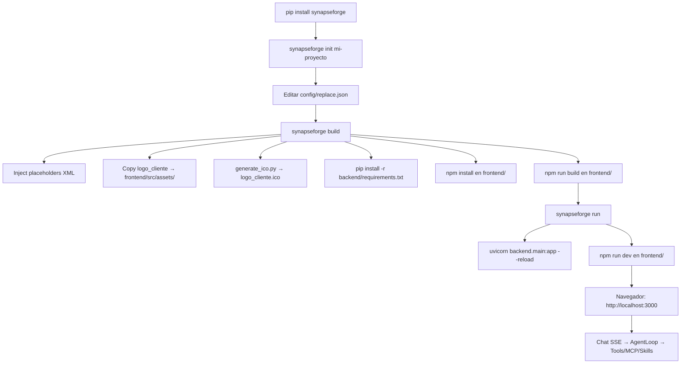

<p align="center">
  
</p>

---

<h1 align="center">synapseForge</h1>

---

<p align="center">
  <a href="./LICENSE">
    
  </a>
</p>

---

<h3 align="center">CLI + Framework para crear, construir y ejecutar proyectos de agentes IA full-stack</h3>

---

## Descripción

synapseForge es un paquete PyPI (`pip install synapseforge`) que provee:

1. **CLI `synapseforge`** con subcomandos para gestionar el ciclo de vida completo de un proyecto
2. **Framework de agentes** (backend/agent/) instalado como dependencia: Agent, Tools, Loop, Sessions, MCP, Skills, Permissions
3. **Template de proyecto** embebido en el paquete (backend FastAPI + frontend React/Vite/TS) que se materializa con `synapseforge init`

El usuario instala el paquete, inicializa un proyecto, configura `config/replace.json`, ejecuta `build` (inject placeholders, copy logo, gen ico, install deps, build frontend) y `run` (levanta uvicorn + vite dev).

---

## ¿Qué resuelve?

- **Scaffolding repetitivo**: Un comando crea venv, copia template, inyecta config, compila frontend
- **Configuración dispersa**: Un solo `config/replace.json` con placeholders XML para todo el proyecto
- **Logo/branding del cliente**: Copia automática + generación `.ico` via `generate_ico.py`
- **Dependencias duales**: `pip install` en venv del proyecto + `npm install` + `npm run build` en frontend
- **MCP integrado**: Config en `~/.config/synapseForge/config.json`, health check via CLI y API
- **Distribución**: El usuario decide cómo empaquetar/desplegar (PyInstaller, Docker, systemd, etc.)

---

## Store — Tools y Skills Disponibles

El paquete incluye un `store/` con tools y skills listas para instalar:

```
synapseforge/store/
├── tools_store/             # Tools disponibles (.py)
│   └── ...                  # Instalar con: synapseforge install tool <nombre>
└── skills_store/            # Skills disponibles (carpeta con SKILL.md)
    └── ...                  # Instalar con: synapseforge install skill <nombre>
```

El usuario instala las que necesita via CLI, y se copian a `~/.config/synapseForge/tools/` o `~/.config/synapseForge/skills/`. El agente no tiene skills nativas — todo se personaliza.

| Comando | Descripción |
|---------|-------------|
| `synapseforge install tool <nombre>` | Instala una tool del store al config del usuario |
| `synapseforge install skill <nombre>` | Instala una skill del store al config del usuario |
| `synapseforge remove tool <nombre>` | Elimina una tool del config del usuario |
| `synapseforge remove skill <nombre>` | Elimina una skill del config del usuario |
| `synapseforge list tools` | Lista tools disponibles en store + instaladas |
| `synapseforge list skills` | Lista skills disponibles en store + instaladas |

---

## Estructura del producto

### 1. Paquete PyPI (`synapseforge`)

```
synapseforge/
├── cli/                    # Entry point: init, build, run
├── templates/
│   └── project/            # Template embebido (backend/, frontend/, config/)
├── backend/agent/          # Framework (instalado como dependencia)
│   ├── agent.py            # Agent class: Groq/Ollama, streaming, tool calling
│   ├── tools.py            # Registry: native + external (~/.config/synapseForge/tools/) + MCP
│   ├── loop.py             # AgentLoop: while True → LLM → tool_calls → execute → continue
│   ├── session.py          # SessionManager: SQLite WAL, messages, config_kv, error_log
│   ├── permissions.py      # Agent defs en ~/.config/synapseForge/agents/*.md (frontmatter YAML)
│   ├── config_dir.py       # ~/.config/synapseForge/ (skills, tools, agents, config.json)
│   ├── contract.py         # ContractResponse: status, message, data, tool_calls, usage
│   ├── utils/
│   │   ├── mcp_helper.py   # MCP stdio/HTTP, tool discovery, execution, health
│   │   ├── skill_loader.py # SKILL.md parsing, triggers, reference guide
│   │   ├── generate_ico.py # PNG → ICO (usado en build)
│   │   └── ...
│   └── prompts/            # system_prompt.md, title.md, select_skills.md, select_reference.md
```

### 2. Proyecto generado (`synapseforge init mi-proyecto`)

```
mi-proyecto/
├── config/
│   └── replace.json        # Placeholders: empresa, owner, legal, repo, cliente, logo_cliente, descripcion, logo, width, height
├── backend/
│   ├── main.py             # FastAPI app, lifespan, routers, CORS, health
│   ├── routes/
│   │   ├── chat.py         # POST /api/chat → SSE stream (AgentLoop)
│   │   ├── config.py       # Providers, models, context-window, MCP servers/health
│   │   └── sessions.py     # CRUD sessions, messages, titles
│   ├── requirements.txt    # synapseforge, fastapi, uvicorn, groq, ollama, python-dotenv, etc.
│   └── ./      # Venv creado en init (Python 3.12+, nombre = repo)
├── frontend/
│   ├── package.json        # React 18, TS, Vite, Tailwind, shadcn/ui, lucide-react
│   ├── vite.config.ts
│   ├── src/
│   │   ├── services/chatService.ts    # SSE parsing: chunk, tool_call, tool_result, subagent_*, session_title, done
│   │   ├── services/configService.ts  # Providers, models, context-window, MCP health
│   │   ├── services/sessionService.ts # Sessions list, delete
│   │   ├── components/Sidebar.tsx     # Sessions tab + Config tab (provider/model, context, MCP health)
│   │   ├── components/MessageBubble.tsx
│   │   └── ...
│   └── dist/               # Generado en build (npm run build)
├── .config/
│   └── synapseForge/       # Config usuario (skills/, tools/, agents/, config.json solo MCP)
└── README.md               # Este archivo (generado con placeholders)
```

### 3. Configuración usuario (`~/.config/synapseForge/`)

```
synapseForge/
├── skills/                 # Carpeta por skill con SKILL.md (description, triggers, body, Reference Guide)
├── tools/                  # .py sueltos con TOOL_NAME, TOOL_DESCRIPTION, TOOL_PARAMETERS, execute()
├── agents/                 # .md con frontmatter YAML: name, description, permission:{tool:{}, skill:{}}, parameters:{}
└── config.json             # Solo MCP: {mcp: {timeout, servers: {label: {command, args, env, server_url, transport, disabled}}}}
```

---

## Instalación

### 1. Instalar paquete

```bash
>>> pip install synapseforge
```

### 2. Inicializar proyecto

```bash
>>> synapseforge init mi-proyecto
>>> cd mi-proyecto
```

Crea: estructura de carpetas, `config/replace.json` vacío, venv `./` en backend/ (nombre = repo), copia template.

### 3. Configurar

Editar `config/replace.json`:

```json
{
  "empresa": "Mi Empresa",
  "owner": "mi-usuario",
  "legal": "Mi Empresa S.A.",
  "repo": "mi-proyecto",
  "cliente": "Mi Cliente",
  "logo_cliente": "path/to/logo_cliente.png",
  "descripcion": "Descripción del proyecto",
  "logo": "https://github.com/.../logo.png",
  "width": 150,
  "height": null
}
```

### 4. Construir

```bash
>>> synapseforge build
```

Pipeline secuencial:
1. **Inject placeholders** — Reemplaza `<tag>valor</tag>` en todo el proyecto desde `replace.json`
2. **Copy logo cliente** — `logo_cliente` → `frontend/src/assets/logo_cliente.png` (verbatim)
3. **Generate .ico** — Ejecuta `backend/agent/utils/generate_ico.py` → `logo_cliente.ico`
4. **Install Python deps** — `pip install -r backend/requirements.txt` en `./`
5. **Check Node** — Verifica `node` y `npm` en PATH (requiere Node 20+)
6. **Install Node deps** — `npm install` en `frontend/`
7. **Build frontend** — `npm run build` en `frontend/` → genera `frontend/dist/`

### 5. Ejecutar

```bash
>>> synapseforge run
```

Levanta en paralelo:
- Backend: `uvicorn backend.main:app --reload --host 0.0.0.0 --port 8000` (venv `./` activado)
- Frontend: `npm run dev` en `frontend/` (puerto 3000)
- Abre navegador en `http://localhost:3000`

---

## CLI — Comandos

| Comando | Descripción |
|---------|-------------|
| `synapseforge init <nombre>` | Crea proyecto desde template + venv |
| `synapseforge build` | Pipeline completo: inject, logo, ico, deps, build frontend |
| `synapseforge run` | Levanta backend (uvicorn) + frontend (vite dev) |
| `synapseforge --help` | Ayuda global y por subcomando |

---

## Pipeline / Flujo principal



---

## Backend — Arquitectura clave

### AgentLoop (`backend/agent/loop.py`)

```python
async def run(session_id, user_message, file_contents, stream_cancel_event, system_prompt, tool_permissions, skill_permissions, parameters, agent_name, depth, parent_id):
    # 1. Create/recover session (SQLite)
    # 2. Load history (max_turns from config)
    # 3. Build system_prompt (base + skills + agents list)
    # 4. Resolve tools (native + external + MCP) filtered by permissions
    # 5. while iteration < MAX_ITERATIONS:
    #    # 6.   llm_streaming(model, messages, tools) → yields chunk / tool_calls_detected
    # 7.   if tool_calls: execute each → append tool results → continue
    # 8.   else: yield final chunk → save → done
```

### Tools Registry (`backend/agent/tools.py`)

- **Nativas**: `read`, `write`, `edit`, `glob`, `grep`, `webfetch`, `websearch`, `question`, `task`, `shell`, `skill`, `reference`, `check_email`, `mcp`
- **Externas**: `~/.config/synapseForge/tools/*.py` (carga dinámica, schema desde signature + docstring)
- **MCP**: `mcp_helper.get_mcp_tools()` → descubre tools de servidores en `config.json` → registra como `type: function` schemas
- **Ejecución**: `_execute_tool(name, **kwargs)` despacha a nativa → externa → MCP → error

### MCP (`backend/agent/utils/mcp_helper.py`)

- `McpConnection`: subprocess stdio persistente, JSON-RPC 2.0 (`tools/list`, `tools/call`)
- `get_mcp_tools()`: conecta a cada servidor stdio, lista tools, wrappea a function schema
- `execute_mcp_tool(name, args)`: despacha al servidor dueño
- Health check: stdio (tools/list) + HTTP (GET server_url)

### Sessions (`backend/agent/session.py`)

- SQLite WAL: `sessions`, `messages`, `config_kv`, `error_log`
- `messages`: role, content, tool_calls (JSON), tool_results (JSON), tool_call_id, tool_name, turn_number
- `config_kv`: `selected_model`, `selected_provider`, `context_window_turns` (persistidos, cargados en lifespan)

### Permissions (`backend/agent/permissions.py`)

- Agentes definidos en `~/.config/synapseForge/agents/<name>.md` con frontmatter YAML
- `permission.tool`: dict tool→allow/deny/ask; `permission.skill`: dict skill→allow/deny/ask
- `filter_tools()`, `filter_skills()` evalúan wildcard `*` y precedencia (última gana)

---

## Frontend — Flujo de Chat

1. Usuario escribe mensaje + adjunta archivos opcionales
2. `chatService.sendMessage()` → `POST /api/chat` con `FormData` (message, session_id, files[])
3. SSE stream parsing: `data: {"type": "chunk|tool_call|tool_result|subagent_call|subagent_result|session_title|done", "content": ...}`
4. `MessageBubble` renderiza chunks incrementales, tool calls colapsables, resultados
5. `Sidebar`:
   - **Sessions tab**: lista (title, preview, timestamp), click carga historial, delete
   - **Config tab**: provider/model dropdowns, context window input, MCP health badges (connected/failed/disabled + tools count)

---

## Requisitos Previos

| Herramienta | Versión | Verificación en `build` |
|-------------|---------|-------------------------|
| **Python** | 3.12+ | Requerido para `pip install synapseforge` |
| **Node.js** | 20+ | Verificado en `build` (falla si no está) |
| **Ollama** | Latest | Solo si se usa provider LOCAL (opcional) |
| **Git** | 2.40+ | Para clonar/versionar |

> **Node.js y Ollama NO se instalan automáticamente**. El CLI verifica y muestra error claro si faltan.

---

## Stack Tecnológico


---

## Licencia

Apache 2.0 - Ver archivo [LICENSE](./LICENSE)

---

Copyright (c) 2026 SYNASPE AI SAS

---