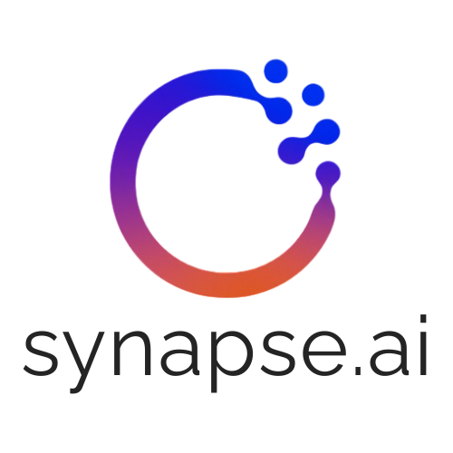

<p align="center">
  
</p>

<h1 align="center">synapseForge</h1>

<p align="center">
Análisis de Producto
</p>

---

# ANÁLISIS EXHAUSTIVO DE PRODUCTO: synapseForge

## 1. RESUMEN EJECUTIVO DEL PRODUCTO

**synapseForge** es un framework Python de código abierto diseñado para construir, orquestar y desplegar agentes de IA a escala mediante un flujo conversacional, eliminando la necesidad de programación tradicional.

### Posicionamiento en el Mercado
- **Categoría**: Framework de desarrollo de Agentes AI No-Code/Low-Code
- **Mercado objetivo**: Global, valor estimado $50B+ para 2028
- **Diferenciación principal**: Constructor conversacional que genera código ejecutable desde lenguaje natural

---

## 2. ANÁLISIS DEL PROBLEMA

### Problema Identificado
Los frameworks actuales (LangChain, CrewAI, AutoGen, n8n) requieren:
- **Conocimiento técnico**: Programación en Python o configuración visual compleja
- **Curva de aprendizaje alta**: Documentación extensa, múltiples dependencias
- **Iteración manual**: Cambios requieren editar código manualmente
- **Falta de validación**: Los errores se propagan sin controles estrictos

### Impacto del Problema
| Segmento | Dolor Actual | Oportunidad |
|----------|--------------|-------------|
| No técnicos | Imposible crear agentes | Accesibilidad total |
| PyMEs | Costos altos de desarrollo | Reducción 70%+ en tiempo |
| Empresas | Dependencia de desarrolladores | Autonomía de negocio |
| Desarrolladores | Boilerplate repetitivo | Productividad 10x |

---

## 3. PROPUESTA DE VALOR

### Propuesta Central
> "Construye agentes de IA describiendo lo que necesitas. El framework hace el resto."

### Pilares de Valor

| Pilar | Descripción | Benefit Principal |
|-------|-------------|-------------------|
| **Sin Código** | Lenguaje natural → código ejecutable | Democratización total |
| **Primitivas Propias** | Agent, Tool, Memory, Pipeline custom | Flexibilidad absoluta |
| **Validación Exhaustiva** | Checks en cada paso del pipeline | Confiabilidad operacional |
| **Iteración Visual** | Spec Markdown editable | Precisión sin código |
| **Observabilidad Native** | Traces, métricas, cost tracking | Debugging sin herramientas externas |

---

## 4. FEATURES Y CAPACIDADES

### Feature Matrix - Priorizada por MVTP

#### CORE FEATURES (Fase 1 - MVP)
| Feature | Descripción | Prioridad | Complejidad |
|---------|-------------|-----------|-------------|
| **Builder Conversacional** | Interfaz conversacional para describir agentes | MUST HAVE | Alta |
| **Spec Generator** | Genera spec en Markdown desde descripción | MUST HAVE | Alta |
| **Pipeline de Ejecución** | Router → Planner → Executor → Validator | MUST HAVE | Alta |
| **Primitivas Propias** | Agent, Tool, Memory, State custom | MUST HAVE | Alta |
| **Compilación Automática** | Genera código Python ejecutable | MUST HAVE | Media |
| **Templates Predefinidos** | 3-5 arquetipos de agentes | SHOULD HAVE | Media |

#### ENHANCED FEATURES (Fase 2 - Beta)
| Feature | Descripción | Prioridad | Complejidad |
|---------|-------------|-----------|-------------|
| **Interfaz Visual** | GUI para iterar specs | SHOULD HAVE | Alta |
| **Checkpointing Básico** | Pause & Resume de ejecuciones | SHOULD HAVE | Alta |
| **Observabilidad Integrada** | Dashboard de traces y métricas | SHOULD HAVE | Media |
| **Memory Dual** | Short-term + Long-term | SHOULD HAVE | Media |
| **Tool Builder** | Crear herramientas desde descripción | COULD HAVE | Alta |

#### ADVANCED FEATURES (Fase 3+)
| Feature | Descripción | Prioridad | Complejidad |
|---------|-------------|-----------|-------------|
| **Time-travel** | Volver a estados anteriores | COULD HAVE | Muy Alta |
| **Multi-thread Agents** | Ejecuciones paralelas aisladas | COULD HAVE | Muy Alta |
| **Dashboard Métricas** | Visualización avanzada | COULD HAVE | Media |
| **Deployment Simplified** | One-click deploy | COULD HAVE | Alta |

---

## 5. ANÁLISIS DE MERCADO

### Tamaño de Mercado

| Métrica | Valor | Fuente |
|---------|-------|--------|
| **Market TAM (2030)** | $50.2B | Gartner 2024 |
| **CAGR (2024-2030)** | 44.2% | Multiple sources |
| **TAM España/Latam** | $2-4B (estimado) | Análisis propio |

### Tendencias de Mercado

1. **Democratización AI**: Las herramientas no-code para AI crecen 89% YoY
2. **Agentic Workflows**: Gartner predice 80% de apps usarán agents para 2028
3. **Shadow IT**: 67% de empresas usan herramientas AI no aprobadas por IT
4. **Developer Experience**: La productividad del desarrollador es prioridad #1

### Segmentación de Mercado

```
Segmento Primario: SMBs y Startups Latam/España
├── Tamaño: ~500K empresas
├── Pain: Sin equipo técnico para IA
├── Willingness: Alto ($100-500/mes)
└── Canales: Comunidades dev, Discord, LinkedIn

Segmento Secundario: Developers Individuales
├── Tamaño: ~2M developers Latam
├── Pain: Boilerplate repetitivo
├── Willingness: Medio (freemium)
└── Canales: GitHub, StackOverflow, Dev.to

Segmento Terciario: Empresas Medianas
├── Tamaño: ~50K empresas
├── Pain: Dependencia de vendors
├── Willingness: Alto ($2000+/mes)
└── Canales: Ventas directas, Partners
```

### Análisis de Competidores

#### Competidores Directos

| Competidor | Fortalezas | Debilidades | Posición |
|------------|------------|--------------|----------|
| **LangChain** | Ecosistema maduro, comunidad grande | Código requerido, docs confusas | Líder mercado |
| **CrewAI** | Multi-agent simple | Limitado, sin UI | Challenger |
| **AutoGen** | Microsoft detrás | Complejo,Azure-locked | Challenger |
| **n8n** | Visual, integrations | No true agentic, limitante | Challenger |
| **Coze** | No-code agent platform | Solo cloud, China-focused | Nicho |

#### Matriz Competitiva synapseForge

| Dimensión | LangChain | CrewAI | n8n | synapseForge |
|-----------|-----------|--------|-----|-------------|
| No-code | ✗ | ✗ | Parcial | ✓✓✓ |
| Validación exhaustiva | ✗ | ✗ | ✗ | ✓✓✓ |
| Primitivas propias | ✗ | ✗ | ✗ | ✓✓✓ |
| Iteración visual | ✗ | ✗ | ✓ | ✓✓✓ |
| Compilación auto | ✗ | ✗ | ✗ | ✓✓✓ |
| Open Source | ✓ | ✓ | ✓ | ✓ |
| Observabilidad native | ✗ | ✗ | ✗ | ✓✓✓ |

---

## 6. MODELO DE NEGOCIO

### Modelo Open Source + SaaS

```
┌─────────────────────────────────────────────────────────┐
│                    REVENUE STACK                         │
├─────────────────────────────────────────────────────────┤
│  SAAS (70% revenue)                                     │
│  ├── Tier 1: Free (Open Source)                         │
│  │   ├── Core framework                               │
│  │   ├── Builder básico                               │
│  │   └── Templates 3 agentes                       │
│  ├── Tier 2: Pro - $29/mo                            │
│  │   ├── Todo del Tier 1                             │
│  │   ├── Builder visual completo                    │
│  │   ├── Templates ilimitados                       │
│  │   ├── Checkpointing basic                         │
│  │   └── Soporte community                           │
│  ├── Tier 3: Team - $99/mo                           │
│  │   ├── Todo del Tier 2                            │
│  │   ├── 5 seats                                   │
│  │   ├── Checkpointing advanced                    │
│  │   ├── Deployment managed                       │
│  │   └── Soporte priority                          │
│  └── Tier 4: Enterprise - Custom                    │
│      ├── Todo del Tier 3                              │
│      ├── SSO/SAML                                   │
│      ├── RBAC                                       │
│      ├── On-premise option                           │
│      └── Soporte dedicated (24/7)                    │
├─────────────────────────────────────────────────────────┤
│  SERVICES (30% revenue)                                │
│  ├── Consulting implementation                        │
│  ├── Custom agent development                        │
│  ├── Training & certification                       │
│  └── Enterprise support contracts                   │
└─────────────────────────────────────────────────────────┘
```

### Unit Economics

| Métrica | Valor Objetivo |
|---------|---------------|
| **CAC** | $50 (organic), $150 (paid) |
| **LTV** | $1,200 (Pro), $8,000 (Team) |
| **LTV:CAC** | 8:1 (target: >3:1) |
| **Payback Period** | 4 meses |
| **Churn Rate** | <5% mensual |

---

## 7. ROADMAP DETALLADO

### Roadmap de Producto (18 meses)

```
FASE 1: FOUNDATION (Meses 1-4)
=============================
Milestone 1.1: Core Framework (Mes 2)
├── Agent, Tool, Memory, State primitives
├── Pipeline Router → Planner → Executor → Validator
├── Basic validation (inputs/outputs)
└── CLI para ejecución básica

Milestone 1.2: Builder Conversacional MVP (Mes 3)
├── Input: Descripción en lenguaje natural
├── Output: Spec Markdown
├── Iteración básica (approve/edit/regenerate)
└── Compilación a código Python

Milestone 1.3: Templates Launch (Mes 4)
├── Research Agent template
├── Outreach Agent template
├── Support Agent template
└── Documentación + ejemplos
→ DELIVERABLE: MVP funcional, public beta

FASE 2: GROWTH (Meses 5-8)
==========================
Milestone 2.1: Interfaz Visual (Mes 6)
├── Dashboard web para spec editing
├── Visual pipeline builder
├── Tool configuration UI
└── Preview de compilación

Milestone 2.2: Observabilidad (Mes 7)
├── Trace viewer integrado
├── Métricas de ejecución (latencia, errores, cost)
├── Logging estructurado
└── Integration con Prometheus/Grafana

Milestone 2.3: Checkpointing (Mes 8)
├── Pause & Resume
├── State persistence (SQLite/PostgreSQL)
├── Retry con backoff configurables
└── Execution history
→ DELIVERABLE: Beta pública, primeros usuarios pagos

FASE 3: SCALE (Meses 9-14)
==========================
Milestone 3.1: Multi-threading (Mes 10)
├── Ejecución paralela de agentes
├── Aislamiento de contextos
├── Rate limiting
└── Queue management

Milestone 3.2: Tool Library (Mes 11)
├── Marketplace de herramientas
├── Integrations (Slack, Notion, HubSpot, etc.)
├── Custom tool marketplace
└── Rating & reviews system

Milestone 3.3: Deployment (Mes 12)
├── One-click deployment
├── Docker containerization
├── Kubernetes operator
└── Cloud (AWS/Azure/GCP) templates
→ DELIVERABLE: Producto completo, go-to-market agresivo

FASE 4: ENTERPRISE (Meses 15-18)
=============================
Milestone 4.1: Enterprise Features (Mes 15)
├── SSO/SAML
├── RBAC granular
├── Audit logs
└── Compliance (GDPR, SOC2)

Milestone 4.2: Multi-tenant (Mes 16)
├── Workspace isolation
├── Team management
├── Billing centralizado
└── Usage quotas

Milestone 4.3: Partner Program (Mes 18)
├── SI partnerships
├── Agency program
├── Referral program
└── Certification program
→ DELIVERABLE: Enterprise ready, $2M+ ARR target
```

---

## 8. KPIs Y MÉTRICAS

### North Star Metric

> **NSM: Monthly Active Agents (MAA)**

**Target**: 10,000 MAA al cierre de Y1

### KPIs por Categoría

#### Acquisition Metrics
| KPI | Descripción | Target Y1 |
|-----|-------------|-----------|
| **Signups mensuales** | Nuevos usuarios registrados | 2,000/mo |
| **Activation rate** | Usuarios que crean ≥1 agente | 60% |
| **CAC** | Costo por usuario adquirido | <$100 |

#### Activation Metrics
| KPI | Descripción | Target Y1 |
|-----|-------------|-----------|
| **Time to first agent** | Tiempo hasta crear primer agente | <15 min |
| **Time to first run** | Tiempo hasta ejecutar primer agente | <30 min |
| **Compilación success rate** | % de compilaciones exitosas | >90% |

#### Retention Metrics
| KPI | Descripción | Target Y1 |
|-----|-------------|-----------|
| **D7 retention** | Usuarios activos day 7 | 40% |
| **D30 retention** | Usuarios activos day 30 | 25% |
| **Monthly churn** | Churn rate mensual | <8% |

#### Revenue Metrics
| KPI | Descripción | Target Y1 |
|-----|-------------|-----------|
| **MRR** | Monthly recurring revenue | $50K |
| **ARPU** | Average revenue per user | $15/mo |
| **LTV** | Lifetime value | >$500 |

---

## 9. GO-TO-MARKET (GTM) STRATEGY

### GTM Strategy por Segmento

#### Segmento 1: Developers (Inbound)
**Canales**:
- GitHub (repo, stars, contributions)
- Dev.to, Medium (technical content)
- YouTube tutorials
- Discord community

**Funnel**:
```
GitHub → Readme → Star → Try (local) → Discord → Feedback → Pro
```

#### Segmento 2: SMBs (Product-Led Growth)
**Canales**:
- Product Hunt launch
- Indie hackers communities
- LinkedIn ads (targeted)
- SEO (long-tail keywords)

**Funnel**:
```
Ad/Search → Landing → Free trial → Create agent → Activate → Upgrade
```

#### Segmento 3: Enterprise (Sales-Led)
**Canales**:
- LinkedIn outbound
- Industry events
- Partners/SIs
- Direct sales

**Funnel**:
```
Outreach → Demo → Proof of Concept → Contract → Onboard
```

---

## 10. RIESGOS Y MITIGACIONES

### Matriz de Riesgos

| Riesgo | Probabilidad | Impacto | Mitigación |
|--------|--------------|---------|-------------|
| **Competidor mayor lanza feature similar** | Alta | Alto | Move fast, early community |
| **Adoption más lenta de lo esperado** | Media | Alto | Expandir segmentos, ajustar pricing |
| **Calidad del código generado** | Media | Medio | Testing extensivo, feedback loop |
| **Dependencia de LLMs para builder** | Alta | Medio | Prompt engineering robusto, fallback |

### Risk Response Plans

**Riesgo 1: Competidor mayor (ej. LangChain añade no-code)**
- Early mover advantage: Community lock-in
- Differentiation: Focus en UX no-code, no solo features

**Riesgo 2: Calidad del código generado**
- Code review automático
- User feedback loops
- Linting y testing en compilación

**Riesgo 3: Dependencia de LLM para builder**
- Prompt library versionada
- Fallback a modelos más baratos
- Human-in-the-loop para casos complejos

---

## 11. CONCLUSIONES

### Síntesis Estratégica

synapseForge tiene una oportunidad real de capturar un mercado creciente con una diferenciación clara: **el único framework que permite construir agentes de IA sin programar, generando código ejecutable de calidad.**

### Factores Clave de Éxito

1. **Velocidad de ejecución**: La window de oportunidad es 12-18 meses antes de que grandes players respondan
2. **Community first**: Network effects son el mayor defensible
3. **Calidad del código**: La promesa de "código ejecutable" debe cumplirse con estándar alto
4. **Execution excellence**: Roadmap agresivo pero realista

### Recomendaciones Clave

1. **Priorizar Community Growth**: Network effects son críticos
2. **Validar con Developers Primero**: Early adopters perfectos
3. **Multi-Provider LLM**: Evitar lock-in con OpenAI
4. **Pricing Progressive**: Free = core completo, Pro = builder visual
5. **Metrics-Driven Development**: Evitar feature bloat

---

*Documento generado: Mayo 2026*
*Versión: 1.0*
*Tipo: Producto - Análisis Estratégico*