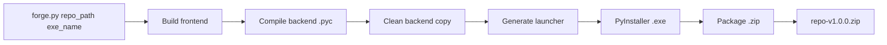

<p align="center">
  
</p>

---

<h1 align="center">synapseForge / launch</h1>

---

<p align="center">
  <a href="./LICENSE">
    
  </a>
</p>

---

<h3 align="center">Distribución automatizada de agentes IA full-stack en un solo comando</h3>

---

## Descripción

**launch** es el módulo de empaquetado de synapseForge. Toma un repositorio de agente (backend FastAPI + frontend React/Vite) y genera un archivo `.zip` listo para distribuir, que incluye:

- Ejecutable `.exe` lanzador (sin consola, abre el navegador automáticamente)
- Backend compilado a `.pyc` (sin código fuente expuesto)
- Frontend compilado (`frontend/dist/`)
- Python embebido (carpeta `python/` con deps instaladas)
- `.env`, `LICENSE`, `README.md`

**Resultado:** un solo `.zip` que el usuario final descomprime y ejecuta con doble click. Sin instalar Python, sin pip, sin npm.

---

## ¿Qué resuelve?

- **Distribución repetitiva**: automatiza compilación, empaquetado y exclusión de archivos innecesarios
- **Sin exposición de código fuente**: compila a `.pyc` y excluye los `.py` originales
- **Portabilidad total**: incluye Python embebido, no requiere runtime externo
- **Cero configuración para el usuario**: descomprime y ejecuta

---

## Requisitos

| Herramienta | Versión | Uso |
|-------------|---------|-----|
| **Python** | 3.12+ | Entorno del proyecto a empaquetar |
| **Node.js** | 20+ | Build del frontend (npm) |
| **PyInstaller** | 6+ | Generación del ejecutable |

---

## Instalación

```bash
>>> cd synapseForge/launch
>>> pip install -r requirements.txt
```

---

## Uso

```bash
>>> python forge.py <ruta_absoluta_al_repo> "<nombre_del_ejecutable>"
```

### Ejemplos

```bash
# Windows
>>> python forge.py D:\ia-san-juan\4_reinas "<cliente>nombre_cliente</cliente>"

# Linux
>>> python forge.py /home/user/mi-agente "Mi Agente"

# Saltar build del frontend (usar dist/ existente)
>>> python forge.py D:\ia-san-juan\4_reinas "<cliente>nombre_cliente</cliente>" --skip-frontend
```

### Argumentos

| Argumento | Obligatorio | Descripción |
|-----------|-------------|-------------|
| `repo_path` | ✅ | Ruta absoluta al directorio raíz del repositorio |
| `exe_name` | ✅ | Nombre del ejecutable (con o sin .exe) |
| `--skip-frontend` | ❌ | Salta `npm run build` (usa frontend/dist/ existente) |
| `--no-embed` | ❌ | Usa el venv existente (`.{repo}/`) en vez de descargar Python embebido |
| `--no-zip` | ❌ | Solo genera el ejecutable, sin empaquetar |

---

## Pipeline



### Pasos detallados

1. **Build frontend** — ejecuta `npm install && npm run build` en `repo/frontend/`
2. **Compilar backend** — `python -m compileall -b backend/` → genera `.pyc` legacy junto a cada `.py`
3. **Limpiar copia** — copia `backend/` excluyendo:
   - `__pycache__/`
   - `build_launcher/`
   - `agent.db`
   - Todos los `.md` y `.txt` excepto en `agent/prompts/`
4. **Generar launcher** — personaliza `templates/launcher.py` con los valores del repo (python embebido, puerto, módulo)
5. **Compilar ejecutable** — PyInstaller `--onefile --noconsole` → `{exe_name}.exe`
6. **Empaquetar** — crea `.zip` con:
   - `{exe_name}.exe`
   - `backend/` (solo `.pyc`)
   - `frontend/dist/`
   - `python/` (Python embebido + deps)
   - `.env`, `LICENSE`, `README.md`

---

## Estructura del proyecto

```plaintext
synapseForge/
└── launch/                          # Módulo de empaquetado
    ├── forge.py                     # CLI principal
    ├── templates/
    │   └── launcher.py              # Template del ejecutable lanzador
    ├── requirements.txt             # Dependencias (pyinstaller)
    └── README.md                    # Este archivo
```

---

## Output del build

```
{repo}/__forge_build__/
├── launcher.py                      # Launcher generado (temporal)
├── temp/                            # PyInstaller workpath (autolimpieza)
├── dist/
│   ├── {exe_name}.exe
│   └── backend/                     # Backend compilado y limpio
└── {repo}-v{version}.zip            # Producto final
```

El `.zip` final se mueve a la raíz del repositorio.

---

## Convención de repositorios

Para que **launch** funcione correctamente, el repositorio debe seguir esta estructura:

```plaintext
{repo}/
├── .{repo}/                         # Venv (ej: .4_reinas)
├── backend/                         # FastAPI
│   ├── main.py                      # Entry point
│   ├── agent/                       # Lógica del agente
│   │   └── prompts/                 # .md/.txt acá se conservan
│   └── routes/                      # Endpoints
├── frontend/
│   └── dist/                        # Generado por npm run build
├── .env                             # Configuración
├── LICENSE
└── README.md
```

---

## Licencia

Apache 2.0 — Ver archivo [LICENSE](../LICENSE)

---

Copyright (c) 2026 SYNAPSE AI SAS

---
